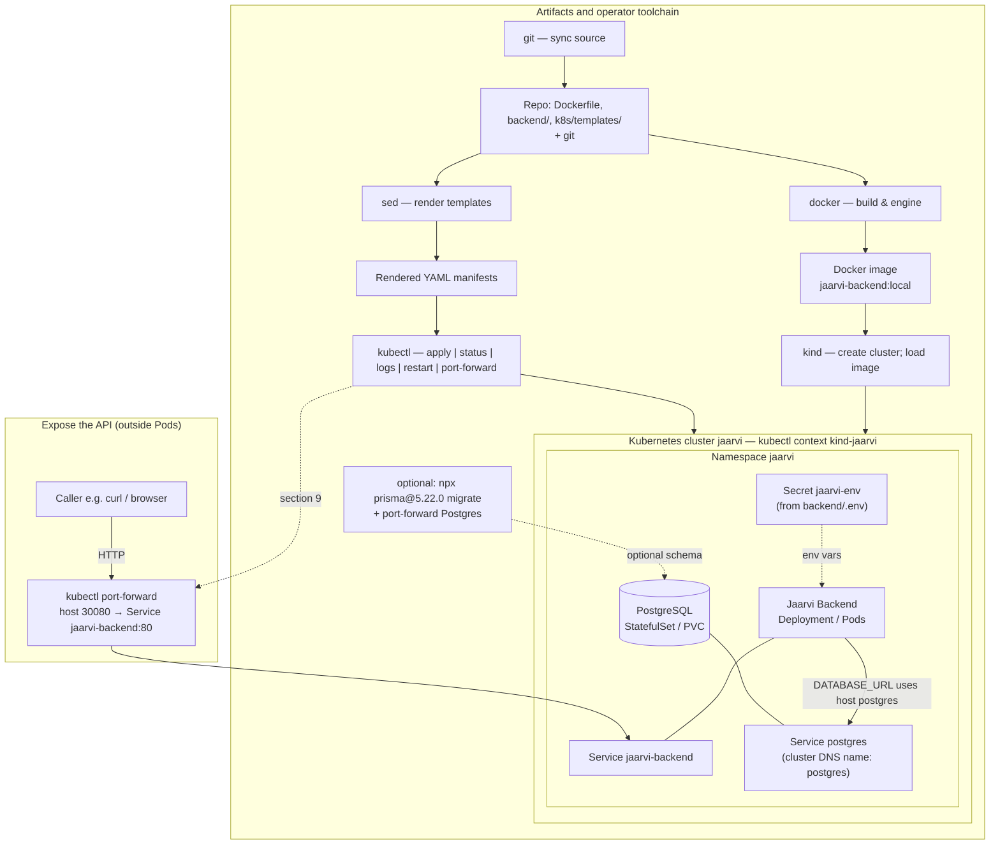

# Deploy Jaarvi backend on a MacBook (macOS, manual on the machine)

This guide is for someone with **no infrastructure background**. You work **on the MacBook** (Terminal.app or another terminal). Everything is installed and run **locally on that Mac**. There is **no** remote-over-SSH workflow in this document.

**Getting the code:** clone the **whole** Jaarvi repository on the Mac (`git clone`). You will use the `backend/` and `k8s/` folders from that clone.

**What you will run:** Docker, Kubernetes (via **kind**), PostgreSQL inside the cluster, and the Jaarvi API in a container.

**Time:** First time usually 45–90 minutes if tools are not installed yet.

---

## 1. What you are building (plain language)

- **Docker** packages the backend into an **image** (a sealed box with Node.js and your app).
- **kind** starts a small **Kubernetes** cluster on your computer (inside Docker).
- **Kubernetes** starts **PostgreSQL** and the **backend API** and keeps them running.
- A **port forward** makes the API reachable from other devices on your network (browser or mobile app).

**Health check:** when deployment works, opening `http://<SERVER_IP>:30080/api/health` should return JSON with `"success": true`.

**Secrets:** passwords and keys live in `backend/.env` on the Mac. Do not paste the contents of `.env` into chat, tickets, or screenshots.

### 1.1 First-time order (Kubernetes from scratch—do not skip ahead)

Someone deploying **for the first time** should complete the sections below **in this order**. Later sections assume earlier ones succeeded (for example, migrations need a **running Postgres Pod** inside the cluster).

| Order | Section | Goal (plain language) |
|------|---------|------------------------|
| 1 | §2 | Clone repo; confirm `backend/` and `k8s/` exist. |
| 2 | §3 | Install Docker Desktop, **`kubectl`**, **`kind`**, and (for migrations) **Node.js / `npx`**. |
| 3 | §4 | Write **`backend/.env`** and **`DATABASE_URL`** so they match how you will run Prisma (**§8**) and match the Secret applied in §7.2. |
| 4 | §5 | Start the **kind** cluster **`jaarvi`** and select context **`kind-jaarvi`**. |
| 5 | §6 | **`docker build`** the API image and **`kind load`** it so Pods can use **`jaarvi-backend:local`**. |
| 6 | §7 | **`kubectl apply`** namespace → Secret → Postgres → backend; **`rollout wait`** Postgres **then** backend. |
| 7 | **§8** | **Tunnel Postgres to your Mac** and run **Prisma migrate** so tables exist (**before** relying on DB-backed API behavior). |
| 8 | §9 | **`port-forward`** the **API** Service so callers reach **`…:30080`**. |
| 9 | §10 | **`curl`** health checks from the Mac and (optionally) the LAN. |

**Typical mistakes:** running **§8** before Postgres is **Ready** (migrations fail); using **`npx prisma`** without pinning the CLI version (**§8**) and hitting a schema error on Prisma v7; forgetting a **running** **`kubectl port-forward svc/postgres`** while Prisma connects to **`127.0.0.1`**.

---

## 2. Before you start

### 2.1 What you need on the MacBook

| Requirement | Why |
|-------------|-----|
| **macOS** (recent version, e.g. Sonoma or newer) | Steps and paths match Apple’s desktop OS. |
| **Administrator access** | Installing Docker Desktop and copying binaries into `/usr/local/bin` may ask for your password. |
| **Internet** | Clone the repo and download Docker, kubectl, kind, and images. |
| **~4 GB free RAM** and **~15 GB disk** (more is better) | Docker Desktop + kind + images + database. |
| **Git** | To clone the repository. If `git` is missing, install **Xcode Command Line Tools**: run `xcode-select --install` in Terminal and follow the prompts. |

### 2.2 Clone the repository

Pick a folder where you keep projects (example: your home directory). Replace the URL with your real Jaarvi remote (HTTPS or SSH, whichever you use for Git):

```bash
cd ~
git clone https://github.com/geovanniduarte/Jaarvi.git
cd Jaarvi
```

You should see `backend/` and `k8s/` next to each other. All later commands assume you are at the **repository root** (the `Jaarvi` folder), unless stated otherwise.

To update the project later (new code from Git):

```bash
cd ~/Jaarvi
git pull
```

If the repository is **private**, GitHub (or your host) will ask you to sign in or use an SSH key the first time you clone or pull—follow the prompts from your Git provider.

### 2.3 Folder layout after clone

```text
~/Jaarvi/                    (names may differ: your clone path)
├── backend/                 ← Dockerfile, package.json, prisma/, and your local .env
└── k8s/
    └── templates/           ← namespace.yaml, postgres.yaml, backend.yaml
```

Open a terminal and go to the repo root when a step says “from the repository root”:

```bash
cd ~/Jaarvi
```

(Use your actual path if you cloned somewhere else.)

### 2.4 Which Mac CPU (for downloading kubectl and kind)

In Terminal run:

```bash
uname -m
```

| Output | Meaning | Use these binaries in sections 3.2 and 3.3 |
|--------|---------|-----------------------------------------------|
| `arm64` | Apple Silicon (M1, M2, M3, …) | **arm64** (sometimes labeled `aarch64`) |
| `x86_64` | Intel Mac | **amd64** |

---

## 3. Install tools on the Mac (one-time)

Run each block in order. If a command fails, read the error message before continuing.

### 3.1 Docker (Docker Desktop for Mac)

On macOS you use **Docker Desktop**, not the Linux shell installer.

1. Download **Docker Desktop for Mac** from [https://www.docker.com/products/docker-desktop/](https://www.docker.com/products/docker-desktop/).
2. Pick the installer that matches your Mac: **Apple Chip** (Apple Silicon) or **Intel Chip**.
3. Open the `.dmg`, drag Docker to **Applications**, then open **Docker** from Applications.
4. Wait until the whale icon in the menu bar is steady and the menu says Docker is running.

**Alternative (Homebrew):** if you already use Homebrew:

```bash
brew install --cask docker
```

Then open **Docker** from Applications once.

Verify in Terminal:

```bash
docker ps
```

**What you should see:** if Docker is working, the command prints a **table header** (columns such as `CONTAINER ID`, `IMAGE`, `COMMAND`, `CREATED`, `STATUS`, `PORTS`, `NAMES`) and **no error**. That is correct even when there are **no data rows** below the header—`docker ps` lists **only running** containers by default, so a fresh setup often shows just the header line. To list stopped or exited containers as well, use `docker ps -a`. To confirm the engine further, use `docker info` or a quick one-off check: `docker run --rm hello-world`.

If you see “Cannot connect to the Docker daemon”, Docker Desktop is not running—open it from Applications.

**Resources:** kind needs enough RAM. In Docker Desktop: **Settings → Resources** and give at least **4 CPUs / 4 GB RAM** if you can.

### 3.2 kubectl (Kubernetes command-line client)

**Kubernetes** (often abbreviated **K8s**) is the control plane that **runs and supervises containers** on a cluster: it decides *where* they run, restarts them if they crash, exposes network ports, attaches storage, and applies the configuration you declare in YAML files. You do **not** need to understand all of that to follow this guide; you only need a way to *talk* to your cluster.

**kubectl** is that tool: the **Kubernetes CLI**—a **terminal program** that sends commands to the cluster’s API. In this manual you use it to:

- **Point** your Mac at the right cluster (after **kind** creates one, kubectl uses a **context** such as `kind-jaarvi`).
- **Apply** manifests so Postgres and the Jaarvi backend are created and updated (`kubectl apply`, `kubectl rollout`, and similar).
- **Inspect** whether things are healthy (`kubectl get pods`, logs, descriptions).
- Later, **forward** port **30080** so other devices can reach the API (`kubectl port-forward`).

Docker Desktop runs the container processes on your Mac (including the **kind** cluster “nodes,” which are themselves containers); **kubectl** is how you operate **Kubernetes** on top of that. Installing kubectl only adds the `kubectl` command; nothing useful runs *until* you have a cluster—subsection **3.3** (**kind**) creates that cluster on your machine.

Install the official **macOS** binary (**darwin**) that matches your Mac chip from section **2.4** (`arm64` vs `amd64`).

**Apple Silicon (`arm64`):**

```bash
curl -LO "https://dl.k8s.io/release/$(curl -L -s https://dl.k8s.io/release/stable.txt)/bin/darwin/arm64/kubectl"
chmod +x kubectl
sudo mv kubectl /usr/local/bin/kubectl
kubectl version --client
```

**Intel Mac (`x86_64`):**

```bash
curl -LO "https://dl.k8s.io/release/$(curl -L -s https://dl.k8s.io/release/stable.txt)/bin/darwin/amd64/kubectl"
chmod +x kubectl
sudo mv kubectl /usr/local/bin/kubectl
kubectl version --client
```

### 3.3 kind (Kubernetes-in-Docker)

**kind** (**K**ubernetes **IN** **D**ocker) is a small official tool that **creates a real Kubernetes cluster on your Mac**—but lightweight: cluster “nodes” are **containers** launched by Docker, not separate physical servers. That makes kind ideal for learning and local demos without a cloud account.

In this manual, kind is what gives you something for **kubectl** to talk to after `kind create cluster`. You use it to:

- **Provision** the local cluster (this guide names it **`jaarvi`**).
- **Load** the backend image from Docker into that cluster (`kind load docker-image` in section **6**) so Kubernetes can run your **`jaarvi-backend:local`** image without a registry.

**Prerequisites:** Docker Desktop must be running (section **3.1**); **kubectl** should already be installed (section **3.2**) so you can switch context to `kind-jaarvi` and apply manifests afterward.

Install the **`kind`** binary for your Mac from [kind releases](https://github.com/kubernetes-sigs/kind/releases). The commands below use **v0.31.0** as an example—if you pick a newer release, replace the version in the URL with the one you downloaded.

**Apple Silicon:**

```bash
curl -Lo ./kind "https://kind.sigs.k8s.io/dl/v0.31.0/kind-darwin-arm64"
chmod +x ./kind
sudo mv ./kind /usr/local/bin/kind
kind version
```

**Intel Mac:**

```bash
curl -Lo ./kind "https://kind.sigs.k8s.io/dl/v0.31.0/kind-darwin-amd64"
chmod +x ./kind
sudo mv ./kind /usr/local/bin/kind
kind version
```

### 3.4 Optional helpers

- **`curl`**: preinstalled on macOS.
- **`sed`**: preinstalled; used to fill template placeholders.
- **Node.js** (only if you will run **`npx prisma@5.22.0 migrate deploy`** or **`npm run prisma:migrate:deploy`** from section **8**): install from [https://nodejs.org/](https://nodejs.org/) (LTS 20.x) or `brew install node@20` if you use Homebrew.

---

## 4. Configure the backend environment

### 4.1 Create `backend/.env`

The file `.env` is **not** in Git (secrets must stay local). After clone, create it from the example:

```bash
cd ~/Jaarvi/backend
cp .env.example .env
nano .env
```

(`nano` is built in; you can also open `.env` in TextEdit or VS Code—just keep it **outside** screenshots and chats.)

Use any editor (`nano`, `vim`, or a graphical editor). Set at least:

| Variable | What to put |
|----------|-------------|
| `DB_USER` | A database username (must match what Postgres will use). |
| `DB_PASSWORD` | A strong password. |
| `DB_NAME` | Database name (e.g. `jaarvi_prod`). |
| `DB_PORT` | `5432` (default for Postgres in this setup). |
| `DB_HOST` | For **pods inside Kubernetes**, deployment overrides this to **`postgres`** (cluster DNS name). Your file can still say `127.0.0.1` for clarity when you migrate from the Mac (**§8**); do **not** use **`0.0.0.0`** as a database hostname—clients cannot connect to it. |
| `JWT_SECRET` | At least **32 characters**, random. |
| `PORT` | `3000` unless you have a reason to change it (must match the template step below). |
| `NODE_ENV` | `production` for a real deployment. |

**`DATABASE_URL` and Prisma:** the **Prisma CLI** reads **`DATABASE_URL`** from **`backend/.env`** as a **literal** string—it does **not** expand shell-style **`${VAR}`** placeholders inside that file.

- **`DB_USER`**, **`DB_PASSWORD`**, **`DB_NAME`** (and port) inside **`DATABASE_URL`** must match what you loaded into **`jaarvi-env`** (**§7.2**).
- When you migrate **from your Mac through a Postgres port-forward** (**§8**), the host inside **`DATABASE_URL`** must be **`127.0.0.1`** (or **`localhost`**) **and** the port must match the **local** end of **`kubectl port-forward`** (often **`5432`**).

The Node app still builds its own URL from **`DB_*`** at runtime (**`env.ts`**); keep **`DATABASE_URL`** in sync anyway so **`npx prisma …`** sees the correct connection string.

Save the file. **Do not commit `.env` to git** (it should already be listed in `.gitignore`).

---

## 5. Create the Kubernetes cluster (kind)

From the **repository root** (parent of `backend` and `k8s`):

```bash
cd ~/Jaarvi
docker ps
```

Seeing only the header row (no containers listed) is normal before you create the kind cluster; see the **Verify** note in section **3.1**. If this fails, open **Docker Desktop** from Applications and wait until it is fully started, then run `docker ps` again.

Create the cluster **named `jaarvi`** (name used in the rest of this guide). Run the lines below **one after another**. Each command is in its **own** block so you can copy it alone in preview mode.

**1.** List existing kind clusters and match the name **`jaarvi`**. If that name is missing, **create** the cluster. If **`jaarvi`** already exists, the create part is skipped.

```bash
kind get clusters | grep -q jaarvi || kind create cluster --name jaarvi
```

**2.** Point **kubectl** at this cluster’s API. The context name follows the pattern **`kind-<cluster-name>`**, so **`jaarvi`** → **`kind-jaarvi`**. Later `kubectl` commands in this guide apply to this cluster only.

```bash
kubectl config use-context kind-jaarvi
```

**3.** Show cluster nodes with extra columns (**`-o wide`**). Confirms the control plane node is **Ready** and that your Mac is really talking to **kind-jaarvi**.

```bash
kubectl get nodes -o wide
```

You should see one node `Ready`.

---

## 6. Build the backend Docker image

Still from the repository root:

```bash
docker build -t jaarvi-backend:local -f backend/Dockerfile backend
```

This can take several minutes the first time.

Load the image into the kind cluster (so Kubernetes can run it without a registry):

```bash
kind load docker-image jaarvi-backend:local --name jaarvi
```

---

## 7. Deploy to Kubernetes (namespace, secrets, Postgres, API)

Replace placeholders in templates with **`jaarvi`** for app and namespace, set Postgres disk size, NodePort, image name, and container port.

**Convention:** `__BACKEND_PORT__` must match the **`PORT`** value in `backend/.env` (default **3000**).

**Order vs. migrations:** Complete **§7.5** (Postgres rollout **successful**) **before** **§8** (Prisma). Running migrate while Postgres still starts yields **connection refused**. Exposing the API (**§9**) can wait until after migrations or in parallel—they are independent—as long as **§8’s** Postgres forward runs in its **own terminal** while **`npx prisma@5.22.0 migrate deploy`** executes.

### 7.1 Namespace

```bash
kubectl apply -f <(sed -e "s|__APP_NAME__|jaarvi|g" -e "s|__NAMESPACE__|jaarvi|g" k8s/templates/namespace.yaml)
```

### 7.2 Secret from `.env`

Creates/updates the secret **`jaarvi-env`** from your file:

```bash
kubectl -n jaarvi create secret generic jaarvi-env --from-env-file=backend/.env --dry-run=client -o yaml | kubectl apply -f -
```

If you change `.env` later, run this command again and restart the backend deployment (see troubleshooting).

### 7.3 PostgreSQL

```bash
kubectl apply -f <(sed -e "s|__APP_NAME__|jaarvi|g" -e "s|__NAMESPACE__|jaarvi|g" -e "s|__POSTGRES_STORAGE__|1Gi|g" k8s/templates/postgres.yaml)
```

`1Gi` is one gibibyte of disk for the database inside the cluster. Increase if you expect large data (e.g. `10Gi`).

### 7.4 Backend service and deployment

```bash
kubectl apply -f <(sed -e "s|__APP_NAME__|jaarvi|g" -e "s|__NAMESPACE__|jaarvi|g" -e "s|__NODE_PORT__|30080|g" -e "s|__BACKEND_IMAGE__|jaarvi-backend:local|g" -e "s|__BACKEND_PORT__|3000|g" k8s/templates/backend.yaml)
```

If your `PORT` in `.env` is not `3000`, use that value instead of `3000` in `__BACKEND_PORT__`.

### 7.5 Wait until workloads are ready

Applying YAML (sections **7.3–7.4**) only **declares** what Kubernetes should run; Pods may still be **pulling images**, attaching **persistent volumes**, passing **health checks**, or **retrying** if a dependency starts slowly. **`kubectl rollout status`** subscribes to the controller until the workload reports “finished deploying” or the wait times out—it is safer than guessing with `sleep`.

- **`-n jaarvi`** scopes both commands to the **`jaarvi`** namespace.
- **`--timeout=180s`** waits **up to three minutes** per workload; if a line exits with an error or hangs past the deadline, inspect Pods and logs (**section 12**).

**Order matters:** Postgres is the StatefulSet (**stable identity + disk**); the backend talks to **`postgres`** inside the cluster. Wait for Postgres first, then confirm the Deployment has rolled out successfully.

Run these **one at a time**. Each block is standalone so you can copy it separately in preview.

**1.** Block until **`statefulset/postgres`** has completed its rollout (Pod running, StatefulSet reconciliation done).

```bash
kubectl -n jaarvi rollout status statefulset/postgres --timeout=180s
```

**Success:** kubectl prints something like **`successfully rolled out`** and exits. **Failure / timeout:** the command exits non‑zero; use **`kubectl -n jaarvi get pods`** and **`kubectl -n jaarvi describe pod`** on the Postgres Pod.

**2.** Block until **`deployment/jaarvi-backend`** has finished updating all desired replicas.

```bash
kubectl -n jaarvi rollout status deployment/jaarvi-backend --timeout=180s
```

If the backend **CrashLoops** waiting for Postgres, letting **(1)** finish first usually resolves it on retry; otherwise use logs and **`describe`** (**section 12**).

---

## 8. Database schema (migrations)

The running API image does **not** automatically apply Prisma migrations. After Postgres is up, the database volume might still be **empty** until migrations are applied.

### 8.1 Where this sits in the full flow

- **Depends on:** Postgres **StatefulSet rollout finished** (**§7.5**, step **1**) and correct **`backend/.env` + Secret** (**§7.2**).
- **Does not require:** API port-forward (**§9**). Open only a **Postgres** tunnel for this section; add the backend port-forward when you expose the HTTP API (**§9**).
- **When to repeat:** after **new migration files** from Git or when pointing at an **empty** database—not on every reboot (see **§16**).

You run Prisma **on the Mac**, but it must talk through **`kubectl`** to Postgres **inside** the cluster unless you expose Postgres some other way (not covered here).

---

### 8.2 Step 1 — Confirm `kubectl` is talking to the right cluster

**Purpose:** `npx prisma` connects to whichever URL is in **`DATABASE_URL`**, but Postgres still lives inside **kind**. If **`kubectl`** points at the wrong context, later steps will forward the wrong Postgres or none at all.

```bash
kubectl config current-context
```

You want **`kind-jaarvi`** (matching **§5**). If not:

```bash
kubectl config use-context kind-jaarvi
```

---

### 8.3 Step 2 — Confirm Postgres Pod is usable

**Purpose:** Migrate only **after** Postgres is running; otherwise Prisma raises connection errors (**P1001**).

```bash
kubectl -n jaarvi get pods -l app.kubernetes.io/component=postgres -o wide
```

The Pod should show **`Running`** (if not, revisit **§7.5** and **§12**).

---

### 8.4 Step 3 — Tunnel cluster Postgres to your Mac (leave this terminal open)

**Purpose:** Postgres listens on **`5432`** **inside** the cluster. **`kubectl port-forward`** maps a **localhost** port on your Mac to that Service so Prisma—running **outside** Pods—can open a TCP connection to **`127.0.0.1`**.

**Terminal A** (stay connected; Ctrl+C closes the tunnel):

```bash
kubectl -n jaarvi port-forward svc/postgres 5432:5432
```

- **`svc/postgres`** is the Kubernetes **Service** backing the Postgres StatefulSet.
- **`5432:5432`** → local port **5432** on the Mac → remote Service port **5432**.

If your Mac already uses **5432** for another Postgres (often “Postgres.app” or Docker), reuse the forward with a **free local port** instead, e.g. **`15432:5432`**:

```bash
kubectl -n jaarvi port-forward svc/postgres 15432:5432
```

Then set **`DB_PORT`** and the port inside **`DATABASE_URL`** to **`15432`** for the duration of the migrate (**§8.6**).

---

### 8.5 Step 4 — Align `backend/.env` on the Mac

**Purpose:** Prisma validates credentials against the database you forward. Those credentials must match the **`POSTGRES_*`** bootstrap values taken from **`jaarvi-env`** (created from **`backend/.env`** in **§7.2**).

- **`DATABASE_URL`** must contain **`127.0.0.1`** (not **`0.0.0.0`**) when using the forward above, and **`DB_USER`** / **`DB_PASSWORD`** / **`DB_NAME`** that match what you deployed.
- Use a single **literal** **`postgresql://…`** string in **`DATABASE_URL`** (**§4**); Prisma **does not** expand **`${VAR}`** inside **`DATABASE_URL`** in **`dotenv`** on its own.

---

### 8.6 Step 5 — Prerequisites for `npx`

**Purpose:** Migrate uses **Node/npm** tooling on the Mac (see **§3.4**), not Docker.

```bash
command -v node && command -v npx
```

Both should print a path. If not, fix **§3.4** then open a **new** terminal (**§12**, `npx` troubleshooting).

---

### 8.7 Step 6 — Apply migrations (recommended command)

Open **Terminal B** (while **Terminal A** still shows an active Postgres forward).

**Purpose:** Runs Prisma Migrate **deploy** (`prisma/migrations/` in your clone). Using **`npm run prisma:migrate:deploy`** from **`backend/`** also works (**uses `package.json`**), but pinning the **`prisma`** package version avoids **`npx`** downloading Prisma **7.x**, whose CLI **rejects** this repo’s **Prisma 5** schema (**`url` in `schema.prisma`**) unless the project has been migrated to **`prisma.config.ts`**.

From the repository root (`Jaarvi/`):

```bash
cd ~/Jaarvi/backend
npx prisma@5.22.0 migrate deploy
```

**Versions:** **`5.22.0`** tracks **`backend/package.json`** (**`dependencies`**: **`@prisma/client`**, **`devDependencies`**: **`prisma`**). If dependencies are upgraded later, bump this pin to match or prefer **`npm run prisma:migrate:deploy`** inside **`backend/`** after **`npm ci`/`npm install`**.

If you skip migrations and tables are missing, the API may **`CrashLoop`** on DB reads or surface query errors (**§12**).

---

## 9. Expose the API on the network

kind runs inside Docker; **NodePort alone is often not enough** to reach the API from another PC on the LAN. The project’s deployment flow uses **`kubectl port-forward`** on the Mac so port **30080** on the Mac listens for traffic.

On the MacBook, run:

```bash
nohup kubectl -n jaarvi port-forward --address 0.0.0.0 svc/jaarvi-backend 30080:80 > /tmp/jaarvi-port-forward.log 2>&1 &
sleep 3
```

- **`30080:80`** means: host port **30080** → service port **80** (the Service maps to the app’s container port via `targetPort`).
- **`--address 0.0.0.0`** allows other devices on the network to connect to this Mac’s IP.

**After a reboot**, this background process is gone; start the same `nohup kubectl ...` line again. **Full reboot order** (Docker → cluster checks → port-forward → health): see **section 16** (**Reboot**).

**macOS firewall:** if **System Settings → Network → Firewall** is on and others cannot connect, you may need to allow **incoming** connections for **Terminal** (or your terminal app) or temporarily test with the firewall off to confirm. Ensure **TCP 30080** can reach the Mac from your LAN.

Find the Mac’s LAN IP (for a phone or another computer on the same Wi‑Fi):

```bash
ipconfig getifaddr en0
```

If that prints nothing, try `en1`, or open **System Settings → Network → Wi‑Fi → Details** and read the IP address. It is often `192.168.x.x`.

---

## 10. Verify deployment

### 10.1 From the MacBook

```bash
curl -s http://127.0.0.1:30080/api/health
```

Expected: JSON including `"success": true` and a message similar to **"Hola, soy Jaarvi"**.

### 10.2 From another device on the same network

In a browser:

```text
http://<SERVER_IP>:30080/api/health
```

Or from another terminal:

```bash
curl -s http://<SERVER_IP>:30080/api/health
```

---

## 11. Useful commands (day two)

| Goal | Command |
|------|---------|
| See pods | `kubectl -n jaarvi get pods` |
| Backend logs | `kubectl -n jaarvi logs deploy/jaarvi-backend --tail=100 -f` |
| Postgres logs | `kubectl -n jaarvi logs statefulset/postgres --tail=100` |
| Describe a failing pod | `kubectl -n jaarvi describe pod <pod-name>` |
| **Check backend port-forward** | `pgrep -af "port-forward.*jaarvi-backend"` |
| **Check Postgres forward** (during **§8**) | `pgrep -af "port-forward.*svc/postgres"` |
| Stop **backend** port-forward | `pkill -f "kubectl.*port-forward.*jaarvi-backend"` |
| Stop **Postgres** port-forward | Ctrl+C in the **`Terminal A`** from **§8.4**, or `pkill -f "kubectl.*port-forward.*postgres"` (**review matches**—can kill unintended forwards) |

---

## 12. Troubleshooting

### Docker: "Cannot connect to the Docker daemon"

Open **Docker Desktop** from Applications and wait until it finishes starting. Check the whale icon in the menu bar. Then run `docker ps` again. On macOS there is no `systemctl` for Docker.

### `kind: command not found` / `kubectl: command not found`

Repeat the install sections; ensure binaries are under `/usr/local/bin` and your `PATH` includes it (`echo $PATH`).

### `npx: command not found` / `command not found: npx`

**Cause:** **Node.js** (and therefore **npm**, which provides **`npx`**) is not installed, or it is installed but your **PATH** does not include the directory that contains `node` and `npx`.

**Fix (pick one):**

- **Installer:** install **LTS 20.x** from [https://nodejs.org/](https://nodejs.org/), then **quit Terminal and open it again** so `PATH` refreshes.
- **Homebrew:** `brew install node@20` — if `npx` still fails, run **`brew info node@20`** and add the printed **`export PATH=...`** snippet to your shell config, or use the suggested **`brew link node@20`** option, then open a new terminal.

Verify:

```bash
node -v
npx -v
```

Both should print versions. Then retry **`npx prisma@5.22.0 migrate deploy`** from **`backend/`** (section **8**—see step **§8.7**) or **`npm run prisma:migrate:deploy`** after installing dependencies.

### Pods not ready / CrashLoopBackOff

```bash
kubectl -n jaarvi get pods
kubectl -n jaarvi describe pod <name>
kubectl -n jaarvi logs <name>
```

Common causes: wrong secret keys, invalid `.env`, Postgres not ready yet (wait and retry).

### Health check: connection refused on port 30080

- Confirm port-forward is running (`pgrep -af port-forward`).
- Restart the `nohup kubectl ... port-forward ...` command from section 9.
- Confirm firewall allows **30080**.

### Changed `.env` after deploy

```bash
kubectl -n jaarvi create secret generic jaarvi-env --from-env-file=backend/.env --dry-run=client -o yaml | kubectl apply -f -
kubectl -n jaarvi rollout restart deployment/jaarvi-backend
```

### How `DB_HOST` works in Kubernetes

The manifest sets **`DB_HOST=postgres`** on the backend container so the app uses the **Kubernetes service name** for Postgres, even if `backend/.env` still says **`localhost`** or placeholders. **`0.0.0.0`** is invalid for Postgres **clients**; use **`postgres`** inside the cluster (**backend Pod**) or **`127.0.0.1` + port-forward** on the Mac when running Prisma (**§8**).

### Prisma migrate: “url is no longer supported” / CLI version mismatch

**Cause:** `npx prisma` without pinning may install **Prisma 7.x**, which expects **`prisma.config.ts`** instead of **`url`** in **`schema.prisma`**.

**Fix:** Run **`npx prisma@5.22.0 migrate deploy`** from **`backend/`**, or **`npm run prisma:migrate:deploy`** after **`npm install`** so `node_modules` supplies **Prisma 5.x** (**§8.7**).

---

## 13. Names and ports summary

| Item | Value |
|------|--------|
| kind cluster name | `jaarvi` |
| Kubernetes context | `kind-jaarvi` |
| Namespace | `jaarvi` |
| Secret name | `jaarvi-env` |
| API URL path (health) | `/api/health` |
| Host port (after port-forward) | `30080` |
| Backend image tag (local build) | `jaarvi-backend:local` |

---

## 14. Security notes (non-optional reading)

- Restrict who can open **port 30080** on the Mac (firewall rules, trusted Wi‑Fi only).
- Use strong `JWT_SECRET` and `DB_PASSWORD`.
- This setup is suitable for **lab / home / small trusted network** demos. Production on the public internet usually adds HTTPS, a reverse proxy, managed databases, backups, and monitoring—plan with someone responsible for security.

---

## 15. Application components, tooling, and operator actions

This illustration is intentionally **hardware-agnostic**: it describes **what the Jaarvi stack is made of**, **how pieces relate**, and **which tools implement which responsibilities**—the same concepts apply wherever Docker, kind, and Kubernetes run.

### 15.1 Application components in the cluster (what runs, and dependencies)

Kubernetes groups everything for this demo under **namespace `jaarvi`**.

| Component (name in this guide) | Kind / role | How it relates to the rest |
|--------------------------------|--------------|----------------------------|
| **Secret `jaarvi-env`** | Holds key/value pairs from **`backend/.env`** | Mounted or referenced as env on the backend Pods (see templates); Postgres uses its **own** Secret from manifests. |
| **PostgreSQL** (StatefulSet + Service **`postgres`** + PersistentVolumeClaim) | Relational database for the API | Stable in-cluster hostname **`postgres`**; backend uses **`DB_HOST=postgres`** (forced in deployment) regardless of stray values in `.env`. |
| **Jaarvi backend** (`Deployment` + Pods, image **`jaarvi-backend:local`**) | HTTP API (Node runtime; **`PORT`** in `.env`, often **3000**) | Depends on Postgres for persistence; consumes **`jaarvi-env`** secret; listens on container port wired in **`backend.yaml`** / Service **`targetPort`**. |
| **Service `jaarvi-backend`** | Cluster Network abstraction for reaching API Pods | **`kubectl port-forward` maps host `30080` → this Service (`80` → `targetPort`)** per section **9**; callers use **`/api/health`** etc. on that forwarded port. |
| **`jaarvi-backend:local`** (image) | Build artifact (`docker build` from **`backend/`**) | Not magically inside the cluster: **kind needs `kind load docker-image`** (section **6**) so Pods can pull it locally without a registry. |

### 15.2 Tools and representative actions

| Tool | What it owns in this workflow | Typical actions here (conceptual verbs) |
|------|-------------------------------|----------------------------------------|
| **Git** | Source of **`backend/`**, **`k8s/templates/`** | **`clone`** / **`pull`** to refresh code and manifests. |
| **`docker`** | Images and visibility into containers | **`docker build -t jaarvi-backend:local -f backend/Dockerfile backend`**; **`docker ps`** (running containers); engine must be running for kind. |
| **`kind`** | Local Kubernetes atop Docker | **`kind create cluster --name jaarvi`**; **`kubectl config use-context kind-jaarvi`** (with kubectl); **`kind load docker-image jaarvi-backend:local --name jaarvi`**. |
| **`kubectl`** | Lifecycle and introspection via the Kubernetes API | **`kubectl apply`** (namespace, Postgres, backend, Secret); **`kubectl -n jaarvi rollout status …`**; **`get pods`** / **`logs`** / **`describe`**; **`kubectl -n jaarvi port-forward`** to **`svc/postgres`** (migrations—**§8.4**) and **`svc/jaarvi-backend 30080:80`** (API—**§9**); **`rollout restart`** after Secret changes (troubleshooting). |
| **`sed`** | Turning templates under **`k8s/templates/`** into concrete manifests | Substitute placeholders (app name, namespace, storage size, NodePort placeholder, image tag, container port) and pipe **`stdout`** into **`kubectl apply -f -`**. |
| **Node.js + `npx`** (optional) | Database schema tooling on the Mac | **`npx prisma@5.22.0 migrate deploy`** (**§8.7**) with **`DATABASE_URL`** pointing at **`127.0.0.1`** through a Postgres **`port-forward`**, **or** **`npm run prisma:migrate:deploy`** from **`backend/`** using local **`node_modules`**. Pinning avoids stray **Prisma 7** CLI (**§12** troubleshooting). |

### 15.3 Diagram (components × tools × data flow)



*Relationships that matter:* the **backend** resolves **Postgres by Service DNS** inside the cluster; **callers outside the cluster** reach the backend only via a **long-lived port-forward process** (`kubectl`), not directly by SSHing “into YAML.” Updating **`.env`** implies recreating/updating **`jaarvi-env`** and restarting the Deployment so Pods pick up new configuration.

---

## 16. Reboot (restart Jaarvi infrastructure)

Use this checklist after **macOS reboots** or when Docker Desktop was **fully quit**—not when you redeploy changed code.

**What usually survives:** **`kind`** cluster definitions, manifests, Postgres data on the PersistentVolumeClaim, and **`kubectl`** context **`kind-jaarvi`** (stored under **`~/.kube/`**)—as long as **Docker Desktop** still has its disk images.

**What always stops:** the **`kubectl port-forward`** helper from section **9** is a normal process on the host; reboot kills it—you must **start it again** for **`http://…:30080`**.

Run the blocks below **in order** (same style as earlier steps: **one command per fenced block** for easy copy in preview).

---

**1.** Open **Docker Desktop** from Applications and wait until it reports **running** (whale icon in the menu bar is steady).

**2.** Smoke-test the daemon (see section **3.1** if you see “Cannot connect to the Docker daemon”).

```bash
docker ps
```

**3.** Point **kubectl** at the **`jaarvi`** cluster.

```bash
kubectl config use-context kind-jaarvi
```

**4.** Confirm Kubernetes is answering.

```bash
kubectl get nodes -o wide
```

If this errors (no cluster / cannot reach API), revisit **sections 5 and 12**—you cannot skip straight to port-forward until the cluster exists.

**5.** Confirm Jaarvi Pods in namespace **`jaarvi`**.

```bash
kubectl -n jaarvi get pods
```

Give them a minute after Docker starts; Pods should settle to **`Running`**. Optionally wait for declarative rollout (same timeouts as section **7.5**):

```bash
kubectl -n jaarvi rollout status statefulset/postgres --timeout=180s
```

```bash
kubectl -n jaarvi rollout status deployment/jaarvi-backend --timeout=180s
```

**You do not re-run migrations** (**section 8**) on every reboot—only after an **empty** DB, **changed** **`prisma/migrations`**, or a deliberate **`migrate deploy`** on a restored volume. Postgres port-forward (**§8.4**) is only needed **while running Prisma**, not permanently after reboot (**§16** restores the **API** forward **§9**).

**6.** (**Optional**) If **`address already in use`** on **`30080`**, stop an old listener (normally unnecessary right after reboot). See section **11** for details.

```bash
pkill -f "kubectl.*port-forward.*jaarvi-backend"
```

**7.** Start the API port-forward again (**section 9**).

```bash
nohup kubectl -n jaarvi port-forward --address 0.0.0.0 svc/jaarvi-backend 30080:80 > /tmp/jaarvi-port-forward.log 2>&1 &
```

```bash
sleep 3
```

**8.** Health check (**section 10**).

```bash
curl -s http://127.0.0.1:30080/api/health
```

---

*This document is derived from the same flow as `.cursor/commands/deploy-kubernetes.md`, omitting any SSH-based or remote-copy automation. All steps are intended to be executed **on the MacBook** by a human operator, after cloning the full repository on that Mac.*
