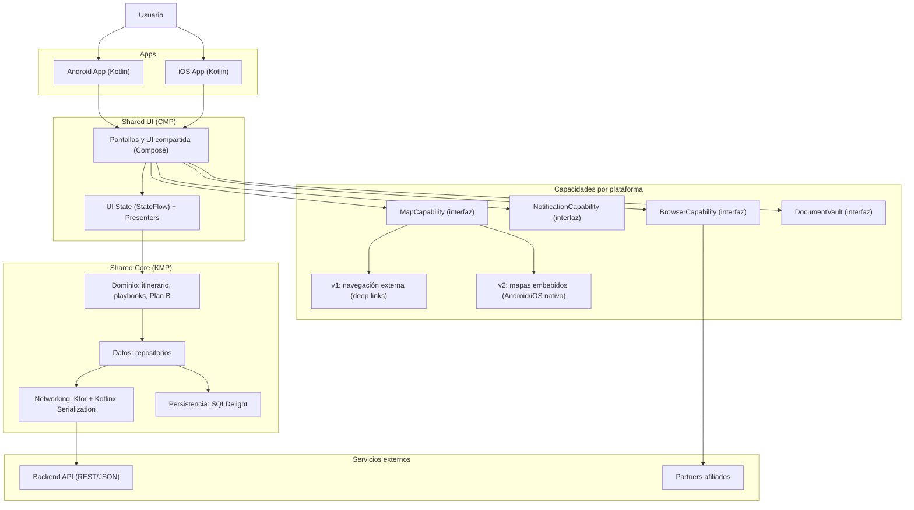

```mermaid
flowchart TB
  User[Usuario]

  subgraph Apps[Apps]
    AndroidApp["Android App (Kotlin)"]
    IosApp["iOS App (Kotlin)"]
  end

  subgraph SharedUI["Shared UI (CMP)"]
    Screens["Pantallas y UI compartida (Compose)"]
    UIState["UI State (StateFlow) + Presenters"]
  end

  subgraph SharedCore["Shared Core (KMP)"]
    Domain["Dominio: itinerario, playbooks, Plan B"]
    Data["Datos: repositorios"]
    Net["Networking: Ktor + Kotlinx Serialization"]
    Db["Persistencia: SQLDelight"]
  end

  subgraph Platform["Capacidades por plataforma"]
    MapCap["MapCapability (interfaz)"]
    MapV1["v1: navegación externa (deep links)"]
    MapV2["v2: mapas embebidos (Android/iOS nativo)"]
    NotifCap["NotificationCapability (interfaz)"]
    BrowserCap["BrowserCapability (interfaz)"]
    DocsCap["DocumentVault (interfaz)"]
  end

  subgraph Services["Servicios externos"]
    BackendAPI["Backend API (REST/JSON)"]
    Affiliate["Partners afiliados"]
  end

  User --> AndroidApp
  User --> IosApp

  AndroidApp --> Screens
  IosApp --> Screens

  Screens --> UIState
  UIState --> Domain
  Domain --> Data
  Data --> Net
  Data --> Db

  Screens --> MapCap
  MapCap --> MapV1
  MapCap --> MapV2

  Screens --> NotifCap
  Screens --> BrowserCap
  Screens --> DocsCap

  Net --> BackendAPI
  BrowserCap --> Affiliate
```