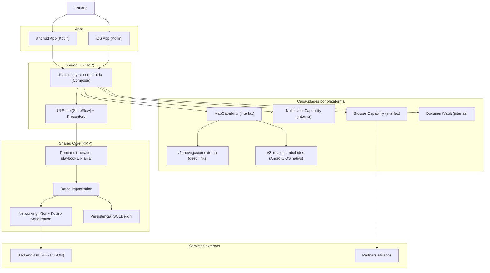
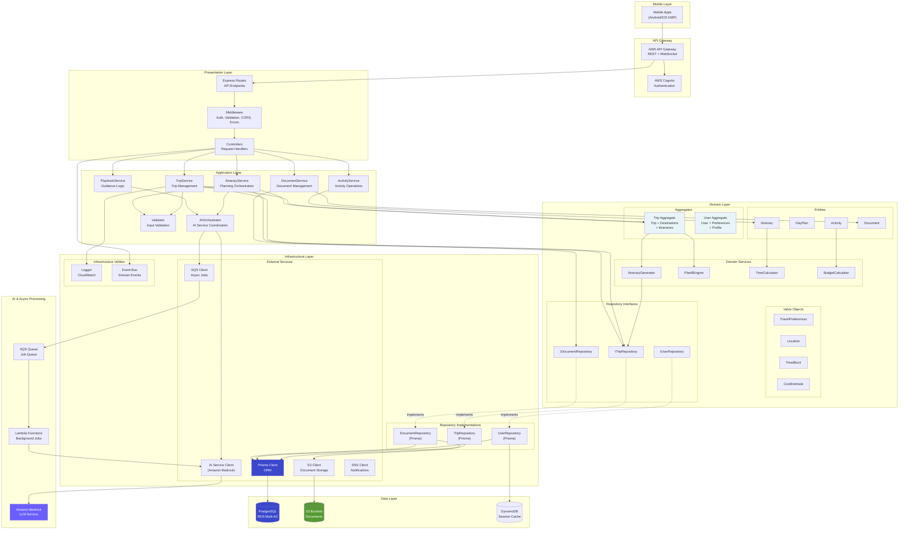

MOBILE



BACKEND



INFRASTRUCTURE

```plantuml
@startuml Jaarvi AWS Infrastructure
!define RECTANGLE_COLOR #FF9900
!define VPC_COLOR #E8F4F8
!define DATABASE_COLOR #3B48CC
!define STORAGE_COLOR #569A31
!define COMPUTE_COLOR #FF9900

skinparam rectangle {
  BackgroundColor<<mobile>> #3498DB
  BackgroundColor<<cdn>> #FF9900
  BackgroundColor<<gateway>> #FF9900
  BackgroundColor<<auth>> #DD344C
  BackgroundColor<<compute>> #FF9900
  BackgroundColor<<database>> #3B48CC
  BackgroundColor<<storage>> #569A31
  BackgroundColor<<ai>> #6B5EFF
  BackgroundColor<<messaging>> #E7157B
  BackgroundColor<<monitoring>> #FF9900
  BorderColor Black
  FontColor White
}

actor "User" as user

' Mobile Layer
package "Mobile Apps" <<mobile>> {
  component "Android App\n(Kotlin/Compose)" as android
  component "iOS App\n(Kotlin/Compose)" as ios
}

' Edge Layer
component "CloudFront\nCDN" <<cdn>> as cdn
component "API Gateway\nREST/WebSocket" <<gateway>> as apigw
component "Cognito\nAuthentication" <<auth>> as cognito

' Application Layer
package "VPC - Application Tier" <<compute>> as vpc_app {
  component "Application\nLoad Balancer" <<gateway>> as alb
  
  package "ECS Cluster" <<compute>> {
    component "Backend API\nNode.js/TypeScript\nPrisma ORM" <<compute>> as backend
    component "AI Service\nItinerary Generation\nPlaybooks Engine" <<ai>> as ai_service
  }
}

' Data Layer
package "VPC - Data Tier" <<database>> as vpc_data {
  database "RDS PostgreSQL\nPrimary (Multi-AZ)" <<database>> as postgres
  database "RDS PostgreSQL\nRead Replica" <<database>> as postgres_read
  database "DynamoDB\nSession Cache" <<database>> as dynamodb
}

' Storage Layer
storage "S3 Documents\nTravel Docs\nTickets & Permits" <<storage>> as s3_docs
storage "S3 Static Assets\nImages & Maps\nPlaybooks" <<storage>> as s3_static

' AI & Processing Services
component "Amazon Bedrock\nLLM Service" <<ai>> as bedrock
component "Lambda Functions\nEvent Processing" <<compute>> as lambda

' Messaging & Notifications
queue "SQS\nAsync Job Queue" <<messaging>> as sqs
component "SNS\nPush Notifications" <<messaging>> as sns

' Monitoring
component "CloudWatch\nLogs & Metrics\nAlerts" <<monitoring>> as cloudwatch

' CI/CD
cloud "CI/CD Pipeline" {
  component "GitHub Actions" <<compute>> as github
  component "App Distribution\nGoogle Play\nApp Store" <<mobile>> as distribution
}

' Connections
user -down-> android
user -down-> ios

android -down-> cdn
ios -down-> cdn
android -down-> apigw : Direct API
ios -down-> apigw : Direct API

cdn -down-> apigw
apigw -right-> cognito : Auth
apigw -down-> alb

alb -down-> backend
alb -down-> ai_service

backend -down-> postgres : Write
backend -down-> postgres_read : Read
backend -down-> dynamodb : Cache
backend -right-> s3_docs : Documents
backend -right-> s3_static : Assets

ai_service -down-> postgres
ai_service -right-> bedrock : Generate
ai_service -right-> s3_static : Playbooks

backend -down-> sqs : Queue Jobs
sqs -right-> lambda
lambda -up-> ai_service : Trigger

backend -down-> sns : Notifications
ai_service -down-> sns
sns -up-> android : Push
sns -up-> ios : Push

backend -right-> cloudwatch : Logs
ai_service -right-> cloudwatch : Logs
lambda -right-> cloudwatch : Logs

github -down-> backend : Deploy
github -down-> ai_service : Deploy
github -down-> distribution
distribution -up-> android : Release
distribution -up-> ios : Release

note right of backend
  **Backend API**
  - REST API with Prisma ORM
  - Trip CRUD operations
  - Document management
  - User preferences
  - Authentication flows
end note

note right of ai_service
  **AI Service**
  - Itinerary generation
  - Playbooks execution
  - Plan B alternatives
  - Local advice engine
  - Context-aware recommendations
end note

note bottom of postgres
  **PostgreSQL Database**
  - Users, Trips, Itineraries
  - Activities, Documents
  - AI Generation metadata
  - Multi-AZ for High Availability
  - Automated backups
end note

note bottom of s3_docs
  **Secure Document Storage**
  - Encrypted at rest (AES-256)
  - Lifecycle policies
  - Versioning enabled
  - Access control with IAM
end note

@enduml

