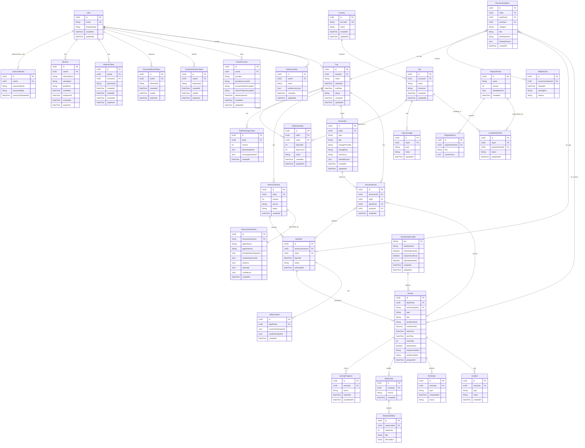

# Diseño de Base de Datos — Jaarvi (Propuesta v1)

## 1) Resumen de enfoque

- **Base de datos recomendada**: **PostgreSQL**.
- **Acceso/ORM (patrón obligatorio)**: **Prisma**.
  - **Single Source of Truth**: `prisma/schema.prisma` define modelos y relaciones.
  - **Convención de nombres**: **Modelos en PascalCase**, **campos en camelCase** (según *Database Patterns*).
  - **Cambios de esquema**: siempre vía **migrations** (Prisma).
- **Modelo de datos**: relacional (normalizado) + uso controlado de **JSONB** para snapshots/auditabilidad de IA (inputs, contexto, citas, rationale), manteniendo campos “hot” como columnas indexables.

## 2) ERD (Mermaid)

## 3) Especificación de tablas (Prisma-friendly)

> Nota: se describe el modelo lógico. La implementación final debe vivir en `prisma/schema.prisma` con modelos PascalCase y campos camelCase.

### 3.1 User
- **Propósito**: identidad del viajero (MVP: un propietario por viaje).
- **Campos**:
  - `id` UUID PK
  - `email` string UK (único)
  - `displayName` string
  - `emailVerifiedAt` datetime (nullable)
  - `status` enum-like string: `active|disabled` (CHECK/enum) (MVP: `active`)
  - `createdAt` datetime (default now)
  - `updatedAt` datetime (auto-update)
- **Índices**: `email` único.

### 3.1.1 UserCredential (login con email/contraseña)
- **Propósito**: credenciales para autenticación (nunca almacenar contraseña en texto plano).
- **Campos**:
  - `id` UUID PK
  - `userId` UUID FK → User (único; 1–1)
  - `passwordHash` string (hash seguro)
  - `passwordAlgo` string (p. ej. `argon2id`) (TBD)
  - `passwordUpdatedAt` datetime
- **Restricciones**:
  - `(userId)` único (un set de credenciales por usuario)
- **Índices**: `userId` único.
- **Notas de seguridad**:
  - Guardar **hash** (y parámetros del algoritmo si aplica); nunca guardar la contraseña.
  - En caso de OAuth-only, `UserCredential` puede no existir.

### 3.1.2 EmailVerificationToken (verificación de email)
- **Propósito**: confirmar propiedad del email.
- **Campos**:
  - `id` UUID PK
  - `userId` UUID FK → User
  - `tokenHash` string (hash del token)
  - `createdAt` datetime
  - `usedAt` datetime (nullable)
  - `expiresAt` datetime
- **Índices**:
  - `(userId, createdAt desc)`
  - `tokenHash` (si se busca por token; recomendado único) (TBD)

### 3.1.3 PasswordResetToken (recuperación de contraseña)
- **Propósito**: permitir reset de contraseña de forma segura.
- **Campos**:
  - `id` UUID PK
  - `userId` UUID FK → User
  - `tokenHash` string
  - `createdAt` datetime
  - `usedAt` datetime (nullable)
  - `expiresAt` datetime
- **Índices**:
  - `(userId, createdAt desc)`
  - `tokenHash` (si se busca por token; recomendado único) (TBD)

### 3.1.4 Session (sesiones/dispositivos)
- **Propósito**: modelar sesiones activas por dispositivo para logout y seguridad.
- **Campos**:
  - `id` UUID PK
  - `userId` UUID FK → User
  - `deviceName` string (nullable)
  - `userAgent` string (nullable)
  - `ipAddress` string (nullable)
  - `createdAt` datetime
  - `lastSeenAt` datetime (nullable)
  - `revokedAt` datetime (nullable)
  - `expiresAt` datetime
- **Índices**:
  - `(userId, expiresAt desc)`
  - `(userId, revokedAt)`

### 3.1.5 RefreshToken (rotación de tokens)
- **Propósito**: refresh tokens hashados y ligados a una sesión (rotación y revocación).
- **Campos**:
  - `id` UUID PK
  - `userId` UUID FK → User
  - `sessionId` UUID FK → Session
  - `tokenHash` string (hash del refresh token)
  - `createdAt` datetime
  - `rotatedAt` datetime (nullable)
  - `revokedAt` datetime (nullable)
  - `expiresAt` datetime
- **Restricciones**:
  - `tokenHash` único (recomendado)
- **Índices**:
  - `tokenHash` único
  - `(sessionId, expiresAt desc)`
  - `(userId, expiresAt desc)`

### 3.1.6 OAuthAccount (login social)
- **Propósito**: asociar una cuenta externa (Google/Apple/etc.) con un usuario.
- **Campos**:
  - `id` UUID PK
  - `userId` UUID FK → User
  - `provider` string (p. ej. `google`, `apple`)
  - `providerAccountId` string
  - `accessTokenEncrypted` string (nullable) (si se requiere) (TBD)
  - `refreshTokenEncrypted` string (nullable) (si se requiere) (TBD)
  - `tokenExpiresAt` datetime (nullable)
  - `createdAt`, `updatedAt`
- **Restricciones**:
  - `(provider, providerAccountId)` único
- **Índices**:
  - `(userId, provider)`
  - `(provider, providerAccountId)` único

### 3.2 PreferenceSet
- **Propósito**: preferencias reutilizables del usuario (intereses, estilo, restricciones).
- **Campos**:
  - `id` UUID PK
  - `userId` UUID FK → User
  - `name` string (p. ej. “Backpacking”, “Family Trip”)
  - `preferencesJson` JSONB (estructura flexible controlada por app)
  - `createdAt`, `updatedAt`
- **Índices**: `(userId, createdAt desc)`.

### 3.3 Trip
- **Propósito**: viaje (draft/active/completed).
- **Campos**:
  - `id` UUID PK
  - `ownerId` UUID FK → User
  - `name` string (nullable)
  - `startDate`, `endDate` datetime
  - `status` enum-like string: `draft|active|completed` (CHECK/enum)
  - `createdAt`, `updatedAt`
- **Restricciones**:
  - `startDate <= endDate`
- **Índices**: `(ownerId, status)`, `(ownerId, startDate)`.

### 3.4 Country + City + CityCoverage
- **Country**: catálogo de países.
- **City**: catálogo de ciudades, siempre asociadas a un país.
- **CityCoverage**: nivel de cobertura por ciudad (playbooks fuertes vs limitada) para MVP escalable.
- **Campos clave**:
  - `Country.isoCode`: código ISO (p. ej. `CO`, `ES`, `FR`).
  - `City.timezone`: requerido para cálculos de “Today mode”.
  - `CityCoverage.level`: `high|medium|low` (CHECK/enum).
- **Índices**:
  - `Country(isoCode)` único.
  - `City(countryId, name)` único (evita duplicados por país).
  - `CityCoverage(cityId)`.

### 3.5 TripDestination
- **Propósito**: destinos seleccionados en el viaje y su orden/duración.
- **Campos**:
  - `tripId` FK, `cityId` FK
  - `dayOrder` int (orden)
  - `daysCount` int (>0)
- **Restricciones**:
  - `daysCount > 0`
  - `(tripId, dayOrder)` único
- **Índices**: `(tripId, dayOrder)`.

### 3.6 TripPlanningContext (snapshot IA)
- **Propósito**: snapshot reproducible para planificación (inputs + cobertura).
- **Campos**:
  - `tripId` FK
  - `version` int (incremental)
  - `inputsSnapshot` JSONB (preferencias+restricciones resueltas)
  - `coverageSnapshot` JSONB (nivel de cobertura por destino/playbook)
  - `createdAt`
- **Índices**: `(tripId, version desc)`.

### 3.7 ItineraryVersion + DayPlan + Activity
- **ItineraryVersion**: versionado de itinerarios (soporta IA + edición manual).
  - `source`: `ai|manual|mixed`
  - `status`: `draft|ready|archived`
- **DayPlan**: un día de itinerario, referenciado por fecha + **ciudad** (el día se ejecuta en una ciudad determinada).
  - `dayDate` datetime (normalizado a zona del destino/usuario) (TBD)
  - `refreshedAt` para “start-of-day refresh”
- **Activity**: actividades ordenadas con bloque de tiempo y tipo.
  - `type`: `transfer|visit|meal|freeTime|booking|other`
  - `sortOrder` para orden en UI
- **Regla (configurable)**: cada `DayPlan` debe incluir las actividades obligatorias definidas por configuración (seed) en `ActivityTypeConfig`. `sleep` es solo un ejemplo; el sistema debe soportar otros tipos obligatorios sin cambios de esquema. Para cada actividad obligatoria, el sistema debe indicar si está **pendiente** o **preparada** y enlazar evidencia (documento) o una nota.
- **Restricciones**:
  - `(itineraryVersionId, dayDate)` único (si aplica por zona) (TBD)
  - `startTime < endTime` para Activity **cuando ambos existan**
  - `startTime` y `endTime` pueden ser null para actividades no atadas a un bloque horario (ej.: una actividad obligatoria “por definir” o en tránsito).
  - `(dayPlanId, sortOrder)` único
- **Índices**:
  - DayPlan: `(itineraryVersionId, dayDate)`, `(cityId, dayDate)`
  - Activity: `(dayPlanId, sortOrder)`, `(dayPlanId, startTime)`
  - Activity (pending): `(dayPlanId, isMandatory, readinessStatus)`

#### 3.7.1 ActivityTypeConfig (configuración de actividades)
- **Propósito**: definir tipos estables de actividad y reglas globales (obligatorias por día) vía seed/config.
- **Campos**:
  - `key` PK string (ej.: `sleep`)
  - `displayName` string (ej.: “Sleep”)
  - `isMandatoryDaily` boolean (true si el tipo es obligatorio por día)
  - `requiresEvidence` boolean (MVP recomendado: false; evidencia opcional via documento o nota)
  - `allowNotNeeded` boolean (si el tipo puede marcarse como no requerido)
  - `createdAt`, `updatedAt`

#### 3.7.2 Campos adicionales en Activity para actividades obligatorias
- **activityTypeKey**: FK a `ActivityTypeConfig.key` para tipificar de forma estable.
- **isMandatory**: boolean (true si el tipo es obligatorio por día).
- **readinessStatus**: `pending|planned|prepared|notNeeded`.
- **readinessNote**: texto corto para evidencia manual (ej.: “friend house”, “overnight flight/bus/train”, etc.).
- **preparedAt**: cuándo se marcó como preparado.

### 3.8 ItineraryGeneration (IA: auditabilidad)
- **Propósito**: registrar *cómo* y *por qué* se generó un itinerario.
- **Campos**:
  - `itineraryVersionId` FK (1–1)
  - `agentName`, `agentVersion` (TBD para identificar modelos/agentes)
  - `promptInputsSnapshot` JSONB (trip + preferencias)
  - `contextInputsUsed` JSONB (vuelos, clima, horarios, etc. cuando exista)
  - `citations` JSONB (lista de fuentes; URLs o referencias de proveedor) (TBD)
  - `rationale` JSONB (estructura por día/actividad con “why”)
  - `confidence` JSONB (por día/actividad)
  - `createdAt`
- **Índices**: `itineraryVersionId` único.

### 3.9 DailyContext
- **Propósito**: snapshot del contexto del día (restricciones y señales como clima).
- **Campos**:
  - `dayPlanId` FK
  - `constraintsSnapshot` JSONB
  - `weatherSnapshot` JSONB (si existe integración) (TBD)
  - `createdAt`
- **Índices**: `(dayPlanId, createdAt desc)`.

### 3.10 Execution (ActivityProgress, StepGuide, Reminder, Incident)
- **ActivityProgress**: estado de ejecución por actividad.
  - `status`: `notStarted|inProgress|done|skipped`
- **StepGuide / StepGuideStep**: pasos/guías (playbooks) enlazados a una actividad.
- **Reminder**: recordatorios (leave time, cierre, próximo traslado).
  - `type`: `leaveTime|closingTime|transfer|custom` (TBD)
  - `status`: `scheduled|sent|cancelled|failed`
- **Incident**: registro simple de incidentes (opcional).
- **Índices**:
  - ActivityProgress: `activityId` único
  - Reminder: `(activityId, scheduledAt)`, `(scheduledAt, status)`
  - StepGuide: `activityId` único

### 3.11 Document vault (Document, DocumentLink)
- **Regla de seguridad**:
  - **DB guarda metadata**.
  - El archivo vive en **object storage** (S3/GCS/etc.) referenciado por `storageProvider + storageKey`.
  - `checksum` para integridad.
  - `metadataJson` para tags/proveedor/relevancia temporal.
- **DocumentLink** permite enlazar un documento a **múltiples** entidades (trip/day/activity).
- **Índices**:
  - Document: `(tripId, createdAt desc)`
  - DocumentLink: `(tripId, dayPlanId, activityId)`, `(documentId)`

### 3.12 Playbooks y cobertura (PlaybookPack, PlaybookEntry, LocalAdvicePack)
- **PlaybookPack**: paquete versionado de conocimiento/guías.
- **LocalAdvicePack**: publicación de un pack para un destino (phased coverage).
- **Índices**:
  - LocalAdvicePack: `(cityId, status)`, `(cityId, publishedAt desc)`
  - PlaybookEntry: `(playbookPackId, key)` único

### 3.13 Afiliados (Recommendation, AffiliateClick)
- **Recommendation**: recomendación contextual (no intrusiva).
- **AffiliateClick**: atribución mínima por clic.
- **Índices**:
  - Recommendation: `(tripId, createdAt desc)`, `(dayPlanId)`, `(activityId)`
  - AffiliateClick: `(recommendationId, clickedAt desc)`

## 4) Índices y plan de performance (hot queries)

### Query caliente 1: “Today Mode”
Objetivo: cargar la pantalla “Hoy” con lo mínimo necesario.
- Inputs típicos: `userId`, `tripId (active)`, fecha actual y destino.
- Datos necesarios:
  - `Trip (active)` + `ItineraryVersion (ready/latest)` + `DayPlan (today)`
  - `Activity` ordenadas por `sortOrder`
  - `ActivityProgress` para marcar completadas
  - `Reminder` relevantes
  - `DocumentLink` + `Document` para documentos del día/actividad
- Índices clave: `(ownerId, status)`, DayPlan `(itineraryVersionId, dayDate)`, Activity `(dayPlanId, sortOrder)`.

### Query caliente 1.1: “Pendientes obligatorios del día”
Objetivo: mostrar rápidamente si el día tiene actividades obligatorias pendientes.
- Input: `dayPlanId`
- Query conceptual: `Activity` where `dayPlanId = ? AND isMandatory = true`
  - si `readinessStatus != prepared`, mostrar como pendiente
  - si falta algún tipo obligatorio, el sistema debe auto-crearlo según `ActivityTypeConfig` (TBD enforcement)
- Índices clave: `(dayPlanId, isMandatory, readinessStatus)` y/o `(dayPlanId, activityTypeKey)`.

### Query caliente 2: “Editar itinerario”
- Cargar `DayPlan + Activity` y persistir cambios frecuentes.
- Índices clave: Activity `(dayPlanId, sortOrder)` y `updatedAt` en entidades editables.

### Query caliente 3: “Auditoría IA”
- Mostrar “por qué” y fuentes del itinerario.
- Índices clave: ItineraryGeneration `itineraryVersionId` único.

### Query caliente 4: “Login y sesión”
- **Login**: buscar usuario por `email`, verificar hash de contraseña, crear `Session` + `RefreshToken`.
- **Refresh**: buscar `RefreshToken` por `tokenHash`, validar expiración/revocación, rotar token, actualizar `Session.lastSeenAt`.
- Índices clave: `User.email` único, `RefreshToken.tokenHash` único, `(sessionId, expiresAt desc)`.

### Particionado (cuando crezca)
- **Candidatos**: `AffiliateClick`, `Incident` por mes (por `clickedAt` / `createdAt`) si el volumen crece.
- **MVP**: no necesario.

## 5) Modelado específico de IA (reproducibilidad y trazabilidad)

- **Snapshots obligatorios**:
  - `TripPlanningContext.inputsSnapshot`: inputs resueltos (preferencias, restricciones, fechas).
  - `ItineraryGeneration.promptInputsSnapshot`: lo enviado al agente/modelo.
  - `ItineraryGeneration.contextInputsUsed`: qué datos externos se usaron (vuelos, clima, horarios) cuando aplique.
- **Rationale (“why”)**:
  - Guardar una estructura por `dayPlanId/activityId` para explicar decisiones (tiempo/costo/distancia/dinámica local).
- **Confianza**:
  - Guardar señales por día/actividad para ayudar a UI a invitar edición manual cuando la confianza sea baja.
- **Citas/fuentes**:
  - JSONB con lista de referencias (URL o provider ref). Si no se dispone aún, dejar **TBD** y guardar al menos `providerName` + `retrievedAt`.

## 6) Document vault (seguridad)

- **DB**: metadata + referencias.
- **Object storage**: archivo real.
- **Encriptación**: **TBD** (depende del proveedor), pero el modelo deja lugar para:
  - `storageProvider`, `storageKey`, `checksum`
  - `metadataJson` con flags de sensibilidad y disponibilidad offline (futuro).

## 7) Recordatorios / scheduling

- `Reminder` modela el ciclo de vida: `scheduled` → `sent` o `cancelled/failed`.
- La ejecución real (jobs) depende de infraestructura (TBD), pero el DB permite reintentos y auditoría.

## 8) Tracking afiliados

- Mínimo viable: `AffiliateClick`.
- Extensión futura: `AffiliateImpression` (si se quiere medir exposición) (TBD).

## 9) Ciclo de vida de datos

- **Soft delete**: **TBD** (no definido explícitamente en Database Patterns). Recomendación segura:
  - incorporar `deletedAt` en entidades sensibles (`Trip`, `ItineraryVersion`, `Document`) si se requiere recuperación.
  - si no, hard delete controlado con restricciones y cascadas cuidadosamente.
- **Retención**:
  - clicks afiliados: retención configurable (TBD).
  - incidentes: opcional y con retención corta (TBD).
  - tokens de verificación/reset: retención corta (p. ej. 7–30 días) (TBD).
  - sesiones: retención por política (p. ej. 90 días) (TBD).

## 10) Ejemplos (mínimo 3)

### 10.1 Viaje con 2 destinos y 3 días
- `Trip`: “Europa express”, `startDate=2026-05-01`, `endDate=2026-05-03`, `status=draft`
- `TripDestination`:
  - (dayOrder=1) París (FR), daysCount=2
  - (dayOrder=2) Bruselas (BE), daysCount=1
- `ItineraryVersion` (version=1, source=ai, status=ready)
- `DayPlan`:
  - 2026-05-01 París (ciudad)
  - 2026-05-02 París (ciudad)
  - 2026-05-03 Bruselas (ciudad)
- `Activity` (ejemplo día 1):
  - 09:00–10:00 “Airport → Hotel” (transfer)
  - 11:00–13:00 “Louvre visit” (visit)

### 10.2 ItineraryGeneration (metadata IA)
- `agentName`: “itinerary-agent”
- `agentVersion`: “v1”
- `promptInputsSnapshot`: { tripDates, preferences, constraints }
- `contextInputsUsed`: { flightPrices, flightSchedules, weatherSummary }
- `rationale`: { dayPlans: [{ activityId, why: { time, cost, distance, localDynamics } }] }
- `confidence`: { activityId: "medium" }
- `citations`: [{ source: "provider", url: "TBD", retrievedAt }]

### 10.3 Documento ligado a una actividad
- `Document`: “Museum ticket”, type=ticket, storageProvider=s3, storageKey=..., checksum=...
- `DocumentLink`: tripId + activityId (Louvre visit) para acceso contextual desde “Today”.

### 10.4 Login (email/contraseña) + sesión
- `User`: email=`user@mail.com`, status=`active`, emailVerifiedAt=`2026-01-10T...Z`
- `UserCredential`: passwordHash=`<argon2id-hash>`, passwordAlgo=`argon2id`, passwordUpdatedAt=`...`
- `Session`: deviceName=`Pixel 8`, createdAt=`...`, expiresAt=`...`
- `RefreshToken`: tokenHash=`<sha256(token)>`, sessionId=`...`, expiresAt=`...`

