# Jaarvi - Wireframes & User Flow

> **Product & UX Design Document**  
> **Version**: 1.0 MVP (Manual-first approach)  
> **Created**: January 2026

---

## Table of Contents

1. [User Flow Overview](#user-flow-overview)
2. [Wireframe Screens](#wireframe-screens)
   - **Phase 1 (MVP) - Core Screens**
   - [Screen 1: Trip List (Countries View)](#screen-1-trip-list-countries-view)
   - [Screen 2: Trip Detail (Cities List)](#screen-2-trip-detail-cities-list)
   - [Screen 3: City Itinerary (Days Tabs View)](#screen-3-city-itinerary-days-tabs-view)
   - [Screen 4: Day Activities (Edit Mode)](#screen-4-day-activities-edit-mode---reordering)
   - [Screen 5: Add/Edit Activity Modal](#screen-5-addedit-activity-modal)
   - [Screen 6: Activity Detail (Execution View)](#screen-6-activity-detail-execution-view)
   - [Screen 7: Activity Execution Pipeline (In Progress)](#screen-7-activity-execution-pipeline-in-progress)
   - [Screen 8: Activity Execution - Navigation Mode](#screen-8-activity-execution---navigation-mode)
   - [Screen 9: Activity Execution - Problem Resolution](#screen-9-activity-execution---problem-resolution)
   - [Screen 10: Today View (Active Trip Execution)](#screen-10-today-view-active-trip-execution)
   - [Screen 11: Document Vault](#screen-11-document-vault-linked-to-trip)
   - [Screen 12: Create Trip Flow (Step 1)](#screen-12-create-trip-flow-step-1-basic-info)
   - [Screen 13: Create Trip Flow (Step 2)](#screen-13-create-trip-flow-step-2-add-destinations)
   - [Screen 14: Create Trip Flow (Step 3)](#screen-14-create-trip-flow-step-3-preferences)
   - [Screen 15: Login/Register](#screen-15-loginregister)
   - [Screen 16: Profile Settings](#screen-16-profile-settings)
   - [Screen 23: Mandatory Activity Alert](#screen-23-mandatory-activity-alert)
   - [Screen 24: Push Notification Template](#screen-24-push-notification-template)
   - [Screen 25: Document Upload Modal](#screen-25-document-upload-modal)
   - [Screen 33: App Settings](#screen-33-app-settings)
   - **Phase 2 (AI Features)**
   - [Screen 17: AI Itinerary Generation](#screen-17-ai-itinerary-generation)
   - [Screen 18: Activity Detail with AI Rationale](#screen-18-activity-detail-with-ai-rationale)
   - [Screen 19: AI Activity Suggestions Modal](#screen-19-ai-activity-suggestions-modal)
   - [Screen 20: Itinerary Optimization Comparison](#screen-20-itinerary-optimization-comparison)
   - [Screen 21: AI Audit Trail Detail](#screen-21-ai-audit-trail-detail)
   - [Screen 22: Daily Plan Refresh Modal](#screen-22-daily-plan-refresh-modal)
   - [Screen 26: Affiliate Recommendation Card](#screen-26-affiliate-recommendation-card)
   - [Screen 34: Restore Trip Dialog](#screen-34-restore-trip-dialog)
   - **Phase 3 (Advanced)**
   - [Screen 27: Trip Collaboration](#screen-27-trip-collaboration)
   - [Screen 28: Conflict Resolution Dialog](#screen-28-conflict-resolution-dialog)
   - [Screen 29: Offline Mode Indicator](#screen-29-offline-mode-indicator)
   - [Screen 30: Embedded Map View](#screen-30-embedded-map-view)
   - [Screen 31: Personalized Recommendations Feed](#screen-31-personalized-recommendations-feed)
   - [Screen 32: In-App Booking Flow](#screen-32-in-app-booking-flow)
3. [Interaction Patterns](#interaction-patterns)
4. [Design Decisions & Rationale](#design-decisions--rationale)

---

## User Flow Overview

### High-Level Navigation Hierarchy

```
Login/Register
    ↓
Trip List (Countries)
    ├→ Trip Detail (Cities)
    │    ├→ City Itinerary (Days)
    │    │    ├→ Day Activities (Edit Mode)
    │    │    │    └→ Add/Edit Activity Modal
    │    │    └→ Activity Detail
    │    │         ├→ Activity Execution Pipeline
    │    │         │    ├→ Navigation Mode
    │    │         │    └→ Problem Resolution
    │    │         └→ Document Vault
    │    └→ Document Vault
    └→ Create Trip Flow (3 steps)
         └→ Trip Detail

Bottom Nav Access (Any Time):
    ├→ Home (Trip List)
    ├→ Trips (Trip List)
    ├→ Today (Today View)
    │    └→ Activity Execution Pipeline
    ├→ Documents (Document Vault)
    └→ Profile
```

### Complete Navigation Flow Diagram

```mermaid
graph TB
    Start([User Opens App]) --> LoginScreen[Screen 15: Login/Register]
    LoginScreen --> TripList[Screen 1: Trip List<br/>Countries View]
    
    %% Main Trip Flow
    TripList -->|Tap Trip Card| TripDetail[Screen 2: Trip Detail<br/>Cities List]
    TripList -->|Create New Trip| CreateStep1[Screen 12: Create Trip<br/>Step 1: Basic Info]
    
    %% Create Trip Flow
    CreateStep1 -->|Next| CreateStep2[Screen 13: Create Trip<br/>Step 2: Add Destinations]
    CreateStep2 -->|Back| CreateStep1
    CreateStep2 -->|Next| CreateStep3[Screen 14: Create Trip<br/>Step 3: Preferences]
    CreateStep3 -->|Back| CreateStep2
    CreateStep3 -->|Create Trip| TripDetail
    CreateStep1 -->|Cancel| TripList
    CreateStep2 -->|Cancel| TripList
    CreateStep3 -->|Cancel| TripList
    
    %% Trip Detail Flow
    TripDetail -->|Back| TripList
    TripDetail -->|Tap City Card| CityItinerary[Screen 3: City Itinerary<br/>Days Tabs View]
    TripDetail -->|View Documents| DocVault[Screen 11: Document Vault]
    TripDetail -->|Generate with AI| AIGeneration[Screen 17: AI Itinerary<br/>Generation]
    TripDetail -->|Collaborators| Collab[Screen 27: Trip<br/>Collaboration]
    
    %% AI Generation Flow (Phase 2)
    AIGeneration -->|Generated| CityItinerary
    AIGeneration -->|Cancel| TripDetail
    
    %% City Itinerary Flow
    CityItinerary -->|Back| TripDetail
    CityItinerary -->|Tap Activity| ActivityDetail[Screen 6: Activity Detail<br/>Execution View]
    CityItinerary -->|Edit Mode| DayActivities[Screen 4: Day Activities<br/>Edit Mode - Reordering]
    CityItinerary -->|Swipe Tabs| CityItinerary
    CityItinerary -->|Optimize| OptimizeView[Screen 20: Optimization<br/>Comparison]
    CityItinerary -->|AI Suggestions| AISuggestions[Screen 19: AI Suggestions<br/>Modal]
    
    %% AI Optimization Flow (Phase 2)
    OptimizeView -->|Apply| CityItinerary
    OptimizeView -->|Keep Original| CityItinerary
    AISuggestions -->|Add Selected| CityItinerary
    AISuggestions -->|Skip| CityItinerary
    
    %% Day Activities Edit Flow
    DayActivities -->|Done/Cancel| CityItinerary
    DayActivities -->|Add Activity| AddEditModal[Screen 5: Add/Edit Activity<br/>Modal]
    DayActivities -->|Edit Activity| AddEditModal
    AddEditModal -->|Save| DayActivities
    AddEditModal -->|Cancel| DayActivities
    
    %% Activity Detail Flow
    ActivityDetail -->|Back| CityItinerary
    ActivityDetail -->|Start Activity| ExecPipeline[Screen 7: Activity Execution<br/>Pipeline - In Progress]
    ActivityDetail -->|View Documents| DocVault
    ActivityDetail -->|Navigate| NavMode[Screen 8: Activity Execution<br/>Navigation Mode]
    ActivityDetail -->|View AI Rationale| AIRationale[Screen 18: AI Rationale<br/>Detail]
    ActivityDetail -->|View Affiliate| AffiliateCard[Screen 26: Affiliate<br/>Recommendation]
    
    %% AI Rationale Flow (Phase 2)
    AIRationale -->|Back| ActivityDetail
    AIRationale -->|View Audit| AIAudit[Screen 21: AI Audit<br/>Trail]
    AIAudit -->|Back| AIRationale
    
    %% Affiliate Flow (Phase 2)
    AffiliateCard -->|Book| BookingFlow[Screen 32: In-App<br/>Booking Flow]
    AffiliateCard -->|Dismiss| ActivityDetail
    BookingFlow -->|Complete| DocVault
    BookingFlow -->|Cancel| ActivityDetail
    
    %% Activity Execution Pipeline Flow
    ExecPipeline -->|Complete| CityItinerary
    ExecPipeline -->|Navigation Step| NavMode
    ExecPipeline -->|Help| ProblemRes[Screen 9: Activity Execution<br/>Problem Resolution]
    ExecPipeline -->|Pause| ActivityDetail
    ExecPipeline -->|Back| ActivityDetail
    
    %% Navigation Mode Flow
    NavMode -->|Arrived| ExecPipeline
    NavMode -->|Help| ProblemRes
    NavMode -->|Back| ExecPipeline
    NavMode -->|Open Full Map| EmbeddedMap[Screen 30: Embedded<br/>Map View]
    EmbeddedMap -->|External| ExternalMaps[External Maps App]
    EmbeddedMap -->|Back| NavMode
    ExternalMaps -->|Return| NavMode
    
    %% Problem Resolution Flow
    ProblemRes -->|Apply Solution| ExecPipeline
    ProblemRes -->|Cancel| ExecPipeline
    ProblemRes -->|Show Plan B| ActivityDetail
    
    %% Document Vault Flow
    DocVault -->|Back| TripDetail
    DocVault -->|View Document| DocViewer[Document Viewer]
    DocVault -->|Add Document| DocUpload[Screen 25: Document<br/>Upload Modal]
    DocViewer -->|Close| DocVault
    DocUpload -->|Save| DocVault
    DocUpload -->|Cancel| DocVault
    
    %% Today View Flow (Bottom Nav)
    TripList -.->|Bottom Nav: Today| TodayView[Screen 10: Today View<br/>Active Trip Execution]
    TripDetail -.->|Bottom Nav: Today| TodayView
    CityItinerary -.->|Bottom Nav: Today| TodayView
    
    TodayView -->|Tap Current Activity| ExecPipeline
    TodayView -->|Tap Next Activity| ActivityDetail
    TodayView -->|Navigate| NavMode
    TodayView -->|Morning Refresh| DailyRefresh[Screen 22: Daily Plan<br/>Refresh Modal]
    TodayView -->|Mandatory Alert| MandatoryAlert[Screen 23: Mandatory<br/>Activity Alert]
    TodayView -.->|Bottom Nav: Home| TripList
    
    %% Daily Planning Modals (Phase 2)
    DailyRefresh -->|Accept All| TodayView
    DailyRefresh -->|Review| CityItinerary
    MandatoryAlert -->|Resolve| ActivityDetail
    MandatoryAlert -->|Remind Later| TodayView
    
    %% Bottom Navigation (Available from most screens)
    CityItinerary -.->|Bottom Nav: Documents| DocVault
    ActivityDetail -.->|Bottom Nav: Documents| DocVault
    TodayView -.->|Bottom Nav: Documents| DocVault
    TripList -.->|Bottom Nav: Profile| ProfileSettings[Screen 16: Profile<br/>Settings]
    TripDetail -.->|Bottom Nav: Profile| ProfileSettings
    
    %% Profile & Settings Flow
    ProfileSettings -->|Settings| AppSettings[Screen 33: App Settings]
    ProfileSettings -->|Back| TripList
    AppSettings -->|Backup/Restore| RestoreDialog[Screen 34: Restore<br/>Trip Dialog]
    AppSettings -->|Back| ProfileSettings
    RestoreDialog -->|Back| AppSettings
    
    %% Collaboration Flow (Phase 3)
    Collab -->|Conflict| ConflictRes[Screen 28: Conflict<br/>Resolution]
    Collab -->|Back| TripDetail
    ConflictRes -->|Resolved| Collab
    
    %% Offline Indicator (Phase 3)
    TodayView -.->|Offline| OfflineMode[Screen 29: Offline<br/>Mode Indicator]
    OfflineMode -.->|Online| TodayView
    
    %% Personalized Feed (Phase 3)
    TripList -->|For You| PersonalizedFeed[Screen 31: Personalized<br/>Recommendations]
    PersonalizedFeed -->|Back| TripList
    PersonalizedFeed -->|Add to Trip| CityItinerary
    
    %% Push Notifications (Screen 24 - External trigger)
    Notification([Screen 24: Push<br/>Notification]) -.->|Tap| TodayView
    Notification -.->|Tap Activity| ActivityDetail
    Notification -.->|Tap Document| DocVault
    
    %% Styling
    classDef planningPhase fill:#e1f5ff,stroke:#0288d1,stroke-width:2px
    classDef executionPhase fill:#fff3e0,stroke:#f57c00,stroke-width:2px
    classDef modalScreen fill:#f3e5f5,stroke:#7b1fa2,stroke-width:2px
    classDef navScreen fill:#e8f5e9,stroke:#388e3c,stroke-width:2px
    classDef aiPhase fill:#e8f5e9,stroke:#43a047,stroke-width:2px
    classDef phase3 fill:#fff8e1,stroke:#ffa000,stroke-width:2px
    classDef external fill:#fce4ec,stroke:#c2185b,stroke-width:2px,stroke-dasharray: 5 5
    
    class TripList,TripDetail,CityItinerary,DayActivities,CreateStep1,CreateStep2,CreateStep3 planningPhase
    class ActivityDetail,ExecPipeline,TodayView executionPhase
    class AddEditModal,ProblemRes,DocViewer,DocUpload,MandatoryAlert modalScreen
    class NavMode,DocVault,ProfileSettings,AppSettings navScreen
    class AIGeneration,AISuggestions,OptimizeView,AIRationale,AIAudit,DailyRefresh,AffiliateCard,BookingFlow,RestoreDialog aiPhase
    class Collab,ConflictRes,OfflineMode,EmbeddedMap,PersonalizedFeed phase3
    class ExternalMaps,LoginScreen,Start,Notification external
```



### Legend

**Screen Types:**
- 🔵 **Planning Phase** (Blue): Trip creation, city planning, itinerary editing (Screens 1-5, 12-14)
- 🟠 **Execution Phase** (Orange): Active trip execution, real-time guidance (Screens 6-7, 10)
- 🟣 **Modal Screens** (Purple): Overlays for quick actions (Screens 5, 9, 23, 25)
- 🟢 **Navigation/Utility** (Green): Document vault, settings, navigation (Screens 8, 11, 16, 33)
- 💚 **AI Features** (Light Green): Phase 2 AI-powered screens (Screens 17-22, 26, 34)
- 🟡 **Phase 3 Advanced** (Amber): Collaboration, offline, maps (Screens 27-32)
- 🔴 **External** (Red, dashed): External apps, login, notifications (Screen 15, 24)

**Navigation Types:**
- **Solid arrows (→)**: Primary navigation (taps, buttons)
- **Dotted arrows (⋯→)**: Bottom navigation shortcuts or background processes
- **Back arrows**: Implicit back navigation

---

## Wireframe Screens

### Screen 1: Trip List (Countries View)

```
┌────────────────────────────────────────┐
│  ☰  Jaarvi                    👤  🔔   │ Header
├────────────────────────────────────────┤
│                                        │
│  📍 My Trips                           │
│  ────────────────────────────────────  │
│                                        │
│  ┌──────────────────────────────────┐ │
│  │ 🇫🇷 France & Italy Adventure     │ │ Trip Card
│  │ ─────────────────────────────    │ │
│  │ 📅 Mar 15 - Mar 28, 2026         │ │
│  │ 🏙️  Paris → Rome → Florence      │ │
│  │ ⏱️  14 days  •  💰 $2,500        │ │
│  │                                  │ │
│  │ [▶ Continue Trip]     [🗑️]       │ │
│  └──────────────────────────────────┘ │
│                                        │
│  ┌──────────────────────────────────┐ │
│  │ 🇯🇵 Japan Spring Tour           │ │
│  │ ─────────────────────────────    │ │
│  │ 📅 Apr 5 - Apr 19, 2026          │ │
│  │ 🏙️  Tokyo → Kyoto → Osaka        │ │
│  │ ⏱️  15 days  •  💰 $3,200        │ │
│  │                                  │ │
│  │ [📝 Plan Trip]        [🗑️]       │ │
│  └──────────────────────────────────┘ │
│                                        │
│  ┌──────────────────────────────────┐ │
│  │ 🇲🇽 Mexico City Week            │ │
│  │ ─────────────────────────────    │ │
│  │ 📅 May 10 - May 17, 2026         │ │
│  │ 🏙️  Mexico City                  │ │
│  │ ⏱️  7 days   •  💰 $1,100        │ │
│  │                                  │ │
│  │ [📝 Plan Trip]        [🗑️]       │ │
│  └──────────────────────────────────┘ │
│                                        │
├────────────────────────────────────────┤
│         [➕ Create New Trip]           │ FAB
└────────────────────────────────────────┘
│  🏠  📋  📅  📄  👤                    │ Bottom Nav
└────────────────────────────────────────┘
```

**Key Elements:**
- **Trip Cards**: Show country flag, trip name, dates, cities sequence, duration, budget
- **Trip Status**: Visual indicator (▶ Continue for active, 📝 Plan for draft)
- **Quick Actions**: Continue/Plan and Delete per trip
- **Bottom Navigation**: Home, Trips, Today, Documents, Profile

#### Component Specifications

**Typography**:
- Screen Title ("My Trips"): 24sp, Bold, Primary Text Color
- Trip Name: 18sp, Semibold, Primary Text Color
- Trip Dates: 14sp, Regular, Secondary Text Color
- City Sequence: 14sp, Regular, Secondary Text Color
- Trip Stats (days/budget): 12sp, Regular, Tertiary Text Color

**Spacing**:
- Screen padding: 16dp horizontal, 12dp vertical
- Card margin: 12dp between cards, 16dp from screen edges
- Card internal padding: 16dp
- Button height: 44dp
- Icon size: 24dp (header), 20dp (inline with text)

**Colors** (Material Design 3 - Theme-aware):
- Primary: #2196F3 (Material Blue 500)
- Primary Variant: #1976D2 (Material Blue 700)
- Secondary: #FF9800 (Material Orange 500)
- Background: #FFFFFF (Light) / #121212 (Dark)
- Surface: #F5F5F5 (Light) / #1E1E1E (Dark)
- Error: #F44336 (Material Red 500)
- On Surface: #212121 (Light) / #E0E0E0 (Dark)

**Trip Card Dimensions**:
- Width: Match parent - 32dp (16dp margin each side)
- Min-height: 120dp
- Corner radius: 12dp
- Elevation: 2dp

**Status Badge**:
- Corner radius: 8dp
- Padding: 6dp horizontal, 4dp vertical
- Text size: 12sp
- Active trip: Green background (#E8F5E9), dark green text
- Draft trip: Orange background (#FFF3E0), dark orange text

**FAB (Floating Action Button)**:
- Size: 56dp diameter
- Position: Bottom-right, 16dp from edges
- Elevation: 6dp
- Icon size: 24dp

**Interactive States**:
- Default: Full opacity
- Hover/Focus: 90% opacity, elevation increase to 4dp
- Pressed: 70% opacity
- Disabled: 38% opacity, no interaction

**Bottom Navigation**:
- Height: 56dp
- Icon size: 24dp
- Selected indicator: 2dp underline, primary color
- Unselected icons: 60% opacity

**Animations**:
- Screen transitions: 300ms ease-in-out
- Card tap: Scale to 0.98 in 100ms
- FAB rotation: 200ms when tapped
- Bottom nav indicator slide: 200ms ease-out

**Error States**:
- Empty state: Centered illustration (200dp), message below
- Network error: Retry button below error message
- Delete confirmation: Bottom sheet modal

**Loading States**:
- Skeleton cards: 3 cards with shimmer animation (1500ms loop)
- Pull-to-refresh: Standard material indicator

---

### Screen 2: Trip Detail (Cities List)

```
┌────────────────────────────────────────┐
│  ←  France & Italy Adventure      ⋮    │ Header
├────────────────────────────────────────┤
│                                        │
│  📅 Mar 15 - Mar 28, 2026              │
│  💰 Budget: $2,500  •  ⏱️ 14 days      │
│  ────────────────────────────────────  │
│                                        │
│  🗺️ Destinations                       │
│                                        │
│  ┌──────────────────────────────────┐ │
│  │ 1️⃣ 🇫🇷 Paris                     │ │ City Card
│  │ ───────────────────────────────  │ │
│  │ 📅 Mar 15 - Mar 20 (5 days)      │ │
│  │                                  │ │
│  │ ✅ 5/5 days planned              │ │ Progress
│  │ ━━━━━━━━━━━━━━━━━━━━━━━━━━ 100% │ │
│  │                                  │ │
│  │ [View Itinerary →]               │ │
│  └──────────────────────────────────┘ │
│                                        │
│  ┌──────────────────────────────────┐ │
│  │ 2️⃣ 🇮🇹 Rome                      │ │
│  │ ───────────────────────────────  │ │
│  │ 📅 Mar 21 - Mar 24 (4 days)      │ │
│  │                                  │ │
│  │ ⚠️  2/4 days planned             │ │
│  │ ━━━━━━━━━━░░░░░░░░░░░░░░░░  50% │ │
│  │                                  │ │
│  │ [View Itinerary →]               │ │
│  └──────────────────────────────────┘ │
│                                        │
│  ┌──────────────────────────────────┐ │
│  │ 3️⃣ 🇮🇹 Florence                  │ │
│  │ ───────────────────────────────  │ │
│  │ 📅 Mar 25 - Mar 28 (4 days)      │ │
│  │                                  │ │
│  │ ❌ 0/4 days planned              │ │
│  │ ░░░░░░░░░░░░░░░░░░░░░░░░░░░  0%  │ │
│  │                                  │ │
│  │ [View Itinerary →]               │ │
│  └──────────────────────────────────┘ │
│                                        │
│  ┌──────────────────────────────────┐ │
│  │ ➕ Add Destination                │ │ Add City
│  └──────────────────────────────────┘ │
│                                        │
├────────────────────────────────────────┤
│  [📝 Edit Trip Info]  [🗑️ Delete Trip] │ Actions
└────────────────────────────────────────┘
```

**Key Elements:**
- **Trip Summary**: Dates, budget, total duration at top
- **City Cards**: Sequential numbered list, dates, planning progress
- **Progress Indicators**: Visual bar showing % of days planned
- **Status Icons**: ✅ Complete, ⚠️ Partial, ❌ Empty
- **Quick Nav**: Direct access to city itinerary

#### Component Specifications

**Typography**:
- Trip name (header): 20sp, Bold, Primary Text Color
- Trip stats: 14sp, Regular, Secondary Text Color
- Section header ("Destinations"): 18sp, Semibold, Primary Text Color
- City name: 16sp, Semibold, Primary Text Color
- City dates: 14sp, Regular, Secondary Text Color
- Progress status: 14sp, Regular (varies by status)

**Spacing**:
- Screen padding: 16dp horizontal
- Trip summary top margin: 12dp
- City card margin: 12dp between cards
- Card internal padding: 16dp
- Progress bar top margin: 12dp
- Action button area height: 56dp

**City Card Dimensions**:
- Width: Match parent - 32dp
- Min-height: 140dp
- Corner radius: 12dp
- Elevation: 2dp

**Progress Bar**:
- Height: 8dp
- Corner radius: 4dp
- Background: Light gray (#E0E0E0)
- Fill colors:
  - 100% complete: Green (#4CAF50)
  - 50-99%: Orange (#FF9800)
  - 1-49%: Orange (#FF9800)
  - 0%: Red indicator, empty bar

**Status Icons & Colors**:
- ✅ Complete (100%): Green (#4CAF50), 20dp
- ⚠️ Partial (1-99%): Orange (#FF9800), 20dp
- ❌ Empty (0%): Red (#F44336), 20dp

**Number Badges** (1️⃣, 2️⃣, 3️⃣):
- Size: 28dp diameter
- Background: Surface color with border
- Text: 14sp, Bold

**Add Destination Card**:
- Height: 56dp (smaller than city cards)
- Dashed border: 2dp, primary color
- Background: Transparent
- Icon size: 24dp

**Interactive States**:
- Card tap: Ripple effect, navigate to itinerary
- Button hover: 90% opacity, slight elevation increase
- Button pressed: 70% opacity

**Animations**:
- Progress bar fill: Animate from 0 to value over 800ms
- Card entry: Staggered fade-in (100ms delay between cards)
- Reorder: Smooth position transition 300ms

**Error States**:
- No destinations: Empty state illustration + "Add your first destination" CTA
- Failed to load: Error message with retry button

**Loading States**:
- Skeleton: Trip summary + 3 skeleton city cards
- Progress bar: Pulse animation while loading

---

### Screen 3: City Itinerary (Days Tabs View)

```
┌────────────────────────────────────────┐
│  ←  Paris                         ⋮    │ Header
├────────────────────────────────────────┤
│                                        │
│  📅 Mar 15 - Mar 20, 2026 (5 days)     │
│                                        │
│  ┌──┬──┬──┬──┬──────────────────────┐ │ Day Tabs
│  │D1│D2│D3│D4│D5                    │ │ (Horizontal
│  └──┴──┴──┴──┴──────────────────────┘ │  Scrollable)
│  ▬▬                                    │ Active Indicator
│                                        │
│  📆 Day 1 - Friday, Mar 15             │ Day Header
│  ────────────────────────────────────  │
│                                        │
│  Morning (8:00 - 12:00)                │ Time Block
│  ┌──────────────────────────────────┐ │
│  │ ✈️  Arrive at CDG Airport         │ │ Activity
│  │ ⏰ 08:30  •  📍 Terminal 2E       │ │ Card
│  │ 💰 Included  •  ⏱️ 30 min         │ │
│  │                                  │ │
│  │ 📎 Boarding Pass.pdf             │ │ Linked Doc
│  └──────────────────────────────────┘ │
│                                        │
│  ┌──────────────────────────────────┐ │
│  │ 🚆 Train to City Center          │ │
│  │ ⏰ 09:30  •  📍 RER B Line        │ │
│  │ 💰 €11  •  ⏱️ 45 min              │ │
│  │                                  │ │
│  │ ℹ️  Buy ticket at machine        │ │ Quick Tip
│  └──────────────────────────────────┘ │
│                                        │
│  ┌──────────────────────────────────┐ │
│  │ 🏨 Check-in at Hotel             │ │
│  │ ⏰ 11:00  •  📍 Marais District   │ │
│  │ 💰 Prepaid  •  ⏱️ 30 min          │ │
│  │                                  │ │
│  │ 📎 Reservation.pdf               │ │
│  └──────────────────────────────────┘ │
│                                       │
│  Afternoon (12:00 - 18:00)            │
│  ┌──────────────────────────────────┐ │
│  │ 🍽️  Lunch near Notre-Dame         │ │
│  │ ⏰ 12:30  •  📍 Île de la Cité    │ │
│  │ 💰 €25  •  ⏱️ 1h 30min            │ │
│  └──────────────────────────────────┘ │
│                                       │
│  ┌──────────────────────────────────┐ │
│  │ ➕ Add Activity                  │ │ Add Button
│  └──────────────────────────────────┘ │
│                                        │
├────────────────────────────────────────┤
│  💰 Day Total: €136  •  ⏱️ 8h 30min   │ Summary
└────────────────────────────────────────┘
```

**Key Elements:**
- **Horizontal Day Tabs**: Easy swipe between days
- **Time Blocks**: Morning, Afternoon, Evening sections
- **Activity Cards**: Icon, time, location, cost, duration
- **Linked Documents**: Quick access to tickets/reservations
- **Quick Tips**: Contextual advice inline
- **Day Summary**: Total cost and time at bottom
- **Add Activity**: Floating button per time block

#### Component Specifications

**Typography**:
- City name (header): 20sp, Bold, Primary Text Color
- Date range: 14sp, Regular, Secondary Text Color
- Day header: 16sp, Semibold, Primary Text Color
- Time block header: 14sp, Semibold, Secondary Text Color
- Activity title: 16sp, Medium, Primary Text Color
- Activity details: 14sp, Regular, Secondary Text Color
- Day summary: 14sp, Medium, Secondary Text Color

**Spacing**:
- Screen padding: 16dp horizontal
- Tab strip height: 48dp
- Day header top margin: 16dp
- Time block margin: 20dp between blocks
- Activity card margin: 12dp between cards
- Card internal padding: 16dp

**Day Tabs**:
- Tab width: 48dp (fixed)
- Tab height: 48dp
- Active tab indicator: 3dp thickness, full width, primary color
- Tab text: 14sp, Medium
- Horizontal scroll: Smooth with snap-to-tab behavior
- Active tab: Primary color, other tabs: 60% opacity

**Time Block Headers**:
- Height: 32dp
- Background: Surface color
- Sticky behavior: Stays visible when scrolling activities

**Activity Card Dimensions**:
- Width: Match parent - 32dp
- Min-height: 96dp (varies with content)
- Corner radius: 12dp
- Elevation: 2dp
- Activity icon: 32dp diameter circle with background

**Activity Icons**:
- Size: 24dp within circle
- Circle size: 32dp
- Background colors by type:
  - Transfer (✈️🚆): Blue (#2196F3)
  - Hotel (🏨): Purple (#9C27B0)
  - Meal (🍽️): Orange (#FF9800)
  - Visit (🏛️): Green (#4CAF50)
  - Free time: Gray (#757575)

**Linked Document Indicator**:
- Icon size: 16dp
- Text: 12sp, truncated with ellipsis
- Background: Light surface, 4dp corner radius
- Padding: 4dp horizontal, 2dp vertical

**Quick Tip Badge**:
- Icon: 16dp info icon
- Background: Light blue (#E3F2FD)
- Text: 12sp, italic
- Corner radius: 4dp
- Padding: 6dp

**Add Activity Button**:
- Height: 48dp
- Width: Match parent - 32dp
- Dashed border: 2dp, primary color
- Background: Transparent
- Icon: 24dp

**Day Summary Bar**:
- Height: 48dp
- Background: Surface variant
- Elevation: 1dp
- Sticky to bottom or screen bottom

**Interactive States**:
- Tab selection: Animate indicator slide (200ms)
- Card tap: Ripple, navigate to detail
- Document tap: Open document viewer
- Drag handle (edit mode): Visible on long press

**Animations**:
- Tab switch: Horizontal slide with fade (300ms)
- Activity entry: Staggered fade-in from bottom
- Time block header stick: Smooth transition to sticky position
- Add activity: Expand from button (200ms)

**Error States**:
- No activities: Empty time block with "Add your first activity" message
- Failed to load: Retry button in place of activities

**Loading States**:
- Skeleton: 3-4 activity card skeletons per time block
- Tab skeleton: 5 tab placeholders
- Shimmer animation: 1500ms loop

---

### Screen 4: Day Activities (Edit Mode - Reordering)

```
┌────────────────────────────────────────┐
│  ←  Day 1 - Paris              [Done] │ Header
├────────────────────────────────────────┤
│                                        │
│  📝 Editing Day 1                      │
│  Drag to reorder activities            │
│  ────────────────────────────────────  │
│                                        │
│  ┌──────────────────────────────────┐ │
│  │ ☰ ✈️  Arrive at CDG        [✏️][🗑️]│ │ Draggable
│  │ ⏰ 08:30  •  📍 Terminal 2E       │ │ Activity
│  │ 💰 Included  •  ⏱️ 30 min         │ │
│  └──────────────────────────────────┘ │
│                                        │
│  ┌──────────────────────────────────┐ │
│  │ ☰ 🚆 Train to City        [✏️][🗑️]│ │
│  │ ⏰ 09:30  •  📍 RER B Line        │ │
│  │ 💰 €11  •  ⏱️ 45 min              │ │
│  └──────────────────────────────────┘ │
│                                        │
│  ┌──────────────────────────────────┐ │
│  │ ☰ 🏨 Hotel Check-in       [✏️][🗑️]│ │
│  │ ⏰ 11:00  •  📍 Marais District   │ │
│  │ 💰 Prepaid  •  ⏱️ 30 min          │ │
│  └──────────────────────────────────┘ │
│                                        │
│  ┌──────────────────────────────────┐ │
│  │ ☰ 🍽️  Lunch               [✏️][🗑️]│ │
│  │ ⏰ 12:30  •  📍 Île de la Cité    │ │
│  │ 💰 €25  •  ⏱️ 1h 30min            │ │
│  └──────────────────────────────────┘ │
│                                        │
│  ┌──────────────────────────────────┐ │
│  │ ☰ 🎨 Louvre Museum        [✏️][🗑️]│ │
│  │ ⏰ 14:30  •  📍 1st Arrond.       │ │
│  │ 💰 €17  •  ⏱️ 3h                  │ │
│  └──────────────────────────────────┘ │
│                                        │
│  ┌──────────────────────────────────┐ │
│  │ ➕ Add Activity                   │ │
│  └──────────────────────────────────┘ │
│                                        │
│  ⚠️  Time conflict detected           │ Validation
│  Lunch and Louvre overlap by 30min    │ Warning
│                                        │
├────────────────────────────────────────┤
│  [Cancel]              [Save Changes] │ Actions
└────────────────────────────────────────┘
```

**Key Elements:**
- **Drag Handles**: ☰ icon indicates draggable items
- **Quick Actions**: Edit and Delete per activity
- **Real-time Validation**: Warns about time conflicts
- **Bulk Edit**: Multiple activities editable at once
- **Save/Cancel**: Clear commit or discard changes

#### Component Specifications

**Typography**:
- Same as Screen 3 plus:
- Time conflict warning: 12sp, Bold, Error color
- Save/Cancel buttons: 14sp, Medium

**Drag Handle**:
- Icon size: 24dp
- Color: 60% opacity when inactive
- Touch target: 48dp × 48dp (extends beyond visual size)
- Position: Left side of card

**Activity Card in Edit Mode**:
- Width: Match parent - 32dp
- Min-height: 96dp
- Corner radius: 12dp
- Elevation: 0dp initially, 8dp when dragging
- Border: 2dp dashed when selected

**Reordering Behavior**:
- Active card: Elevated to 8dp, slightly scaled (1.05x)
- Other cards: Animate position smoothly (300ms ease-out)
- Drop zones: Highlighted with blue tint
- Visual feedback: Haptic feedback on reorder

**Time Conflict Indicator**:
- Background: Light red (#FFEBEE)
- Icon: ⚠️ 20dp
- Text: 12sp, red (#F44336)
- Position: Below conflicting activities

**Quick Action Buttons** (Edit/Delete):
- Size: 40dp × 40dp
- Icon size: 20dp
- Position: Right side of card
- Spacing: 8dp between buttons

**Bottom Action Bar**:
- Height: 56dp
- Background: Surface with elevation 4dp
- Button width: 48% each (with 4% gap)
- Button height: 44dp

**Interactive States**:
- Drag start: Scale 1.05x, elevation 8dp, haptic feedback
- Dragging: Follow finger with slight delay for smoothness
- Drop: Animate to final position (200ms)
- Cancel: All cards return to original positions

**Animations**:
- Enter edit mode: Cards gain drag handles (fade in 200ms)
- Reorder: Smooth position swap (300ms cubic-bezier)
- Delete: Slide out left with fade (300ms)
- Save: Success checkmark animation

**Error States**:
- Overlapping times: Red highlight, error message
- Invalid duration: Warning icon, explanatory message

**Loading States**:
- Save in progress: Disabled buttons, spinner on save button

---

### Screen 5: Add/Edit Activity Modal

```
┌────────────────────────────────────────┐
│  Add Activity                     [✕]  │ Modal
├────────────────────────────────────────┤
│                                        │
│  Activity Type *                       │
│  ┌──────────────────────────────────┐  │
│  │ 🎭 Select type...          [▼]   │  │ Dropdown
│  └──────────────────────────────────┘  │
│                                        │
│  Types: ✈️ Transport  🏛️ Visit          │ Quick
│         🍽️ Meal  🏨 Accommodation       │ Select
│         🎉 Activity  ⏸️ Free Time       │ Icons
│                                        │
│  Activity Name *                       │
│  ┌──────────────────────────────────┐  │
│  │ Visit Eiffel Tower               │  │ Text Input
│  └──────────────────────────────────┘  │
│                                        │
│  📍 Location                           │
│  ┌──────────────────────────────────┐  │
│  │ Champ de Mars, Paris      [📍]   │  │ Location
│  └──────────────────────────────────┘  │ Input
│                                        │
│  ⏰ Time                               │
│  ┌───────────────┬──────────────────┐ │
│  │ Start: 15:00  │ End: 17:30  [⏱️] │ │ Time
│  └───────────────┴──────────────────┘ │ Picker
│                                        │
│  💰 Cost (Optional)                    │
│  ┌──────────────────────────────────┐ │
│  │ € 28.50                          │ │ Currency
│  └──────────────────────────────────┘ │ Input
│                                        │
│  📝 Notes (Optional)                   │
│  ┌──────────────────────────────────┐ │
│  │ Buy tickets online in advance    │ │ Text Area
│  │ to skip queues. Summit access.   │ │
│  └──────────────────────────────────┘ │
│                                        │
│  📎 Attach Documents                   │
│  ┌──────────────────────────────────┐ │
│  │ [📄 Upload] [📸 Take Photo]       │ │ Upload
│  └──────────────────────────────────┘ │ Options
│                                        │
│  ┌──────────────────────────────────┐ │
│  │ 🎫 EiffelTicket.pdf         [✕]  │ │ Attached
│  └──────────────────────────────────┘ │ Doc
│                                        │
├────────────────────────────────────────┤
│  [Cancel]              [Save Activity] │ Actions
└────────────────────────────────────────┘
```

**Key Elements:**
- **Required Fields**: Marked with asterisk (*)
- **Type Icons**: Visual quick-select for activity types
- **Location Picker**: Integration with maps
- **Time Picker**: Start and end time selector
- **Currency Input**: Automatic formatting
- **Document Upload**: Attach tickets/reservations
- **Validation**: Real-time field validation

#### Component Specifications

**Modal Dimensions**:
- Max width: 400dp on tablets, full width on phones
- Max height: 80% of screen height
- Corner radius: 16dp (top corners only on phones)
- Background: Surface color
- Elevation: 8dp

**Typography**:
- Modal title: 20sp, Bold, Primary Text Color
- Field labels: 12sp, Medium, Secondary Text Color (uppercase)
- Input text: 16sp, Regular, Primary Text Color
- Helper text: 12sp, Regular, Tertiary Text Color
- Error text: 12sp, Regular, Error color

**Form Fields**:
- Height: 56dp (standard Material text field)
- Border radius: 4dp (top only)
- Label animation: Material standard (float on focus)
- Error state: Red underline, error message below

**Activity Type Selector**:
- Layout: Horizontal chip group, scrollable
- Chip size: 80dp × 56dp
- Icon size: 32dp
- Selected: Primary color background, white icon
- Unselected: Surface variant, gray icon
- Spacing: 8dp between chips

**Location Picker**:
- Field height: 56dp
- Map icon: 20dp on right side
- Recent locations: Dropdown max 5 items
- Search suggestions: Real-time as user types

**Time Pickers**:
- Display format: HH:MM (24h) or h:MM AM/PM (12h, locale-dependent)
- Picker type: Material TimePicker dialog
- Validation: End time must be after start time

**Currency Input**:
- Format: Locale-dependent (€, $, etc.)
- Alignment: Right-aligned numeric input
- Decimal places: 2
- Thousands separator: Locale-dependent

**Bottom Action Buttons**:
- Height: 48dp each
- Full width in modal
- Primary (Save): Filled button, primary color
- Secondary (Cancel): Text button, on surface variant

**Interactive States**:
- Field focus: Animated label float, primary underline
- Type chip selection: Scale 0.95x on tap, then expand
- Location tap: Show map preview or search
- Time tap: Open time picker dialog
- Invalid input: Shake animation (300ms)

**Animations**:
- Modal enter: Slide up from bottom (300ms)
- Modal exit: Slide down to bottom (250ms)
- Field error: Shake horizontally 3 times (300ms total)
- Save success: Checkmark animation, then dismiss

**Error States**:
- Empty required field: "This field is required"
- Invalid time range: "End time must be after start time"
- Location not found: "Could not find this location"

**Loading States**:
- Save in progress: Disabled fields, spinner on save button
- Location search: Spinner in dropdown

---

### Screen 6: Activity Detail (Execution View)

```
┌────────────────────────────────────────┐
│  ←  Eiffel Tower                  [✏️] │ Header
├────────────────────────────────────────┤
│                                        │
│  🗼 Visit Eiffel Tower                 │
│  ────────────────────────────────────  │
│                                        │
│  Status: ⏱️ Starting in 45 minutes     │ Real-time
│                                        │
│  ┌──────────────────────────────────┐ │
│  │ 📍 Location                      │ │ Info Block
│  │ Champ de Mars, 5 Av. Anatole     │ │
│  │ France, 75007 Paris              │ │
│  │                                  │ │
│  │ [🗺️ Open in Maps]                │ │
│  └──────────────────────────────────┘ │
│                                        │
│  ┌──────────────────────────────────┐ │
│  │ ⏰ Time                           │ │
│  │ 15:00 - 17:30 (2h 30min)         │ │
│  └──────────────────────────────────┘ │
│                                        │
│  ┌──────────────────────────────────┐ │
│  │ 💰 Cost                           │ │
│  │ €28.50 (Summit Access)           │ │
│  └──────────────────────────────────┘ │
│                                        │
│  ┌──────────────────────────────────┐ │
│  │ 📝 Notes                          │ │
│  │ Buy tickets online in advance    │ │
│  │ to skip queues. Summit access    │ │
│  │ booked for 15:30.                │ │
│  └──────────────────────────────────┘ │
│                                        │
│  ┌──────────────────────────────────┐ │
│  │ 📎 Documents (2)                  │ │ Documents
│  │ ────────────────────────────     │ │ Section
│  │ 🎫 EiffelTicket.pdf        [👁️] │ │
│  │ 📄 Confirmation.pdf        [👁️] │ │
│  └──────────────────────────────────┘ │
│                                        │
│  ┌──────────────────────────────────┐ │
│  │ ℹ️  Local Tips                    │ │ Contextual
│  │ ────────────────────────────     │ │ Advice
│  │ • Arrive 15 min before time slot │ │
│  │ • Security check at entrance     │ │
│  │ • Best photos from Trocadéro     │ │
│  │ • Restaurants at 2nd floor       │ │
│  └──────────────────────────────────┘ │
│                                        │
│  ┌──────────────────────────────────┐ │
│  │ 🚶 Getting There                  │ │ Navigation
│  │ 12 min walk from current location│ │ Context
│  │ [Start Navigation]               │ │
│  └──────────────────────────────────┘ │
│                                        │
├────────────────────────────────────────┤
│  [⏭️ Skip]    [✅ Mark as Done]        │ Actions
└────────────────────────────────────────┘
```

**Key Elements:**
- **Real-time Status**: Countdown to activity start
- **Location Block**: Address with map integration
- **Documents Access**: Quick view attached files
- **Local Tips**: Contextual advice from playbooks
- **Navigation**: Distance and direction to activity
- **Action Buttons**: Skip or mark complete

#### Component Specifications

**Typography**: 24sp title, 32sp countdown, 16sp body, 14sp tips
**Status Banner**: 80dp height, gradient background (time-based: blue→orange→green→red), centered countdown
**Location Card**: Full width-32dp, 120dp map preview (16:9), 12dp radius, "Open Maps" button 44dp
**Document Grid**: 80dp×80dp thumbnails, 2 columns (phones)/3 (tablets), tap to expand full-screen
**Local Tips**: Info blue background (#E3F2FD), 24dp lightbulb icon, 8dp radius, max 3 visible
**Action Buttons**: 48dp height, full-width-32dp, primary filled/"Mark Complete" outlined, 12dp spacing
**Interactive**: Countdown updates/second with pulse, map tap enlarges then opens, document zoom transition
**Animations**: Number flip (countdown), color transition 500ms (status), staggered document fade-in
**Error**: No docs placeholder, map retry button, hide tips if unavailable
**Loading**: Map/document/tips skeletons with shimmer

---

### Screen 7: Activity Execution Pipeline (In Progress)

```
┌────────────────────────────────────────┐
│  ←  Eiffel Tower Visit           [⋮]  │ Header
├────────────────────────────────────────┤
│                                        │
│  🗼 Visit Eiffel Tower                 │
│  ────────────────────────────────────  │
│                                        │
│  Status: 🟢 IN PROGRESS                │
│  ⏰ Started: 15:05  •  ⏱️ 2h 25min left │ Real-time
│                                        │
│  ━━━━━━━━━━░░░░░░░░░░░░░░░░░░  40%    │ Progress
│  Step 3 of 8                           │ Bar
│                                        │
├────────────────────────────────────────┤
│                                        │
│  ✅ Step 1: Arrive at Eiffel Tower     │ Completed
│  ┌──────────────────────────────────┐ │ Step
│  │ 📍 Champ de Mars entrance        │ │ (Collapsed)
│  │ ✓ Completed at 15:05             │ │
│  └──────────────────────────────────┘ │
│                                        │
│  ✅ Step 2: Security Check             │
│  ┌──────────────────────────────────┐ │
│  │ 🔒 Pass through metal detector   │ │
│  │ ✓ Completed at 15:10             │ │
│  └──────────────────────────────────┘ │
│                                        │
│  ▶️ Step 3: Ticket Validation          │ Current
│  ┌──────────────────────────────────┐ │ Step
│  │ 🎫 Show QR code at entrance      │ │ (Expanded)
│  │ ───────────────────────────────  │ │
│  │                                  │ │
│  │ 📱 Instructions:                 │ │
│  │ 1. Open ticket from documents    │ │
│  │ 2. Present QR code to scanner    │ │
│  │ 3. Wait for green light          │ │
│  │ 4. Enter through turnstile       │ │
│  │                                  │ │
│  │ ℹ️  Tip: Have ticket ready to    │ │ Contextual
│  │    avoid delays at entrance      │ │ Advice
│  │                                  │ │
│  │ 📎 Your Ticket                   │ │
│  │ ┌────────────────────────────┐  │ │
│  │ │ 🎫 EiffelTicket.pdf  [View]│  │ │ Quick
│  │ └────────────────────────────┘  │ │ Access
│  │                                  │ │
│  │ 📍 Location Checkpoint:          │ │
│  │ You should be at: Pillar entrance│ │ Landmark
│  │ Look for: Red signs "Visiteurs"  │ │ Guidance
│  │                                  │ │
│  │ [📸 Upload Photo] [🗺️ Show Map]  │ │ Optional
│  │                                  │ │ Actions
│  └──────────────────────────────────┘ │
│                                        │
│  [✅ Mark Step Complete]               │ Primary
│                                        │ Action
│  ⏭️ Step 4: Take Elevator to 2nd Floor │ Next
│  ┌──────────────────────────────────┐ │ Step
│  │ ⏱️ ~10 min  •  📍 Main elevator   │ │ (Preview)
│  │ [Tap to expand...]               │ │
│  └──────────────────────────────────┘ │
│                                        │
│  ⏭️ Step 5: Explore 2nd Floor         │
│  ⏭️ Step 6: Elevator to Summit        │
│  ⏭️ Step 7: Summit Views              │ Upcoming
│  ⏭️ Step 8: Return to Ground Level    │ Steps
│                                        │ (Collapsed)
│                                        │
├────────────────────────────────────────┤
│  [⏸️ Pause]  [⏭️ Skip Step]  [🆘 Help] │ Actions
└────────────────────────────────────────┘
```

**Key Elements:**
- **Real-time Progress**: Shows time elapsed and remaining
- **Visual Progress Bar**: Overall completion percentage
- **Step States**: ✅ Completed, ▶️ Current, ⏭️ Upcoming
- **Expanded Current Step**: Detailed instructions for active step
- **Landmark Guidance**: "Look for" cues for physical wayfinding
- **Quick Access**: Linked documents available inline
- **Location Checkpoints**: Validates user is in correct location
- **Optional Evidence**: Photo upload for proof/memory
- **Next Step Preview**: Shows what's coming next
- **Step Navigation**: Pause, skip, or request help

#### Component Specifications

**Typography**: 20sp title, 18sp steps, 16sp instructions, 14sp landmarks  
**Progress Bar**: 8dp height, 4dp radius, green fill, gray bg, 300ms animation  
**Step Items**: 64dp collapsed, auto expanded, 32dp circle icons (green✅/blue▶️/gray⏭️)  
**Current Step**: 4dp elevation, primary tint bg, 16dp padding  
**Action Bar**: 56dp height, 3 equal buttons  
**Animations**: Progress fill 300ms, step expand 250ms, checkmark 200ms  
**Interactive**: Tap expand/collapse, pause/resume, skip confirmation  
**Loading**: Shimmer on upcoming steps

---

### Screen 8: Activity Execution - Navigation Mode

```
┌────────────────────────────────────────┐
│  ←  Walking to Eiffel Tower      [⋮]  │ Header
├────────────────────────────────────────┤
│                                        │
│  🚶 Step 3: Walk to Entrance           │
│  ────────────────────────────────────  │
│                                        │
│  📍 Navigation Active                  │
│  🎯 350m away  •  ⏱️ 5 min walking     │ Distance
│                                        │
│  ┌──────────────────────────────────┐ │
│  │                                  │ │
│  │         [MAP PREVIEW]            │ │ Simplified
│  │                                  │ │ Map View
│  │    You ●─────────────────→ 🗼    │ │ (or deep
│  │         Rue de Grenelle          │ │ link to
│  │                                  │ │ maps)
│  │    ↑                             │ │
│  │   Your direction                 │ │
│  └──────────────────────────────────┘ │
│                                        │
│  [🗺️ Open Full Map]                   │
│                                        │
│  🧭 Landmark-Based Directions:         │
│  ┌──────────────────────────────────┐ │
│  │ ✅ 1. Exit Notre-Dame area       │ │ Step-by-
│  │ ✅ 2. Head west on Quai          │ │ Step
│  │ ▶️ 3. You should see the Seine   │ │ Walking
│  │    on your left                  │ │ Guidance
│  │ ⏭️ 4. Cross Pont de l'Alma       │ │
│  │ ⏭️ 5. Eiffel Tower ahead         │ │
│  └──────────────────────────────────┘ │
│                                        │
│  ⚠️  Current Landmark Check:           │
│  ┌──────────────────────────────────┐ │
│  │ Look for: Seine River on left    │ │ Visual
│  │                                  │ │ Checkpoint
│  │ Can you see it?                  │ │
│  │ [✅ Yes, I see it] [❌ No]        │ │
│  └──────────────────────────────────┘ │
│                                        │
│  💡 Local Tips:                        │
│  • Use pedestrian crossings          │ Contextual
│  • Watch for cyclists in bike lanes  │ Safety
│  • Tower entrance on north side      │ Tips
│                                        │
│  ⏰ Reminder: Activity starts 15:00   │
│  ⏱️  You're on track to arrive 14:55  │ Time
│                                        │ Management
├────────────────────────────────────────┤
│  [⏸️ Pause]  [📞 Call Place]  [🆘 Help]│ Actions
└────────────────────────────────────────┘
```

**Key Elements:**
- **Real-time Distance**: Updates as user walks
- **Map Integration**: Preview with option to open full map
- **Landmark-Based Navigation**: Human-friendly directions
- **Visual Checkpoints**: Validates user is on correct route
- **Local Safety Tips**: Context-aware warnings
- **Time Management**: Shows if user is on schedule
- **Alternative Actions**: Pause, call destination, help

#### Component Specifications

**Typography**: 28sp distance, 18sp directions, 16sp landmarks, 14sp time info  
**Map Card**: Full width-32dp, 200dp height, 12dp radius, "Open Maps" button  
**Direction Steps**: 80dp height, 48dp circle icon (green✓/blue▶️/gray○), left-aligned  
**Landmark Icons**: 24dp, inline with text  
**Time Info Bar**: Light blue bg, 48dp height, clock icons 20dp  
**Action Bar**: 56dp height, 3 equal buttons  
**Interactive**: Real-time distance updates, map tap opens external, step tap expands details  
**Animations**: Distance counter 500ms, checkpoint checkmark 300ms  
**Error**: GPS lost warning, recalculate route button  
**Loading**: Map skeleton, pulsing current location dot

---

### Screen 9: Activity Execution - Problem Resolution

```
┌────────────────────────────────────────┐
│  ←  Activity Help                 [✕]  │ Modal
├────────────────────────────────────────┤
│                                        │
│  🚨 Need Help?                         │
│  ────────────────────────────────────  │
│                                        │
│  Current Activity:                     │
│  🗼 Visit Eiffel Tower - Step 3        │ Context
│                                        │
│  What's the issue?                     │
│  ┌──────────────────────────────────┐ │
│  │ ⏰ Running late                   │ │ Common
│  │ 📍 Can't find location            │ │ Issues
│  │ 💰 Cost is different              │ │ (Quick
│  │ 🚫 Place is closed                │ │ Select)
│  │ 🤔 Instructions unclear           │ │
│  │ 🚶 Lost / Wrong direction         │ │
│  │ 🎫 Ticket problem                 │ │
│  │ 🆘 Emergency                      │ │
│  │ ✏️  Other (describe)               │ │
│  └──────────────────────────────────┘ │
│                                        │
│  ▼ Running late? Here's what to do:   │ Contextual
│  ┌──────────────────────────────────┐ │ Solutions
│  │ You're 15 min behind schedule    │ │ (Based on
│  │                                  │ │ selected
│  │ Options:                         │ │ issue)
│  │                                  │ │
│  │ 1️⃣ Skip current step             │ │
│  │    Continue to Step 4            │ │
│  │    [Skip →]                       │ │
│  │                                  │ │
│  │ 2️⃣ Shorten visit                 │ │
│  │    Skip Summit, only 2nd floor   │ │
│  │    Saves 45 min                  │ │
│  │    [Adjust Plan →]                │ │
│  │                                  │ │
│  │ 3️⃣ Reschedule activity           │ │
│  │    Move to tomorrow morning      │ │
│  │    [Reschedule →]                 │ │
│  │                                  │ │
│  │ 4️⃣ See Plan B alternatives       │ │
│  │    Similar activities nearby     │ │
│  │    [Show Plan B →]                │ │
│  └──────────────────────────────────┘ │
│                                        │
│  💬 Need more help?                    │
│  [💬 Chat Support] [📞 Call Support]  │ Additional
│                                        │ Support
├────────────────────────────────────────┤
│  [Cancel]              [Apply Solution]│ Actions
└────────────────────────────────────────┘
```

**Key Elements:**
- **Issue Selection**: Quick-tap common problems
- **Contextual Solutions**: Specific actions for each issue
- **Multiple Options**: User chooses best solution
- **Plan B Integration**: Links to alternative activities
- **Escalation Path**: Chat or call support if needed
- **Impact Preview**: Shows time saved/added per option

#### Component Specifications

**Modal**: Bottom sheet, full width, max 75% height, 16dp top radius, 8dp elevation  
**Typography**: 20sp title, 16sp problem chips, 14sp solutions, 12sp impact text  
**Problem Chips**: 48dp height, horizontal scroll, selected primary bg, 8dp radius  
**Solution Cards**: Full width-32dp, 80dp height, numbered (32dp circle), 16dp padding  
**Impact Badges**: "+30 min" or "-15 min", color-coded (red/green), 12sp  
**Support Buttons**: 48dp height, 48% width each, outlined style  
**Action Bar**: 56dp, Cancel text button, Apply filled button  
**Interactive**: Chip tap selects problem, solution tap expands details, swipe down dismisses  
**Animations**: Slide up 300ms, solution expand 200ms  
**Error**: No solutions available fallback  
**Loading**: Solutions skeleton while calculating options

---

### Screen 10: Today View (Active Trip Execution)

```
┌────────────────────────────────────────┐
│  Today - Paris                    🔔    │ Header
├────────────────────────────────────────┤
│                                        │
│  🌤️ 18°C  •  Friday, Mar 15, 2026     │ Weather
│  ────────────────────────────────────  │
│                                        │
│  📍 Day 1 of 5 in Paris                │
│  ━━━━░░░░░░░░░░░░░░░░░░░░░░░░  20%    │ Progress
│                                        │
│  ⏰ Current Time: 14:15                │
│                                        │
│  ▼ Now                                 │ Timeline
│  ┌──────────────────────────────────┐ │ View
│  │ 🍽️  Lunch near Notre-Dame        │ │
│  │ ───────────────────────────────  │ │ Current
│  │ ⏰ Started 12:30  •  30min left   │ │ Activity
│  │ 📍 Île de la Cité                │ │
│  │                                  │ │
│  │ [View Details]  [✅ Complete]     │ │
│  └──────────────────────────────────┘ │
│                                        │
│  ▼ Next (in 30 minutes)                │
│  ┌──────────────────────────────────┐ │
│  │ 🗼 Visit Eiffel Tower            │ │ Next
│  │ ───────────────────────────────  │ │ Activity
│  │ ⏰ 15:00 - 17:30                  │ │
│  │ 📍 12 min walk                   │ │
│  │ 🚶 Leave at 14:45                │ │ Reminder
│  │                                  │ │
│  │ [🗺️ Navigate]  [View Details]     │ │
│  └──────────────────────────────────┘ │
│                                        │
│  ▼ Later Today                         │
│  ┌──────────────────────────────────┐ │
│  │ 🍷 Dinner at Le Marais           │ │ Upcoming
│  │ ⏰ 19:30  •  📍 Marais District   │ │
│  └──────────────────────────────────┘ │
│                                        │
│  ┌──────────────────────────────────┐ │
│  │ 🏨 Return to Hotel               │ │
│  │ ⏰ 22:00  •  📍 Near Bastille     │ │
│  └──────────────────────────────────┘ │
│                                        │
│  ┌──────────────────────────────────┐ │
│  │ 🚨 Need Help?                     │ │ Quick
│  │ [🆘 Emergency]  [🗺️ Get Directions]│ │ Actions
│  └──────────────────────────────────┘ │
│                                        │
├────────────────────────────────────────┤
│  💰 Spent: €63.50 / €180 today        │ Budget
└────────────────────────────────────────┘
```

**Key Elements:**
- **Weather Context**: Current conditions
- **Day Progress**: Visual indicator of completion
- **Timeline View**: Now, Next, Later sections
- **Current Activity**: Highlighted with time remaining
- **Next Activity**: With "when to leave" reminder
- **Quick Actions**: Navigate, complete, emergency
- **Budget Tracker**: Real-time spending vs. planned

#### Component Specifications

**Typography**: 18sp weather, 24sp current activity, 16sp next, 14sp later activities  
**Weather Bar**: 56dp height, gradient bg, inline icons 20dp  
**Progress Ring**: 120dp diameter, 12dp stroke, animated fill, center shows "3/8 done"  
**Timeline Sections**: "NOW" 48dp header (bold caps), "NEXT" 36dp, "LATER" collapsed  
**Current Card**: Full width-32dp, 140dp min, 8dp elevation, primary accent border 4dp  
**Next Card**: 120dp height, 4dp elevation, orange "Leave in X min" badge  
**Later Cards**: 80dp collapsed, 6dp margin, tap to expand  
**Budget Bar**: 48dp, horizontal progress bar, green→orange→red zones  
**Interactive**: Pull-to-refresh, tap card for detail, swipe complete  
**Animations**: Progress ring animate 1s, cards fade-in staggered 100ms  
**Error**: Sync failed banner, retry button  
**Loading**: Skeleton cards with shimmer

---

### Screen 11: Document Vault (Linked to Trip)

```
┌────────────────────────────────────────┐
│  ←  Documents                     [+]  │ Header
├────────────────────────────────────────┤
│                                        │
│  📂 France & Italy Adventure           │
│  ────────────────────────────────────  │
│                                        │
│  🔍 Search documents...                │ Search
│  ┌──────────────────────────────────┐ │
│  │ 🔍                               │ │
│  └──────────────────────────────────┘ │
│                                        │
│  Filter: [All] [Flights] [Hotels]     │ Filter
│          [Tickets] [Reservations]     │ Tabs
│                                        │
│  ▼ Paris (5)                           │ Grouped
│  ┌──────────────────────────────────┐ │ by City
│  │ 🎫 Louvre Museum Ticket          │ │
│  │ 📅 Mar 15, 14:30                 │ │ Document
│  │ 🔗 Day 1 - Afternoon             │ │ Card
│  │                            [👁️][↓]│ │
│  └──────────────────────────────────┘ │
│                                        │
│  ┌──────────────────────────────────┐ │
│  │ 🏨 Hotel Marais Reservation      │ │
│  │ 📅 Mar 15-20 (Check-in 11:00)    │ │
│  │ 🔗 Day 1-5 - Accommodation       │ │
│  │                            [👁️][↓]│ │
│  └──────────────────────────────────┘ │
│                                        │
│  ┌──────────────────────────────────┐ │
│  │ 🎭 Moulin Rouge Show Ticket      │ │
│  │ 📅 Mar 18, 21:00                 │ │
│  │ 🔗 Day 4 - Evening               │ │
│  │                            [👁️][↓]│ │
│  └──────────────────────────────────┘ │
│                                        │
│  ▼ Rome (3)                            │
│  ┌──────────────────────────────────┐ │
│  │ 🏛️ Colosseum Entry Ticket        │ │
│  │ 📅 Mar 21, 09:00                 │ │
│  │ 🔗 Day 7 - Morning               │ │
│  │                            [👁️][↓]│ │
│  └──────────────────────────────────┘ │
│                                        │
│  ▼ General (2)                         │
│  ┌──────────────────────────────────┐ │
│  │ ✈️ Flight Paris-Rome Boarding    │ │
│  │ 📅 Mar 20, 18:45                 │ │
│  │ 🔗 Day 6 - Transfer              │ │
│  │                            [👁️][↓]│ │
│  └──────────────────────────────────┘ │
│                                        │
└────────────────────────────────────────┘
```

**Key Elements:**
- **Grouped by City**: Documents organized by destination
- **Search & Filter**: Quick find functionality
- **Link Indicators**: Shows which day/activity document relates to
- **Quick Actions**: View and Download per document
- **Date Context**: Shows when document is needed
- **Add Document**: Floating action button

#### Component Specifications

**Typography**: 18sp section headers, 16sp doc titles, 14sp metadata, 12sp link indicators  
**Document Cards**: Full width-32dp, 88dp height, 12dp radius, 2dp elevation  
**Thumbnail**: 64dp square, left-aligned, PDF/image icon, 8dp radius  
**Type Badge**: 20dp icon circle (✈️🏨📝), top-right of thumbnail  
**Link Indicators**: 16dp icon, "Used on Day 1", light blue bg chip  
**Section Headers**: 40dp height, sticky, surface bg with 1dp bottom border  
**Search Bar**: 48dp height, top of screen, magnifying glass icon 20dp  
**FAB**: 56dp diameter, bottom-right 16dp offset, 6dp elevation  
**Interactive**: Tap card to view full doc, swipe left for delete, long-press for options  
**Animations**: Section expand 250ms, card entry staggered 80ms  
**Error**: Upload failed badge (red), retry action  
**Loading**: Thumbnail spinner, skeleton cards

---

### Screen 12: Create Trip Flow (Step 1: Basic Info)

```
┌────────────────────────────────────────┐
│  ←  Create New Trip           [Step 1/3]│ Header
├────────────────────────────────────────┤
│                                        │
│  Trip Name *                           │
│  ┌──────────────────────────────────┐ │
│  │ European Adventure               │ │ Text Input
│  └──────────────────────────────────┘ │
│                                        │
│  📅 Trip Dates *                       │
│  ┌───────────────┬──────────────────┐ │
│  │ Start Date    │ End Date         │ │ Date
│  │ Mar 15, 2026  │ Mar 28, 2026     │ │ Pickers
│  └───────────────┴──────────────────┘ │
│  ⏱️ 14 days total                      │
│                                        │
│  💰 Budget Range (Optional)            │
│  ┌──────────────────────────────────┐ │
│  │ $ 2,500                          │ │ Currency
│  └──────────────────────────────────┘ │ Slider
│  │░░░░░░░░━━━━━━━━░░░░░░░░░░░░░│     │
│  $1,000         $2,500     $5,000     │
│                                        │
│  🎯 Travel Style                       │
│  ┌──────────────────────────────────┐ │
│  │ ☑️ Relaxed  ☐ Moderate  ☐ Intense│ │ Toggle
│  └──────────────────────────────────┘ │ Options
│                                        │
│  👥 Travelers                          │
│  ┌──────────────────────────────────┐ │
│  │ 🧑 Solo  [+]                      │ │ Counter
│  └──────────────────────────────────┘ │
│                                        │
│  📝 Quick Notes (Optional)             │
│  ┌──────────────────────────────────┐ │
│  │ First time in Europe, interested │ │ Text Area
│  │ in art, history, and food        │ │
│  └──────────────────────────────────┘ │
│                                        │
├────────────────────────────────────────┤
│  [Cancel]                 [Next Step →]│ Actions
└────────────────────────────────────────┘
```

#### Component Specifications

**Wizard Progress**: "Step 1/3" badge top-right, 14sp, gray bg  
**Typography**: 16sp field labels, 18sp inputs, 12sp helper text  
**Form Fields**: 56dp height, material standard, required asterisk red  
**Date Pickers**: Calendar icon 20dp right side, tap opens date picker dialog  
**Text Area**: 120dp min-height, auto-expand, 300 char limit counter  
**Action Bar**: 56dp, Cancel text button left, Next filled button right  
**Interactive**: Real-time validation, disabled Next until required fields filled  
**Animations**: Field focus label float, validation checkmark 200ms  
**Error**: Red underline, message below field, shake animation  
**Loading**: Disabled fields during save

---

### Screen 13: Create Trip Flow (Step 2: Add Destinations)

```
┌────────────────────────────────────────┐
│  ←  Add Destinations          [Step 2/3]│ Header
├────────────────────────────────────────┤
│                                        │
│  📍 Select Destinations                │
│  ────────────────────────────────────  │
│                                        │
│  🔍 Search cities...                   │ Search
│  ┌──────────────────────────────────┐ │
│  │ Paris                      [🔍]  │ │
│  └──────────────────────────────────┘ │
│                                        │
│  Popular Destinations:                 │ Quick
│  [🇫🇷 Paris] [🇮🇹 Rome] [🇪🇸 Barcelona] │ Select
│  [🇬🇧 London] [🇩🇪 Berlin] [More...]   │
│                                        │
│  ▼ Your Route                          │
│  ┌──────────────────────────────────┐ │
│  │ 1️⃣ 🇫🇷 Paris                     │ │ Selected
│  │ ───────────────────────────────  │ │ Cities
│  │ Days: [－] 5 [＋]                 │ │ (Ordered)
│  │ Mar 15 - Mar 20                  │ │
│  │                          [✕][☰] │ │ Reorder/
│  └──────────────────────────────────┘ │ Remove
│                                        │
│  ┌──────────────────────────────────┐ │
│  │ 2️⃣ 🇮🇹 Rome                      │ │
│  │ ───────────────────────────────  │ │
│  │ Days: [－] 4 [＋]                 │ │
│  │ Mar 21 - Mar 24                  │ │
│  │                          [✕][☰] │ │
│  └──────────────────────────────────┘ │
│                                        │
│  ┌──────────────────────────────────┐ │
│  │ 3️⃣ 🇮🇹 Florence                  │ │
│  │ ───────────────────────────────  │ │
│  │ Days: [－] 4 [＋]                 │ │
│  │ Mar 25 - Mar 28                  │ │
│  │                          [✕][☰] │ │
│  └──────────────────────────────────┘ │
│                                        │
│  [+ Add Another Destination]           │
│                                        │
│  ℹ️  Total: 13/14 days allocated       │ Validation
│  1 day remaining                       │
│                                        │
├────────────────────────────────────────┤
│  [← Back]                 [Next Step →]│ Actions
└────────────────────────────────────────┘
```

#### Component Specifications

**Wizard Progress**: "Step 2/3" badge, progress dots (●○○)  
**Typography**: 18sp section header, 16sp city names, 14sp details  
**City Search**: 56dp field, autocomplete dropdown, country flags 20dp  
**Added City Cards**: 96dp height, numbered badges 28dp, reorderable drag handles  
**Date Pickers**: Inline in card, 48dp height each  
**Days Counter**: Stepper (+/- buttons), 40dp, centered number 16sp  
**Remove Button**: 40dp circle, trash icon 20dp, right-aligned  
**Interactive**: Search autocomplete, drag reorder with haptic, tap dates for calendar  
**Animations**: Card add slide-in 300ms, reorder smooth 250ms, remove slide-out left  
**Error**: City not found, date overlap warning (red highlight)  
**Loading**: Search dropdown spinner

---

### Screen 14: Create Trip Flow (Step 3: Preferences)

```
┌────────────────────────────────────────┐
│  ←  Trip Preferences          [Step 3/3]│ Header
├────────────────────────────────────────┤
│                                        │
│  🎨 Interests (Select all that apply)  │
│  ┌──────────────────────────────────┐ │
│  │ ☑️ Art & Museums                  │ │ Multi-
│  │ ☑️ History & Architecture         │ │ select
│  │ ☑️ Food & Dining                  │ │ Checkboxes
│  │ ☐ Nightlife & Entertainment      │ │
│  │ ☐ Shopping                        │ │
│  │ ☐ Nature & Outdoors               │ │
│  │ ☐ Photography                     │ │
│  │ ☑️ Local Culture                  │ │
│  └──────────────────────────────────┘ │
│                                        │
│  ⏰ Daily Pace Preference              │
│  ┌──────────────────────────────────┐ │
│  │ ⚪ Early Start (7am - 10pm)       │ │ Radio
│  │ ⚫ Normal Day (9am - 9pm)         │ │ Buttons
│  │ ⚪ Late Start (11am - 11pm)       │ │
│  │ ⚪ Flexible Schedule              │ │
│  └──────────────────────────────────┘ │
│                                        │
│  🍽️ Meal Preferences                   │
│  ┌──────────────────────────────────┐ │
│  │ ☑️ Include restaurant suggestions │ │
│  │ ☑️ Local street food              │ │
│  │ ☐ Fine dining                     │ │
│  │ ☐ Vegetarian/Vegan options       │ │
│  └──────────────────────────────────┘ │
│                                        │
│  🚇 Transportation Preferences         │
│  ┌──────────────────────────────────┐ │
│  │ ☑️ Walking (primary)              │ │
│  │ ☑️ Public Transit                 │ │
│  │ ☐ Taxis/Rideshare                │ │
│  │ ☐ Car Rental                      │ │
│  └──────────────────────────────────┘ │
│                                        │
│  📱 Notification Preferences           │
│  ┌──────────────────────────────────┐ │
│  │ ☑️ Activity reminders             │ │
│  │ ☑️ "Time to leave" alerts         │ │
│  │ ☐ Daily summary                   │ │
│  │ ☐ Budget warnings                 │ │
│  └──────────────────────────────────┘ │
│                                        │
├────────────────────────────────────────┤
│  [← Back]             [Create Trip ✓] │ Actions
└────────────────────────────────────────┘
```

#### Component Specifications

**Wizard Progress**: "Step 3/3" badge, progress dots (●●●)  
**Typography**: 18sp section headers, 16sp options, 14sp helper text  
**Interest Chips**: 40dp height, wrap layout, toggle selection, primary bg when selected  
**Budget Slider**: Track 4dp, thumb 20dp, min/max labels 14sp, current value 20sp bold  
**Checkbox Lists**: 48dp item height, 24dp checkboxes, ripple on tap  
**Section Cards**: 12dp radius, 16dp padding, 12dp margin between  
**Action Bar**: Back text button, Create filled primary button with checkmark icon  
**Interactive**: Multi-select chips scale 0.95 on tap, slider live update, checkbox toggle animation  
**Animations**: Chip select bounce 150ms, slider value update 200ms, final success screen 500ms  
**Error**: Budget below minimum warning (inline)  
**Loading**: "Creating trip..." overlay with spinner on create button tap

---

### Screen 15: Login/Register

**Use Cases:** UC-1.1  
**Priority:** **HIGH** - Blocking for all users  
**Phase:** MVP

```
┌────────────────────────────────────────┐
│                                        │
│         [JAARVI LOGO]                  │
│                                        │
│    Your AI Travel Companion            │
│                                        │
├────────────────────────────────────────┤
│                                        │
│  Welcome Back!                         │
│  ────────────────────────────────────  │
│                                        │
│  📧 Email                              │
│  ┌──────────────────────────────────┐ │
│  │ you@example.com                  │ │
│  └──────────────────────────────────┘ │
│                                        │
│  🔒 Password                           │
│  ┌──────────────────────────────────┐ │
│  │ ••••••••••                  [👁️] │ │
│  └──────────────────────────────────┘ │
│                                        │
│  [Forgot Password?]                    │
│                                        │
│  ┌──────────────────────────────────┐ │
│  │      [Sign In]                   │ │ Primary
│  └──────────────────────────────────┘ │ Button
│                                        │
│  ──────────── OR ────────────          │
│                                        │
│  ┌──────────────────────────────────┐ │
│  │ 🔵 Continue with Google          │ │ Social
│  └──────────────────────────────────┘ │ Auth
│                                        │
│  ┌──────────────────────────────────┐ │
│  │ 🍎 Continue with Apple           │ │
│  └──────────────────────────────────┘ │
│                                        │
│  Don't have an account? [Sign Up]     │
│                                        │
└────────────────────────────────────────┘
```

**Registration Flow** (Tap "Sign Up"):

```
┌────────────────────────────────────────┐
│  ←  Create Account                     │
├────────────────────────────────────────┤
│                                        │
│  Join Jaarvi                           │
│  ────────────────────────────────────  │
│                                        │
│  👤 Full Name *                        │
│  ┌──────────────────────────────────┐ │
│  │ Jane Doe                         │ │
│  └──────────────────────────────────┘ │
│                                        │
│  📧 Email *                            │
│  ┌──────────────────────────────────┐ │
│  │ jane@example.com                 │ │
│  └──────────────────────────────────┘ │
│                                        │
│  🔒 Password *                         │
│  ┌──────────────────────────────────┐ │
│  │ ••••••••••                  [👁️] │ │
│  └──────────────────────────────────┘ │
│  ✓ At least 8 characters              │
│  ✓ One uppercase letter               │
│  ✓ One number                         │
│                                        │
│  ☑️ I agree to Terms & Privacy Policy │
│                                        │
│  ┌──────────────────────────────────┐ │
│  │      [Create Account]            │ │
│  └──────────────────────────────────┘ │
│                                        │
│  Already have an account? [Sign In]   │
│                                        │
└────────────────────────────────────────┘
```

#### Component Specifications

**Typography:**
- Logo title: 32sp, Bold, Primary Color
- Tagline: 16sp, Regular, Secondary Color
- Section headers: 18sp, Semibold
- Field labels: 12sp, Medium, Secondary Color
- Input text: 16sp, Regular
- Link text: 14sp, Medium, Primary Color

**Spacing:**
- Screen padding: 24dp horizontal
- Logo top margin: 48dp
- Field spacing: 16dp between fields
- Button height: 52dp
- Social button height: 48dp
- Button spacing: 12dp

**Input Fields:**
- Height: 56dp
- Border: 1dp, rounded 8dp
- Focus state: 2dp primary color border
- Error state: Red border + error message below

**Buttons:**
- Primary (Sign In): Full width, 52dp height, primary color fill
- Social: Full width, 48dp height, white background, brand color icon
- Text links: No background, primary color text

**Interactive States:**
- Password show/hide toggle
- Real-time password validation (green checkmarks)
- Email format validation
- Disabled submit until valid

**Animations:**
- Field focus: Border color change 200ms
- Error shake: Horizontal shake 300ms
- Success: Checkmark fade-in 150ms
- Screen transition: Fade 250ms

**Security:**
- Password masked by default
- Show password toggle (eye icon)
- Password strength indicator
- Biometric prompt (if available)

---

### Screen 16: Profile Settings

**Use Cases:** UC-1.2  
**Priority:** **HIGH**  
**Phase:** MVP

```
┌────────────────────────────────────────┐
│  ←  Profile Settings              [✓]  │ Header
├────────────────────────────────────────┤
│                                        │
│  ┌──────────────────────────────────┐  │
│  │         [👤 Profile Photo]       │  │ Avatar
│  │                                  │  │ Section
│  │      [Change Photo]              │  │
│  └──────────────────────────────────┘  │
│                                        │
│  Personal Information                  │
│  ────────────────────────────────────  │
│                                        │
│  Full Name                             │
│  ┌──────────────────────────────────┐  │
│  │ Jane Doe                    [✏️] │  │
│  └──────────────────────────────────┘  │
│                                        │
│  Email                                 │
│  ┌──────────────────────────────────┐  │
│  │ jane@example.com            [✏️] │  │
│  └──────────────────────────────────┘  │
│                                        │
│  Phone (Optional)                      │
│  ┌──────────────────────────────────┐  │
│  │ +1 (555) 123-4567           [✏️] │  │
│  └──────────────────────────────────┘  │
│                                        │
│  Preferences                           │
│  ────────────────────────────────────  │
│                                        │
│  Language                              │
│  ┌──────────────────────────────────┐  │
│  │ English (US)                [▼]  │  │
│  └──────────────────────────────────┘  │
│                                        │
│  Units                                 │
│  ┌──────────────────────────────────┐  │
│  │ ⚪ Metric (km, °C)                │ │ Radio
│  │ ⚫ Imperial (miles, °F)           │ │ Group
│  └──────────────────────────────────┘  │
│                                        │
│  Default Currency                      │
│  ┌──────────────────────────────────┐  │
│  │ USD ($)                     [▼]  │  │
│  └──────────────────────────────────┘  │
│                                        │
│  Travel Style                          │
│  ┌──────────────────────────────────┐  │
│  │ ⚫ Relaxed  ⚪ Moderate  ⚪ Intense│ │
│  └──────────────────────────────────┘  │
│                                        │
│  Default Budget Range (per day)        │
│  ┌──────────────────────────────────┐  │
│  │ $ 150                            │  │
│  │ │░░░░░░━━━━━━░░░░░░░░░░░│        │  │ Slider
│  │ $50      $150         $500       │  │
│  └──────────────────────────────────┘  │
│                                        │
│  Account & Security                    │
│  ────────────────────────────────────  │
│                                        │
│  [🔒 Change Password]            [>]   │
│  [📱 Manage Devices]             [>]   │
│  [🔐 Two-Factor Authentication]  [>]   │
│                                        │
│  Privacy                               │
│  ────────────────────────────────────  │
│                                        │
│  [📊 Data & Privacy]             [>]   │
│  [🗑️ Delete Account]             [>]   │
│                                        │
└────────────────────────────────────────┘
```

#### Component Specifications

**Typography:** 20sp title, 16sp field labels, 14sp section headers  
**Avatar:** 80dp diameter, upload/change functionality  
**Form Fields:** 56dp height, edit icon triggers edit mode  
**Section Headers:** 14sp, bold, 32dp top margin  
**List Items:** 56dp height, chevron right for navigation  
**Slider:** Similar to Screen 12  
**Save Button:** Top-right checkmark, saves all changes  

---

### Screen 17: AI Itinerary Generation

**Use Cases:** UC-4.1  
**Priority:** **HIGH** - Flagship Phase 2 feature  
**Phase:** Phase 2

```
┌────────────────────────────────────────┐
│  ←  Generate with AI              [✕]  │ Modal
├────────────────────────────────────────┤
│                                        │
│  ✨ AI Itinerary Generator             │
│  ────────────────────────────────────  │
│                                        │
│  Let Jaarvi AI create your perfect     │
│  itinerary based on your preferences.  │
│                                        │
│  Trip Summary                          │
│  ┌──────────────────────────────────┐ │
│  │ 🇫🇷🇮🇹 France & Italy Adventure   │ │
│  │ 📅 Mar 15-28 (14 days)           │ │
│  │ 🏙️  Paris → Rome → Florence      │ │
│  │ 💰 $2,500 budget                  │ │
│  └──────────────────────────────────┘ │
│                                        │
│  Focus Areas (Optional)                │
│  ┌──────────────────────────────────┐ │
│  │ ☑️ Art & Museums                  │ │
│  │ ☑️ History & Architecture         │ │
│  │ ☑️ Food & Dining                  │ │
│  │ ☐ Nightlife                       │ │
│  │ [View All Interests →]            │ │
│  └──────────────────────────────────┘ │
│                                        │
│  Additional Preferences (Optional)     │
│  ┌──────────────────────────────────┐ │
│  │ Must-see attractions:            │ │
│  │ Eiffel Tower, Colosseum...       │ │
│  │                                  │ │
│  │ Avoid:                           │ │
│  │ Overly touristy spots            │ │
│  │                                  │ │
│  │ Special requests:                │ │
│  │ Include lunch breaks, prefer     │ │
│  │ walking over public transport    │ │
│  └──────────────────────────────────┘ │
│                                        │
│  ℹ️  AI will:                          │
│  • Create day-by-day plans            │
│  • Optimize routes and timing         │
│  • Balance budget across days         │
│  • Respect opening hours & closures   │
│  • Suggest transport between cities   │
│                                        │
│  ⚡ Generation time: ~30-60 seconds   │
│                                        │
├────────────────────────────────────────┤
│  [Cancel]     [✨ Generate Itinerary] │
└────────────────────────────────────────┘

── During Generation: ──

┌────────────────────────────────────────┐
│  ✨ Creating Your Itinerary...         │
├────────────────────────────────────────┤
│                                        │
│  ┌──────────────────────────────────┐ │
│  │    [ANIMATED LOADING INDICATOR]  │ │
│  └──────────────────────────────────┘ │
│                                        │
│  ✓ Analyzing preferences...           │
│  ✓ Finding best attractions...        │
│  ⏳ Optimizing routes...               │
│  ○ Creating daily schedules...        │
│  ○ Finalizing itinerary...            │
│                                        │
│  This may take 30-60 seconds           │
│                                        │
│  [Cancel Generation]                   │
└────────────────────────────────────────┘

── After Generation: ──

┌────────────────────────────────────────┐
│  ✨ Your AI Itinerary is Ready!        │
├────────────────────────────────────────┤
│                                        │
│  ✅ Generated in 47 seconds            │
│                                        │
│  Summary                               │
│  ┌──────────────────────────────────┐ │
│  │ 🎯 45 activities planned          │ │
│  │ ⏱️  Avg 6h 30min per day          │ │
│  │ 💰 $2,420 total ($173/day)        │ │
│  │ ⭐ Confidence: High (92%)         │ │
│  └──────────────────────────────────┘ │
│                                        │
│  Day Highlights                        │
│  ┌──────────────────────────────────┐ │
│  │ Day 1: Paris arrival + Eiffel    │ │
│  │ Day 2: Louvre + Latin Quarter    │ │
│  │ Day 3: Versailles day trip       │ │
│  │ ...                              │ │
│  │ [View Full Itinerary →]          │ │
│  └──────────────────────────────────┘ │
│                                        │
│  What's Next?                          │
│  • Review and adjust activities       │
│  • All activities are editable        │
│  • Add/remove as needed               │
│                                        │
├────────────────────────────────────────┤
│  [Regenerate]            [View & Edit] │
└────────────────────────────────────────┘
```

#### Component Specifications

**Modal:** Full screen overlay  
**Loading Animation:** Step-by-step progress with checkmarks  
**Confidence Score:** Color-coded (>80% green, 60-80% yellow, <60% orange)  
**Cancel Anytime:** Graceful cancellation with progress saved  
**Error Handling:** Retry option if generation fails  
**Regenerate:** Option to generate alternative itinerary  

---

### Screen 18: Activity Detail with AI Rationale

**Use Cases:** UC-4.2  
**Priority:** **HIGH** - Trust building  
**Phase:** Phase 2

```
┌────────────────────────────────────────┐
│  ←  Louvre Museum Visit           [✏️] │
├────────────────────────────────────────┤
│                                        │
│  🏛️ Louvre Museum Visit                │
│  ✨ AI Generated                       │
│  ────────────────────────────────────  │
│                                        │
│  [Existing Activity Detail Content]    │
│  [See Screen 6 for base layout]       │
│                                        │
│  ✨ Why AI Recommended This            │
│  ┌──────────────────────────────────┐ │
│  │ This activity was suggested       │ │
│  │ because:                          │ │
│  │                                   │ │
│  │ ⭐ Confidence: 94% (High)         │ │
│  │                                   │ │
│  │ 🎨 Perfect Match for Interests:  │ │
│  │ • Art & Museums (100% match)     │ │
│  │ • History & Architecture (85%)   │ │
│  │                                   │ │
│  │ ⏰ Optimal Timing:                │ │
│  │ • Fewer crowds at 10:00 AM       │ │
│  │ • 3h visit fits your schedule    │ │
│  │ • Leaves time for lunch nearby   │ │
│  │                                   │ │
│  │ 📍 Location & Logistics:          │ │
│  │ • 15 min walk from hotel         │ │
│  │ • Close to Latin Quarter (next)  │ │
│  │ • Efficient route optimization   │ │
│  │                                   │ │
│  │ 💰 Budget-Friendly:               │ │
│  │ • €17 within daily budget        │ │
│  │ • Free for under 18              │ │
│  │ • Online booking recommended     │ │
│  │                                   │ │
│  │ 🌟 Popular & Highly Rated:        │ │
│  │ • 4.6/5 average rating           │ │
│  │ • Top attraction in Paris        │ │
│  │ • 12M+ visitors annually         │ │
│  │                                   │ │
│  │ [View AI Sources]                │ │
│  └──────────────────────────────────┘ │
│                                        │
│  Alternative Suggestions              │
│  ┌──────────────────────────────────┐ │
│  │ If this doesn't work, consider:  │ │
│  │                                   │ │
│  │ • Musée d'Orsay (similar)        │ │
│  │ • Rodin Museum (quieter)         │ │
│  │ • Orangerie Museum (shorter)     │ │
│  │                                   │ │
│  │ [Show Alternatives]              │ │
│  └──────────────────────────────────┘ │
│                                        │
│  👍 Was this helpful?                 │
│  [👍 Yes] [👎 No] [💬 Feedback]       │
│                                        │
└────────────────────────────────────────┘
```

#### Component Specifications

**AI Badge:** Prominent "✨ AI Generated" indicator  
**Confidence Score:** Color-coded (green/yellow/orange)  
**Rationale Card:** Expandable sections, icons for categories  
**Match Percentages:** Visual progress bars  
**Sources:** Link to AI audit trail (Screen 21)  
**Feedback Buttons:** Improves future recommendations  
**Alternative Suggestions:** Quick-swap functionality  

---

### Screen 19: AI Activity Suggestions Modal

**Use Cases:** UC-4.3  
**Priority:** **HIGH**  
**Phase:** Phase 2

```
┌────────────────────────────────────────┐
│  ✨ AI Suggestions                 [✕]  │ Modal
├────────────────────────────────────────┤
│                                        │
│  Fill Your Free Time                   │
│  ────────────────────────────────────  │
│                                        │
│  You have 2h 30min free on Day 1       │
│  (14:00 - 16:30)                       │
│                                        │
│  Based on your preferences:            │
│                                        │
│  ┌──────────────────────────────────┐ │
│  │ ☐ 🏛️ Musée d'Orsay              │ │
│  │    ⭐ 92% match • €14 • 2h       │ │
│  │    "Best Impressionist art"      │ │
│  │    [View Details]                │ │
│  └──────────────────────────────────┘ │
│                                        │
│  ┌──────────────────────────────────┐ │
│  │ ☐ 🚶 Latin Quarter Walking Tour  │ │
│  │    ⭐ 87% match • Free • 1h 30m  │ │
│  │    "Historic student district"   │ │
│  │    [View Details]                │ │
│  └──────────────────────────────────┘ │
│                                        │
│  ┌──────────────────────────────────┐ │
│  │ ☐ ☕ Café de Flore                │ │
│  │    ⭐ 85% match • €15 • 1h       │ │
│  │    "Iconic literary café"        │ │
│  │    [View Details]                │ │
│  └──────────────────────────────────┘ │
│                                        │
│  ┌──────────────────────────────────┐ │
│  │ ☐ 🛍️ Le Marais Shopping         │ │
│  │    ⭐ 72% match • Variable • 2h  │ │
│  │    "Trendy boutiques"            │ │
│  │    [View Details]                │ │
│  └──────────────────────────────────┘ │
│                                        │
│  💡 Select activities to add          │
│                                        │
├────────────────────────────────────────┤
│  [Skip All]          [Add Selected (0)]│
└────────────────────────────────────────┘
```

#### Component Specifications

**Modal:** Bottom sheet, 75% height, dismissible  
**Suggestion Cards:** Selectable with checkbox  
**Match Score:** Percentage indicator with color  
**Quick Info:** Duration, cost, one-line description  
**Multi-Select:** Add multiple activities at once  
**Skip Option:** Continue without adding  

---

### Screen 20: Itinerary Optimization Comparison

**Use Cases:** UC-4.4  
**Priority:** MEDIUM  
**Phase:** Phase 2

```
┌────────────────────────────────────────┐
│  ←  Optimize Itinerary            [✕]  │ Header
├────────────────────────────────────────┤
│                                        │
│  ✨ Optimization Results               │
│  ────────────────────────────────────  │
│                                        │
│  ┌─────────────┬─────────────────────┐ │
│  │  CURRENT    │   OPTIMIZED ✨      │ │
│  ├─────────────┼─────────────────────┤ │
│  │             │                     │ │
│  │ ⏱️ 6h walk   │ ⏱️ 3h 45min walk    │ │
│  │ 💰 €185     │ 💰 €165             │ │
│  │ 📍 12km     │ 📍 7km              │ │
│  │             │                     │ │
│  └─────────────┴─────────────────────┘ │
│                                        │
│  Changes Made:                         │
│  ┌──────────────────────────────────┐ │
│  │ ✅ Reordered 4 activities         │ │
│  │ ✅ Adjusted 2 time slots          │ │
│  │ ✅ Reduced walking distance 40%   │ │
│  │ ✅ Saved €20 on group tickets     │ │
│  └──────────────────────────────────┘ │
│                                        │
│  Day 1 Changes:                        │
│  ┌──────────────────────────────────┐ │
│  │ Before:          After:          │ │
│  │ 09:00 Louvre     09:00 Orsay     │ │
│  │ 13:00 Orsay      12:00 Lunch     │ │
│  │ 16:00 Eiffel     13:00 Louvre    │ │
│  │ 19:00 Dinner     16:30 Eiffel    │ │
│  │                  19:30 Dinner    │ │
│  │                                  │ │
│  │ 💡 Why: Orsay is less crowded   │ │
│  │    in the morning               │ │
│  └──────────────────────────────────┘ │
│                                        │
│  [View All Days →]                    │
│                                        │
├────────────────────────────────────────┤
│  [Keep Original]    [Apply Optimized] │
└────────────────────────────────────────┘
```

#### Component Specifications

**Comparison View:** Side-by-side current vs optimized  
**Metrics:** Walking time, cost, distance improvements  
**Change List:** Itemized improvements  
**Day Breakdown:** Before/after per day  
**Rationale:** "Why" explanation for changes  
**Accept/Reject:** Clear action buttons  

---

### Screen 21: AI Audit Trail Detail

**Use Cases:** UC-4.6, UC-10.1  
**Priority:** LOW  
**Phase:** Phase 2

```
┌────────────────────────────────────────┐
│  ←  AI Generation Details         [✕]  │ Header
├────────────────────────────────────────┤
│                                        │
│  🏛️ Louvre Museum Visit                │
│  ────────────────────────────────────  │
│                                        │
│  Generation Metadata                   │
│  ┌──────────────────────────────────┐ │
│  │ 🤖 Model: Jaarvi-Travel-v2.1     │ │
│  │ 📅 Generated: Jan 15, 2026 14:32 │ │
│  │ ⭐ Confidence: 94%               │ │
│  │ ⏱️ Generation Time: 2.3 seconds  │ │
│  └──────────────────────────────────┘ │
│                                        │
│  Input Parameters                      │
│  ┌──────────────────────────────────┐ │
│  │ 👤 User Preferences:             │ │
│  │    • Art & Museums: High         │ │
│  │    • History: Medium             │ │
│  │    • Budget: €150/day            │ │
│  │                                  │ │
│  │ 📍 Context:                       │ │
│  │    • Location: Paris, Day 2      │ │
│  │    • Time Slot: 09:00-13:00      │ │
│  │    • Previous: Hotel Check-in    │ │
│  │    • Next: Lunch at Latin Qtr    │ │
│  └──────────────────────────────────┘ │
│                                        │
│  Data Sources                          │
│  ┌──────────────────────────────────┐ │
│  │ 📊 TripAdvisor: 4.6/5 (45K)      │ │
│  │ 📊 Google Maps: 4.7/5 (200K)     │ │
│  │ 📊 Viator: 4.5/5 (12K)           │ │
│  │ 📊 Opening Hours: louvre.fr      │ │
│  │ 📊 Pricing: €17 (official)       │ │
│  └──────────────────────────────────┘ │
│                                        │
│  Reasoning Chain                       │
│  ┌──────────────────────────────────┐ │
│  │ 1. High art interest → Museums   │ │
│  │ 2. Paris Day 2 → Top attractions │ │
│  │ 3. Morning slot → Less crowded   │ │
│  │ 4. Budget €17 < €150 → Approved  │ │
│  │ 5. 3h duration → Fits schedule   │ │
│  └──────────────────────────────────┘ │
│                                        │
│  [Report Issue]    [Provide Feedback] │
│                                        │
└────────────────────────────────────────┘
```

#### Component Specifications

**Metadata Card:** Model version, timestamp, confidence  
**Input Display:** User preferences used for generation  
**Sources:** External data sources with ratings  
**Reasoning Chain:** Step-by-step logic explanation  
**Feedback:** Report issues or provide feedback  

---

### Screen 22: Daily Plan Refresh Modal

**Use Cases:** UC-5.2  
**Priority:** MEDIUM  
**Phase:** Phase 2

```
┌────────────────────────────────────────┐
│  ☀️ Good Morning!                  [✕]  │ Modal
├────────────────────────────────────────┤
│                                        │
│  Day 3 in Paris                        │
│  ────────────────────────────────────  │
│                                        │
│  ⚡ Quick Adjustments Suggested        │
│                                        │
│  ┌──────────────────────────────────┐ │
│  │ ⏰ Time Adjustment                 │ │
│  │ ──────────────────────────────   │ │
│  │ You're starting 30min late.      │ │
│  │ Adjusted first activity:         │ │
│  │ 09:00 → 09:30 Louvre             │ │
│  │                                  │ │
│  │ [Accept] [Keep Original]         │ │
│  └──────────────────────────────────┘ │
│                                        │
│  ┌──────────────────────────────────┐ │
│  │ 🌧️ Weather Update                │ │
│  │ ──────────────────────────────   │ │
│  │ Rain expected 14:00-16:00.       │ │
│  │ Swapped outdoor/indoor:          │ │
│  │ 14:00 Eiffel → Musée d'Orsay     │ │
│  │ 16:00 Orsay → Eiffel (clear)     │ │
│  │                                  │ │
│  │ [Accept] [Keep Original]         │ │
│  └──────────────────────────────────┘ │
│                                        │
│  ┌──────────────────────────────────┐ │
│  │ 🚧 Closure Alert                  │ │
│  │ ──────────────────────────────   │ │
│  │ Versailles closed today.         │ │
│  │ Alternative suggested:           │ │
│  │ Château de Fontainebleau         │ │
│  │ (45min train, similar experience)│ │
│  │                                  │ │
│  │ [Accept] [Find Other] [Skip]     │ │
│  └──────────────────────────────────┘ │
│                                        │
├────────────────────────────────────────┤
│  [Accept All]           [Review Plan] │
└────────────────────────────────────────┘
```

#### Component Specifications

**Modal:** Full screen, morning greeting  
**Adjustment Cards:** Per-issue with accept/reject  
**Weather Integration:** Shows forecast impact  
**Closure Alerts:** Alternatives provided  
**Bulk Accept:** Apply all suggestions at once  

---

### Screen 23: Mandatory Activity Alert

**Use Cases:** UC-5.4  
**Priority:** MEDIUM  
**Phase:** MVP

```
┌────────────────────────────────────────┐
│  ⚠️  Action Required                   │ Alert
├────────────────────────────────────────┤ Banner
│                                        │
│  You have pending mandatory items      │
│  for today and tonight:                │
│                                        │
│  🏨 Tonight's Accommodation            │
│  ┌──────────────────────────────────┐ │
│  │ ❌ No booking confirmed           │ │
│  │ You need a place to sleep tonight│ │
│  │                                  │ │
│  │ Suggestions:                     │ │
│  │ • Add hotel reservation          │ │
│  │ • Link existing booking          │ │
│  │ • Add friend's address note      │ │
│  │                                  │ │
│  │ [Add Accommodation] [Dismiss]    │ │
│  └──────────────────────────────────┘ │
│                                        │
│  🚆 Tomorrow's Transport               │
│  ┌──────────────────────────────────┐ │
│  │ ⚠️  Partial - needs confirmation  │ │
│  │ Paris → Rome train at 9:00 AM    │ │
│  │                                  │ │
│  │ Action needed:                   │ │
│  │ • Upload train ticket/booking    │ │
│  │ • Add confirmation number        │ │
│  │                                  │ │
│  │ [Add Document] [View Activity]   │ │
│  └──────────────────────────────────┘ │
│                                        │
│  [Remind Me Later] [Resolve All]      │
│                                        │
└────────────────────────────────────────┘
```

#### Component Specifications

**Modal Type:** Bottom sheet, 60-80% screen height  
**Priority Colors:**
- ❌ Critical (no accommodation): Red (#F44336)  
- ⚠️ Warning (partial): Orange (#FF9800)  
- ✅ Ready: Green (#4CAF50)  
**Action Buttons:** Primary filled, secondary outlined  
**Dismissible:** Swipe down or "Remind Later" (snooze 2 hours)  

---

### Screen 24: Push Notification Template

**Use Cases:** UC-6.7  
**Priority:** MEDIUM  
**Phase:** MVP

**Types of Notifications:**

**1. Time to Leave Alert**
```
┌────────────────────────────────────────┐
│ [JAARVI ICON]                     now  │
│ 🚶 Time to Leave!                      │
│                                        │
│ Leave now for: Eiffel Tower Visit      │
│ 12 min walk • Needs to arrive by 15:00│
│                                        │
│ [View Route]                           │
└────────────────────────────────────────┘
```

**2. Activity Reminder (30 min before)**
```
┌────────────────────────────────────────┐
│ [JAARVI ICON]                  30 min  │
│ ⏰ Upcoming Activity                   │
│                                        │
│ Louvre Museum visit in 30 minutes      │
│ Don't forget your pre-booked ticket!   │
│                                        │
│ [View Details]                         │
└────────────────────────────────────────┘
```

**3. Mandatory Activity Alert**
```
┌────────────────────────────────────────┐
│ [JAARVI ICON]                   1h ago │
│ ⚠️  Action Required                    │
│                                        │
│ You don't have accommodation booked    │
│ for tonight. Tap to resolve.           │
│                                        │
│ [Fix Now]                              │
└────────────────────────────────────────┘
```

**4. Document Reminder**
```
┌────────────────────────────────────────┐
│ [JAARVI ICON]                   15 min │
│ 📎 Have Your Documents Ready           │
│                                        │
│ You'll need your train ticket soon.    │
│ Paris → Rome departure at 9:00 AM      │
│                                        │
│ [Open Document]                        │
└────────────────────────────────────────┘
```

#### Component Specifications

**Notification Priority:**
- High priority (critical/time-sensitive): Sound + banner
- Medium (reminders): Silent + banner
- Low (suggestions): Silent + notification center only

**Action Buttons:** Max 2 per notification  
**Deep Links:** Navigate to specific activity/document  
**Timing:** Configurable in user preferences  

---

### Screen 25: Document Upload Modal

**Use Cases:** UC-7.1, UC-7.2, UC-7.3  
**Priority:** **HIGH**  
**Phase:** MVP

```
┌────────────────────────────────────────┐
│  Add Document                     [✕]  │ Modal
├────────────────────────────────────────┤
│                                        │
│  Upload Method                         │
│  ┌──────────────────────────────────┐ │
│  │ [📄 Choose File]                 │ │
│  └──────────────────────────────────┘ │
│  ┌──────────────────────────────────┐ │
│  │ [📸 Take Photo]                  │ │
│  └──────────────────────────────────┘ │
│  ┌──────────────────────────────────┐ │
│  │ [📧 Import from Email]           │ │
│  └──────────────────────────────────┘ │
│                                        │
│  ── After file selected: ──           │
│                                        │
│  Preview                               │
│  ┌──────────────────────────────────┐ │
│  │                                  │ │
│  │   [PDF/IMAGE PREVIEW]            │ │ 200dp
│  │                                  │ │ height
│  │                                  │ │
│  └──────────────────────────────────┘ │
│                                        │
│  Document Details                      │
│  ────────────────────────────────────  │
│                                        │
│  Document Type *                       │
│  ┌──────────────────────────────────┐ │
│  │ 🎫 Ticket                    [▼] │ │ Dropdown
│  └──────────────────────────────────┘ │
│  Types: ✈️ Flight  🚆 Train            │
│         🏨 Hotel  🎭 Tour  📝 Other    │
│                                        │
│  Title *                               │
│  ┌──────────────────────────────────┐ │
│  │ Eiffel Tower Summit Ticket       │ │
│  └──────────────────────────────────┘ │
│                                        │
│  Provider (Optional)                   │
│  ┌──────────────────────────────────┐ │
│  │ GetYourGuide                     │ │
│  └──────────────────────────────────┘ │
│                                        │
│  Date & Time Relevance                 │
│  ┌───────────────┬──────────────────┐ │
│  │ Mar 15, 2026  │ 15:30       [📅]│ │
│  └───────────────┴──────────────────┘ │
│                                        │
│  Link to Activity (Optional)           │
│  ┌──────────────────────────────────┐ │
│  │ Day 1: Visit Eiffel Tower   [▼] │ │
│  └──────────────────────────────────┘ │
│  🔗 Linked to: Day 1 - Afternoon      │
│                                        │
│  Notes (Optional)                      │
│  ┌──────────────────────────────────┐ │
│  │ Summit access included,          │ │
│  │ arrive 15 min early             │ │
│  └──────────────────────────────────┘ │
│                                        │
│  Tags                                  │
│  [Pre-paid] [Important] [+Add]        │
│                                        │
├────────────────────────────────────────┤
│  [Cancel]              [Save Document] │
└────────────────────────────────────────┘
```

#### Component Specifications

**Modal:** Full screen on phones, 500dp max-width on tablets  
**Upload Options:** Native file picker, camera, email import  
**Preview:** 200dp height, zoom capability  
**Type Selector:** Chip group, icons for visual identification  
**Activity Linking:** Dropdown with recent activities  
**Tags:** Chip input, predefined + custom  
**Validation:** Title and type required  
**File Support:** PDF, JPG, PNG, HEIC (max 10MB)  

---

### Screen 26: Affiliate Recommendation Card

**Use Cases:** UC-8.1, UC-8.2, UC-8.3, UC-8.4  
**Priority:** **HIGH** - Monetization foundation  
**Phase:** Phase 2

**Integrated into Activity Detail (Screen 6) or City Itinerary (Screen 3):**

```
┌────────────────────────────────────────┐
│  [EXISTING SCREEN CONTENT]             │
│                                        │
│  💡 Recommended for You                │
│  ┌──────────────────────────────────┐ │
│  │ [PARTNER LOGO]           [✕]     │ │ Dismissible
│  │                                  │ │
│  │ 🎟️ Skip-the-Line: Louvre Ticket  │ │
│  │ ──────────────────────────────   │ │
│  │                                  │ │
│  │ ⭐ Recommended because:           │ │
│  │ • Your visit is tomorrow 10:00   │ │
│  │ • Saves 1-2 hours wait time      │ │
│  │ • Same price as on-site ticket   │ │
│  │                                  │ │
│  │ 💰 €18.00 (same as box office)   │ │
│  │ ⚡ Instant confirmation           │ │
│  │ 📱 Mobile ticket                  │ │
│  │                                  │ │
│  │ ⭐ 4.8/5 (2,450 reviews)          │ │
│  │                                  │ │
│  │ ┌──────────────────────────────┐│ │
│  │ │ [Get Tickets →]              ││ │ Primary
│  │ └──────────────────────────────┘│ │ CTA
│  │                                  │ │
│  │ Affiliate partner: GetYourGuide  │ │ Transparency
│  └──────────────────────────────────┘ │
│                                        │
│  [REST OF SCREEN CONTENT]              │
│                                        │
└────────────────────────────────────────┘

── After CTA Click (In-App Browser): ──

┌────────────────────────────────────────┐
│ ← jaarvi.app  GetYourGuide.com    [✕] │ In-App
├────────────────────────────────────────┤ Browser
│                                        │
│  [PARTNER WEBSITE CONTENT]             │
│  [User completes purchase]             │
│                                        │
│  ┌──────────────────────────────────┐ │
│  │ 🎉 Booking Confirmed!             │ │ Success
│  │                                   │ │ State
│  │ Want to add this to your Jaarvi  │ │
│  │ trip?                             │ │
│  │                                   │ │
│  │ [Add to Trip] [Not Now]           │ │
│  └──────────────────────────────────┘ │
│                                        │
└────────────────────────────────────────┘

── Dismissed State: ──

┌────────────────────────────────────────┐
│  💡 Recommendation Dismissed            │
│  ┌──────────────────────────────────┐ │
│  │ ✓ Hidden. Won't show again.      │ │
│  │                                  │ │
│  │ Why did you dismiss this?        │ │
│  │ ○ Already booked                 │ │
│  │ ○ Not interested                 │ │
│  │ ○ Too expensive                  │ │
│  │ ○ Don't like ads                 │ │
│  │                                  │ │
│  │ [Submit Feedback]                │ │
│  └──────────────────────────────────┘ │
└────────────────────────────────────────┘

── Error State: ──

┌────────────────────────────────────────┐
│  💡 Recommended for You                │
│  ┌──────────────────────────────────┐ │
│  │ ⚠️  Unable to load offer          │ │
│  │                                  │ │
│  │ This recommendation is currently │ │
│  │ unavailable. Try again or visit  │ │
│  │ the partner directly:            │ │
│  │                                  │ │
│  │ [Retry] [Open GetYourGuide.com]  │ │
│  └──────────────────────────────────┘ │
└────────────────────────────────────────┘
```

#### Component Specifications

**Card Design:** Distinct from content (light background, subtle border)  
**Dismiss Button:** Top-right ✕, feedback collection optional  
**Transparency:** Clear "Affiliate partner" label at bottom  
**CTA Button:** Primary color, clear action verb  
**Partner Logo:** 40dp height, top-left  
**Ratings:** Star rating + review count for trust  
**Value Proposition:** Clear "why this is useful"  
**In-App Browser:** Custom toolbar with Jaarvi branding  
**Conversion Detection:** JavaScript injection to detect purchase  
**Auto-Add:** Option to add purchased item to trip documents  

**Placement Rules:**
- Max 1 recommendation per screen
- Only show for activities 24-48h ahead
- Never block core functionality
- Respect user dismissals (30-day cooldown)

---

### Screen 27: Trip Collaboration

**Use Cases:** UC-9.1  
**Priority:** MEDIUM  
**Phase:** Phase 3

```
┌────────────────────────────────────────┐
│  ←  Trip Collaborators            [+]  │ Header
├────────────────────────────────────────┤
│                                        │
│  👥 France & Italy Adventure           │
│  ────────────────────────────────────  │
│                                        │
│  Owner                                 │
│  ┌──────────────────────────────────┐ │
│  │ 👤 You (jane@example.com)        │ │
│  │    Full access • Owner           │ │
│  └──────────────────────────────────┘ │
│                                        │
│  Collaborators (2)                     │
│  ┌──────────────────────────────────┐ │
│  │ 👤 John Smith                    │ │
│  │    john@example.com              │ │
│  │    Can edit • Joined Jan 15      │ │
│  │                          [⋮]     │ │
│  └──────────────────────────────────┘ │
│                                        │
│  ┌──────────────────────────────────┐ │
│  │ 👤 Sarah Wilson                  │ │
│  │    sarah@example.com             │ │
│  │    View only • Joined Jan 16     │ │
│  │                          [⋮]     │ │
│  └──────────────────────────────────┘ │
│                                        │
│  Pending Invites (1)                   │
│  ┌──────────────────────────────────┐ │
│  │ 📧 mike@example.com              │ │
│  │    Invited Jan 17 • Can edit     │ │
│  │    [Resend] [Cancel]             │ │
│  └──────────────────────────────────┘ │
│                                        │
│  ── Invite New Collaborator ──        │
│  ┌──────────────────────────────────┐ │
│  │ 📧 Enter email address           │ │
│  └──────────────────────────────────┘ │
│  Permission: [Can Edit ▼]             │
│                                        │
│  [Send Invite]                        │
│                                        │
└────────────────────────────────────────┘
```

#### Component Specifications

**Collaborator Cards:** Avatar, name, email, role, join date  
**Permission Levels:** Owner, Can Edit, View Only  
**Invite Flow:** Email input + permission selector  
**Pending State:** Resend/cancel options  
**Menu (⋮):** Change permission, remove collaborator  

---

### Screen 28: Conflict Resolution Dialog

**Use Cases:** UC-9.2, UC-9.4  
**Priority:** MEDIUM  
**Phase:** Phase 3

```
┌────────────────────────────────────────┐
│  ⚠️  Sync Conflict Detected        [✕]  │ Modal
├────────────────────────────────────────┤
│                                        │
│  Changes were made while you were      │
│  offline. Please resolve conflicts:    │
│                                        │
│  Conflict 1 of 2                       │
│  ┌──────────────────────────────────┐ │
│  │ 🏛️ Louvre Visit - Day 2          │ │
│  │ ──────────────────────────────   │ │
│  │                                  │ │
│  │ Your Version (offline):          │ │
│  │ ⏰ 10:00 - 13:00                  │ │
│  │ 📝 "Added priority tickets"      │ │
│  │                                  │ │
│  │ Server Version (John edited):    │ │
│  │ ⏰ 09:00 - 12:00                  │ │
│  │ 📝 "Morning is better"           │ │
│  │                                  │ │
│  │ [Keep Yours] [Use Theirs] [Merge]│ │
│  └──────────────────────────────────┘ │
│                                        │
│  ── If Merge Selected: ──             │
│  ┌──────────────────────────────────┐ │
│  │ Merged Version:                  │ │
│  │ ⏰ 09:00 - 12:00 (their time)    │ │
│  │ 📝 "Morning is better +          │ │
│  │    priority tickets" (combined)  │ │
│  │                                  │ │
│  │ [Accept Merge] [Edit Manually]   │ │
│  └──────────────────────────────────┘ │
│                                        │
├────────────────────────────────────────┤
│  [Skip All]           [Resolve Next →]│
└────────────────────────────────────────┘
```

#### Component Specifications

**Conflict Card:** Side-by-side comparison  
**Version Labels:** "Your Version" vs "Server Version"  
**Author Attribution:** Who made the change  
**Resolution Options:** Keep yours, use theirs, merge  
**Auto-Merge:** AI attempts to combine changes  
**Skip Option:** Resolve later  

---

### Screen 29: Offline Mode Indicator

**Use Cases:** UC-9.3, UC-9.4  
**Priority:** MEDIUM  
**Phase:** Phase 3

```
┌────────────────────────────────────────┐
│  ☁️ Offline Mode Active           [↻]  │ Status Bar
├────────────────────────────────────────┤
│                                        │
│  📴 You're Currently Offline           │
│  ────────────────────────────────────  │
│                                        │
│  Available Offline:                    │
│  ┌──────────────────────────────────┐ │
│  │ ✅ Trip: France & Italy          │ │
│  │    Downloaded Jan 15             │ │
│  │    14 days • 45 activities       │ │
│  │    127 MB                        │ │
│  └──────────────────────────────────┘ │
│                                        │
│  ┌──────────────────────────────────┐ │
│  │ ✅ Documents (23 files)          │ │
│  │    All synced                    │ │
│  └──────────────────────────────────┘ │
│                                        │
│  ┌──────────────────────────────────┐ │
│  │ ✅ Maps: Paris, Rome, Florence   │ │
│  │    Offline navigation ready      │ │
│  └──────────────────────────────────┘ │
│                                        │
│  Limited Features While Offline:       │
│  • ❌ AI suggestions unavailable      │
│  • ❌ Affiliate recommendations       │
│  • ❌ Real-time sync                  │
│  • ⚠️ Changes saved locally          │
│                                        │
│  Pending Sync (3 changes):            │
│  ┌──────────────────────────────────┐ │
│  │ • Added activity "Local café"    │ │
│  │ • Edited Louvre time             │ │
│  │ • Uploaded 1 document            │ │
│  │                                  │ │
│  │ Will sync when online            │ │
│  └──────────────────────────────────┘ │
│                                        │
└────────────────────────────────────────┘

── When Connection Returns: ──

┌────────────────────────────────────────┐
│  🔄 Syncing Changes...            [✕]  │ Toast
├────────────────────────────────────────┤
│                                        │
│  ┌──────────────────────────────────┐ │
│  │ ✅ 2/3 changes synced            │ │
│  │ ━━━━━━━━━━━━━━░░░░░░░░  66%     │ │
│  │                                  │ │
│  │ Syncing: "Uploaded document"     │ │
│  └──────────────────────────────────┘ │
│                                        │
└────────────────────────────────────────┘
```

#### Component Specifications

**Status Bar:** Persistent indicator when offline  
**Download Status:** Per-trip, per-document status  
**Pending Changes:** Queue of unsynced changes  
**Limited Features:** Clear list of unavailable features  
**Sync Progress:** Real-time progress on reconnection  

---

### Screen 30: Embedded Map View

**Use Cases:** UC-9.5  
**Priority:** LOW  
**Phase:** Phase 3

```
┌────────────────────────────────────────┐
│  ←  Day 1 Map                     [⚙]  │ Header
├────────────────────────────────────────┤
│                                        │
│  ┌──────────────────────────────────┐ │
│  │                                  │ │
│  │                                  │ │
│  │    [INTERACTIVE MAP VIEW]        │ │
│  │                                  │ │
│  │    🏨 Hotel ────────→ 1️⃣        │ │
│  │           (12 min walk)         │ │
│  │                                  │ │
│  │    1️⃣ Louvre ────────→ 2️⃣       │ │
│  │           (8 min walk)          │ │
│  │                                  │ │
│  │    2️⃣ Notre-Dame ────→ 3️⃣       │ │
│  │           (15 min walk)         │ │
│  │                                  │ │
│  │    3️⃣ Eiffel Tower              │ │
│  │                                  │ │
│  │  [📍] [+] [-] [🧭]               │ │ Controls
│  └──────────────────────────────────┘ │
│                                        │
│  Today's Route                         │
│  ┌──────────────────────────────────┐ │
│  │ 🏨 → 1️⃣ → 2️⃣ → 3️⃣ → 🏨          │ │
│  │ Total: 4.2 km • 52 min walking   │ │
│  └──────────────────────────────────┘ │
│                                        │
│  Activities:                           │
│  ┌──────────────────────────────────┐ │
│  │ 1️⃣ Louvre Museum                 │ │
│  │    ⏰ 09:00-12:00 • 📍 Tap to nav │ │
│  └──────────────────────────────────┘ │
│                                        │
│  ┌──────────────────────────────────┐ │
│  │ 2️⃣ Notre-Dame                    │ │
│  │    ⏰ 13:00-14:30 • 📍 Tap to nav │ │
│  └──────────────────────────────────┘ │
│                                        │
│  ┌──────────────────────────────────┐ │
│  │ 3️⃣ Eiffel Tower                  │ │
│  │    ⏰ 15:30-18:00 • 📍 Tap to nav │ │
│  └──────────────────────────────────┘ │
│                                        │
├────────────────────────────────────────┤
│  [📥 Download Map]  [🗺️ Open External]│
└────────────────────────────────────────┘
```

#### Component Specifications

**Map Provider:** MapLibre/OpenStreetMap (free tiles)  
**Route Display:** Numbered markers, walking paths  
**Controls:** Zoom, center on location, compass  
**Activity List:** Synced with map markers  
**Offline Download:** Per-city map tiles  
**External Fallback:** Open in Google/Apple Maps  

---

### Screen 31: Personalized Recommendations Feed

**Use Cases:** UC-9.6  
**Priority:** LOW  
**Phase:** Phase 3

```
┌────────────────────────────────────────┐
│  ✨ For You                       [⚙]  │ Header
├────────────────────────────────────────┤
│                                        │
│  Based on your travel history          │
│  ────────────────────────────────────  │
│                                        │
│  🎯 Perfect Matches                    │
│  ┌──────────────────────────────────┐ │
│  │ 🏛️ Vatican Museums               │ │
│  │ ⭐ 98% match • Rome               │ │
│  │ "You loved Louvre in Paris"      │ │
│  │ [Add to Rome Trip]               │ │
│  └──────────────────────────────────┘ │
│                                        │
│  ┌──────────────────────────────────┐ │
│  │ 🍝 Trastevere Food Tour          │ │
│  │ ⭐ 95% match • Rome               │ │
│  │ "Similar to Latin Quarter walk"  │ │
│  │ [Add to Rome Trip]               │ │
│  └──────────────────────────────────┘ │
│                                        │
│  🌍 Destination Ideas                  │
│  ┌──────────────────────────────────┐ │
│  │ 🇪🇸 Barcelona                    │ │
│  │ "Based on your love of art &     │ │
│  │  architecture in Paris"          │ │
│  │ [Explore →]                       │ │
│  └──────────────────────────────────┘ │
│                                        │
│  ┌──────────────────────────────────┐ │
│  │ 🇳🇱 Amsterdam                    │ │
│  │ "Museum-rich like your Paris     │ │
│  │  itinerary"                      │ │
│  │ [Explore →]                       │ │
│  └──────────────────────────────────┘ │
│                                        │
│  📊 Your Travel Profile               │
│  ┌──────────────────────────────────┐ │
│  │ 🎨 Art Lover (92%)               │ │
│  │ 🏛️ History Buff (87%)            │ │
│  │ 🍽️ Foodie (78%)                  │ │
│  │ 🚶 Urban Explorer (85%)          │ │
│  │                                  │ │
│  │ [Edit Preferences]               │ │
│  └──────────────────────────────────┘ │
│                                        │
└────────────────────────────────────────┘
```

#### Component Specifications

**Recommendation Cards:** Match score, rationale  
**History Reference:** "Because you liked X"  
**Destination Suggestions:** Future trip ideas  
**Travel Profile:** ML-derived preferences  
**Preference Control:** Adjust/correct profile  

---

### Screen 32: In-App Booking Flow

**Use Cases:** UC-9.7  
**Priority:** LOW  
**Phase:** Phase 3

```
┌────────────────────────────────────────┐
│  ←  Book: Louvre Tickets          [✕]  │ Header
├────────────────────────────────────────┤
│                                        │
│  🏛️ Louvre Museum - Skip the Line     │
│  ⭐ 4.8/5 (12,450 reviews)             │
│  ────────────────────────────────────  │
│                                        │
│  Select Date & Time                    │
│  ┌──────────────────────────────────┐ │
│  │ 📅 Mar 15, 2026            [▼]  │ │
│  └──────────────────────────────────┘ │
│  ┌──────────────────────────────────┐ │
│  │ ⏰ 10:00 AM               [▼]   │ │
│  └──────────────────────────────────┘ │
│                                        │
│  Tickets                               │
│  ┌──────────────────────────────────┐ │
│  │ 🎫 Adult (18+)                   │ │
│  │ €17.00           [−] 2 [+]       │ │
│  └──────────────────────────────────┘ │
│  ┌──────────────────────────────────┐ │
│  │ 🎫 Youth (0-17)                  │ │
│  │ Free             [−] 0 [+]       │ │
│  └──────────────────────────────────┘ │
│                                        │
│  ────────────────────────────────────  │
│  Subtotal:                    €34.00  │
│  Booking fee:                  €2.00  │
│  ────────────────────────────────────  │
│  Total:                       €36.00  │
│                                        │
│  Payment Method                        │
│  ┌──────────────────────────────────┐ │
│  │ 💳 Visa ending 4242         [▼]  │ │
│  └──────────────────────────────────┘ │
│                                        │
│  ☑️ Add tickets to Jaarvi vault       │
│  ☑️ Link to Day 2: Louvre activity   │
│                                        │
│  By booking, you agree to the         │
│  [Terms] and [Cancellation Policy]    │
│                                        │
├────────────────────────────────────────┤
│  [Cancel]              [Pay €36.00 →] │
└────────────────────────────────────────┘

── After Successful Payment: ──

┌────────────────────────────────────────┐
│  🎉 Booking Confirmed!                 │
├────────────────────────────────────────┤
│                                        │
│  ✅ Louvre Museum Tickets             │
│  📅 Mar 15, 2026 at 10:00 AM          │
│  🎫 2 Adult tickets                   │
│                                        │
│  Confirmation: #JRV-2026-12345        │
│                                        │
│  ┌──────────────────────────────────┐ │
│  │ 📱 Your tickets have been added   │ │
│  │    to your Jaarvi document vault  │ │
│  │                                  │ │
│  │ 🔗 Linked to: Day 2 - Louvre     │ │
│  └──────────────────────────────────┘ │
│                                        │
│  [View Tickets]   [Back to Itinerary] │
│                                        │
└────────────────────────────────────────┘
```

#### Component Specifications

**Booking Form:** Date, time, quantity selectors  
**Pricing:** Clear breakdown, fees transparent  
**Payment:** Saved cards, add new card  
**Auto-Integration:** Add to vault + link to activity  
**Confirmation:** Reference number, receipt email  

---

### Screen 33: App Settings

**Use Cases:** UC-10.4  
**Priority:** MEDIUM  
**Phase:** MVP

```
┌────────────────────────────────────────┐
│  ←  Settings                           │
├────────────────────────────────────────┤
│                                        │
│  Account                               │
│  ────────────────────────────────────  │
│  [👤 Profile Settings]           [>]  │
│  [🔒 Security & Privacy]         [>]  │
│  [📱 Connected Devices]          [>]  │
│                                        │
│  Notifications                         │
│  ────────────────────────────────────  │
│  [🔔 Notification Preferences]   [>]  │
│  [⏰ Time to Leave Alerts]   [Toggle] │
│  [📅 Activity Reminders]     [Toggle] │
│  [⚠️  Mandatory Activity Alerts] [On]  │
│  [💰 Budget Warnings]        [Toggle] │
│                                        │
│  Data & Sync                           │
│  ────────────────────────────────────  │
│  ┌──────────────────────────────────┐ │
│  │ 🔄 Sync Status: ✅ Up to date    │ │
│  │ Last synced: 2 minutes ago       │ │
│  │ [Sync Now]                       │ │
│  └──────────────────────────────────┘ │
│                                        │
│  [☁️ Backup & Restore]           [>]  │
│  [📥 Download Offline Data]      [>]  │
│  [🗑️ Clear Cache] (125 MB)       [>]  │
│                                        │
│  App Preferences                       │
│  ────────────────────────────────────  │
│  [🌍 Language & Region]          [>]  │
│  [🎨 Appearance (Light/Dark)]    [>]  │
│  [🗺️ Default Map App]           [>]  │
│                                        │
│  Support & Legal                       │
│  ────────────────────────────────────  │
│  [❓ Help Center]                [>]  │
│  [💬 Contact Support]            [>]  │
│  [📋 Terms of Service]           [>]  │
│  [🔒 Privacy Policy]             [>]  │
│  [ℹ️  About Jaarvi]              [>]  │
│                                        │
│  Danger Zone                           │
│  ────────────────────────────────────  │
│  [🚪 Sign Out]                   [>]  │
│  [🗑️ Delete Account]             [>]  │
│                                        │
│  Version 1.0.0 (Build 42)              │
│                                        │
└────────────────────────────────────────┘
```

#### Component Specifications

**List Items:** 56dp height, chevron for navigation, toggle for switches  
**Sync Status Card:** Prominent, shows last sync time  
**Toggle Switches:** Material Design switches, immediate effect  
**Danger Actions:** Red text color for destructive actions  
**Version Info:** Bottom, gray text, tappable for debug info (5 taps)  

---

### Screen 34: Restore Trip Dialog

**Use Cases:** UC-10.5  
**Priority:** LOW  
**Phase:** Phase 2

```
┌────────────────────────────────────────┐
│  ☁️ Backup & Restore              [✕]  │ Modal
├────────────────────────────────────────┤
│                                        │
│  Your Backups                          │
│  ────────────────────────────────────  │
│                                        │
│  Last Backup: Today, 14:32             │
│  ┌──────────────────────────────────┐ │
│  │ ✅ Auto-backup enabled            │ │
│  │    Daily at 2:00 AM              │ │
│  │    [Backup Now]                  │ │
│  └──────────────────────────────────┘ │
│                                        │
│  Available Backups:                    │
│  ┌──────────────────────────────────┐ │
│  │ 📅 Today, 14:32                  │ │
│  │    3 trips • 127 documents       │ │
│  │    [Restore]                     │ │
│  └──────────────────────────────────┘ │
│                                        │
│  ┌──────────────────────────────────┐ │
│  │ 📅 Yesterday, 02:00              │ │
│  │    3 trips • 125 documents       │ │
│  │    [Restore]                     │ │
│  └──────────────────────────────────┘ │
│                                        │
│  ┌──────────────────────────────────┐ │
│  │ 📅 Jan 15, 2026, 02:00           │ │
│  │    2 trips • 98 documents        │ │
│  │    [Restore]                     │ │
│  └──────────────────────────────────┘ │
│                                        │
│  ⚠️  Restoring will replace current   │
│  data. This cannot be undone.         │
│                                        │
└────────────────────────────────────────┘

── Restore Confirmation: ──

┌────────────────────────────────────────┐
│  ⚠️  Confirm Restore                   │
├────────────────────────────────────────┤
│                                        │
│  You are about to restore from:        │
│  📅 Yesterday, 02:00 AM               │
│                                        │
│  This will:                            │
│  • Replace all current trips          │
│  • Replace all documents              │
│  • Reset preferences to backup state  │
│                                        │
│  Current data will be lost.            │
│                                        │
│  Type "RESTORE" to confirm:            │
│  ┌──────────────────────────────────┐ │
│  │                                  │ │
│  └──────────────────────────────────┘ │
│                                        │
│  [Cancel]              [Restore Now]  │
│                                        │
└────────────────────────────────────────┘
```

#### Component Specifications

**Backup List:** Sorted by date, newest first  
**Backup Info:** Trip count, document count, timestamp  
**Auto-Backup Toggle:** Daily schedule, configurable time  
**Restore Confirmation:** Destructive action, requires typing "RESTORE"  
**Warning:** Clear data loss warning  

---

## Interaction Patterns

### 1. **Navigation Hierarchy**

```
Trip List (Countries)
    ↓ [Tap Trip Card]
Trip Detail (Cities List)
    ↓ [Tap City Card]
City Itinerary (Day Tabs)
    ↓ [Tap Activity]
Activity Detail
```

### 2. **Edit Modes**

**View Mode** (Default):
- Tap to view details
- Swipe for quick actions (delete, edit)
- Long press for context menu

**Edit Mode** (Explicit):
- Drag handles visible
- Bulk selection enabled
- Save/Cancel buttons at bottom

### 3. **Day Switching**

- **Horizontal Tabs**: Swipe left/right between days
- **Tab Indicator**: Shows active day
- **Scroll Memory**: Returns to same scroll position when switching back

### 4. **Activity Management**

- **Add**: Floating "+" button or "Add Activity" card
- **Reorder**: Drag and drop with ☰ handle
- **Edit**: Tap "✏️" icon or tap activity in edit mode
- **Delete**: Swipe left or tap "🗑️" icon
- **Quick Complete**: Checkbox or "✅" button in Today view

### 5. **Document Linking**

- **Attach**: During activity creation/edit
- **Access**: From activity detail or document vault
- **Context**: Shows which activity document belongs to

### 6. **Time Blocks**

- **Auto-grouping**: Activities grouped by time of day
- **Visual Separation**: Morning, Afternoon, Evening headers
- **Conflict Detection**: Warns when activities overlap

---

## Design Decisions & Rationale

### 1. **Three-Level Hierarchy: Trips → Cities → Days**

**Decision**: Structure navigation as Trip List (Countries) → City List → Day Itinerary

**Rationale**:
- **Matches mental model**: Users think "I'm going to France and Italy" (trip), then "Paris, then Rome" (cities), then "Day 1 in Paris" (daily plans)
- **Scalability**: Supports multi-city trips without UI complexity
- **Progress tracking**: Each level shows completion status
- **Context preservation**: User always knows where they are (country/trip → city → day)

### 2. **Horizontal Day Tabs**

**Decision**: Use horizontal scrollable tabs for day navigation instead of dropdown or list

**Rationale**:
- **Fast switching**: Swipe gesture is faster than dropdown navigation
- **Visual progress**: See all days at a glance
- **Mobile-native**: Tabs pattern is familiar on mobile
- **Limited space**: More efficient than vertical day cards

### 3. **Activity Cards with Inline Information**

**Decision**: Show time, location, cost, duration on activity cards rather than hiding in detail view

**Rationale**:
- **Reduced taps**: Core information visible without drilling down
- **Scanning**: Users can quickly scan day schedule
- **Planning context**: Cost/time visible when reordering activities
- **MVP-friendly**: No complex calculations needed, just display

### 4. **Manual-First Approach (MVP)**

**Decision**: Prioritize manual itinerary creation over AI generation for MVP

**Rationale**:
- **Faster to market**: Simpler to implement
- **User control**: Builds trust through transparency
- **Data collection**: Gathers real user behavior for AI training
- **Fallback strategy**: Even Phase 2 needs manual editing

### 5. **Today View as Separate Tab**

**Decision**: Dedicated "Today" view in bottom navigation instead of hidden in trip detail

**Rationale**:
- **In-trip priority**: During travel, "what's next" is most important
- **One-tap access**: Critical during high-stress moments
- **Real-time context**: Different information needs than planning mode
- **Status tracking**: Shows current progress, not future plans

### 6. **Document Vault Linked to Activities**

**Decision**: Link documents to specific activities, not just general trip storage

**Rationale**:
- **Contextual retrieval**: Right document at right time
- **Reduced cognitive load**: Don't search through all documents
- **Execution support**: Matches "in-trip" mental model
- **Trust building**: Shows system understands user needs

### 7. **Inline Validation & Warnings**

**Decision**: Show time conflicts and budget warnings inline, not as blocking errors

**Rationale**:
- **Non-blocking**: User can proceed even with conflicts
- **Learning moment**: Explains why conflict exists
- **Manual override**: User knows better than system sometimes
- **Trust building**: Transparent about constraints

### 8. **Progressive Disclosure**

**Decision**: Show essential info in list view, details on tap

**Rationale**:
- **Mobile screen constraints**: Limited space per item
- **Cognitive load**: Reduces information overload
- **Performance**: Faster rendering with less data
- **Flexibility**: Can expand details later without redesign

### 9. **Time Block Grouping**

**Decision**: Group activities by time of day (Morning, Afternoon, Evening)

**Rationale**:
- **Natural chunking**: Matches how people think about their day
- **Visual rhythm**: Creates natural breaks in long lists
- **Planning aid**: Helps balance activities across day
- **Flexibility**: Can add activities to specific time blocks

### 10. **Status Indicators Throughout**

**Decision**: Use icons and progress bars at every level (trip, city, day)

**Rationale**:
- **Visibility**: Clear what's done vs. pending
- **Motivation**: Progress bars encourage completion
- **Navigation aid**: Shows where attention is needed
- **MVP-friendly**: Simple calculation (# planned / # total)

---

## Responsive Behaviors

### Portrait (Primary):
- Single column layout
- Full-width cards
- Bottom navigation visible
- Horizontal day tabs

### Landscape:
- Two-column layout for tablets
- Side navigation instead of bottom
- Day tabs and activity list side-by-side
- Map integration possible

### Small Screens:
- Reduce card padding
- Compact typography
- Hide secondary information
- Shorter labels

---

## Accessibility Considerations

1. **High Contrast Mode**: Support system dark/light modes
2. **Font Scaling**: Respect system font size settings
3. **Touch Targets**: Minimum 44x44pt tap areas
4. **Screen Readers**: Proper labels and navigation hints
5. **Color Independence**: Don't rely on color alone for status

---

## Next Steps for Development

1. **Prototype**: Create interactive prototype with navigation flows
2. **User Testing**: Validate trip → city → day hierarchy with real users
3. **Design System**: Define colors, typography, component library
4. **Animation**: Add micro-interactions for drag/drop, transitions
5. **Offline Mode**: Design offline indicators and sync states
6. **Error States**: Design empty states, loading states, error screens

---

**Document Status**: Draft v1.0  
**Last Updated**: January 2026  
**Author**: Product & UX Design Team

