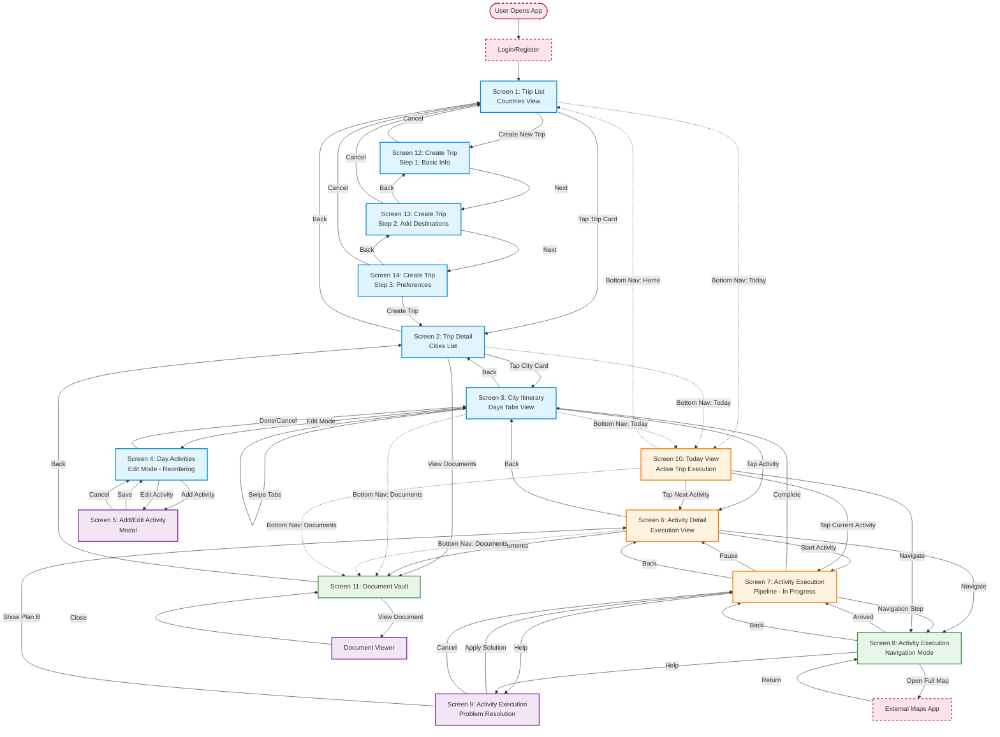

# Jaarvi - Wireframes & User Flow

> **Product & UX Design Document**  
> **Version**: 1.0 MVP (Manual-first approach)  
> **Created**: January 2026

---

## Table of Contents

1. [User Flow Overview](#user-flow-overview)
2. [Wireframe Screens](#wireframe-screens)
   - [Screen 1: Trip List (Countries View)](#screen-1-trip-list-countries-view)
   - [Screen 2: Trip Detail (Cities List)](#screen-2-trip-detail-cities-list)
   - [Screen 3: City Itinerary (Days Tabs View)](#screen-3-city-itinerary-days-tabs-view)
   - [Screen 4: Day Activities (Edit Mode)](#screen-4-day-activities-edit-mode---reordering)
   - [Screen 5: Add/Edit Activity Modal](#screen-5-addedit-activity-modal)
   - [Screen 6: Activity Detail (Execution View)](#screen-6-activity-detail-execution-view)
   - [Screen 7: Activity Execution Pipeline (In Progress)](#screen-7-activity-execution-pipeline-in-progress)
   - [Screen 8: Activity Execution - Navigation Mode](#screen-8-activity-execution---navigation-mode)
   - [Screen 9: Activity Execution - Problem Resolution](#screen-9-activity-execution---problem-resolution)
   - [Screen 10: Today View (Active Trip Execution)](#screen-10-today-view-active-trip-execution)
   - [Screen 11: Document Vault](#screen-11-document-vault-linked-to-trip)
   - [Screen 12: Create Trip Flow (Step 1)](#screen-12-create-trip-flow-step-1-basic-info)
   - [Screen 13: Create Trip Flow (Step 2)](#screen-13-create-trip-flow-step-2-add-destinations)
   - [Screen 14: Create Trip Flow (Step 3)](#screen-14-create-trip-flow-step-3-preferences)
3. [Interaction Patterns](#interaction-patterns)
4. [Design Decisions & Rationale](#design-decisions--rationale)

---

## User Flow Overview

### High-Level Navigation Hierarchy

```
Login/Register
    ↓
Trip List (Countries)
    ├→ Trip Detail (Cities)
    │    ├→ City Itinerary (Days)
    │    │    ├→ Day Activities (Edit Mode)
    │    │    │    └→ Add/Edit Activity Modal
    │    │    └→ Activity Detail
    │    │         ├→ Activity Execution Pipeline
    │    │         │    ├→ Navigation Mode
    │    │         │    └→ Problem Resolution
    │    │         └→ Document Vault
    │    └→ Document Vault
    └→ Create Trip Flow (3 steps)
         └→ Trip Detail

Bottom Nav Access (Any Time):
    ├→ Home (Trip List)
    ├→ Trips (Trip List)
    ├→ Today (Today View)
    │    └→ Activity Execution Pipeline
    ├→ Documents (Document Vault)
    └→ Profile
```

### Complete Navigation Flow Diagram



### Legend

**Screen Types:**
- 🔵 **Planning Phase** (Blue): Trip creation, city planning, itinerary editing
- 🟠 **Execution Phase** (Orange): Active trip execution, real-time guidance
- 🟣 **Modal Screens** (Purple): Overlays for quick actions (add/edit, help)
- 🟢 **Navigation/Utility** (Green): Document vault, navigation mode
- 🔴 **External** (Red, dashed): External apps or entry points

**Navigation Types:**
- **Solid arrows (→)**: Primary navigation (taps, buttons)
- **Dotted arrows (⋯→)**: Bottom navigation shortcuts
- **Back arrows**: Implicit back navigation

---

## Wireframe Screens

### Screen 1: Trip List (Countries View)

```
┌────────────────────────────────────────┐
│  ☰  Jaarvi                    👤  🔔   │ Header
├────────────────────────────────────────┤
│                                        │
│  📍 My Trips                           │
│  ────────────────────────────────────  │
│                                        │
│  ┌──────────────────────────────────┐ │
│  │ 🇫🇷 France & Italy Adventure     │ │ Trip Card
│  │ ─────────────────────────────    │ │
│  │ 📅 Mar 15 - Mar 28, 2026         │ │
│  │ 🏙️  Paris → Rome → Florence      │ │
│  │ ⏱️  14 days  •  💰 $2,500        │ │
│  │                                  │ │
│  │ [▶ Continue Trip]     [🗑️]       │ │
│  └──────────────────────────────────┘ │
│                                        │
│  ┌──────────────────────────────────┐ │
│  │ 🇯🇵 Japan Spring Tour           │ │
│  │ ─────────────────────────────    │ │
│  │ 📅 Apr 5 - Apr 19, 2026          │ │
│  │ 🏙️  Tokyo → Kyoto → Osaka        │ │
│  │ ⏱️  15 days  •  💰 $3,200        │ │
│  │                                  │ │
│  │ [📝 Plan Trip]        [🗑️]       │ │
│  └──────────────────────────────────┘ │
│                                        │
│  ┌──────────────────────────────────┐ │
│  │ 🇲🇽 Mexico City Week            │ │
│  │ ─────────────────────────────    │ │
│  │ 📅 May 10 - May 17, 2026         │ │
│  │ 🏙️  Mexico City                  │ │
│  │ ⏱️  7 days   •  💰 $1,100        │ │
│  │                                  │ │
│  │ [📝 Plan Trip]        [🗑️]       │ │
│  └──────────────────────────────────┘ │
│                                        │
├────────────────────────────────────────┤
│         [➕ Create New Trip]           │ FAB
└────────────────────────────────────────┘
│  🏠  📋  📅  📄  👤                    │ Bottom Nav
└────────────────────────────────────────┘
```

**Key Elements:**
- **Trip Cards**: Show country flag, trip name, dates, cities sequence, duration, budget
- **Trip Status**: Visual indicator (▶ Continue for active, 📝 Plan for draft)
- **Quick Actions**: Continue/Plan and Delete per trip
- **Bottom Navigation**: Home, Trips, Today, Documents, Profile

---

### Screen 2: Trip Detail (Cities List)

```
┌────────────────────────────────────────┐
│  ←  France & Italy Adventure      ⋮    │ Header
├────────────────────────────────────────┤
│                                        │
│  📅 Mar 15 - Mar 28, 2026              │
│  💰 Budget: $2,500  •  ⏱️ 14 days      │
│  ────────────────────────────────────  │
│                                        │
│  🗺️ Destinations                       │
│                                        │
│  ┌──────────────────────────────────┐ │
│  │ 1️⃣ 🇫🇷 Paris                     │ │ City Card
│  │ ───────────────────────────────  │ │
│  │ 📅 Mar 15 - Mar 20 (5 days)      │ │
│  │                                  │ │
│  │ ✅ 5/5 days planned              │ │ Progress
│  │ ━━━━━━━━━━━━━━━━━━━━━━━━━━ 100% │ │
│  │                                  │ │
│  │ [View Itinerary →]               │ │
│  └──────────────────────────────────┘ │
│                                        │
│  ┌──────────────────────────────────┐ │
│  │ 2️⃣ 🇮🇹 Rome                      │ │
│  │ ───────────────────────────────  │ │
│  │ 📅 Mar 21 - Mar 24 (4 days)      │ │
│  │                                  │ │
│  │ ⚠️  2/4 days planned             │ │
│  │ ━━━━━━━━━━░░░░░░░░░░░░░░░░  50% │ │
│  │                                  │ │
│  │ [View Itinerary →]               │ │
│  └──────────────────────────────────┘ │
│                                        │
│  ┌──────────────────────────────────┐ │
│  │ 3️⃣ 🇮🇹 Florence                  │ │
│  │ ───────────────────────────────  │ │
│  │ 📅 Mar 25 - Mar 28 (4 days)      │ │
│  │                                  │ │
│  │ ❌ 0/4 days planned              │ │
│  │ ░░░░░░░░░░░░░░░░░░░░░░░░░░░  0%  │ │
│  │                                  │ │
│  │ [View Itinerary →]               │ │
│  └──────────────────────────────────┘ │
│                                        │
│  ┌──────────────────────────────────┐ │
│  │ ➕ Add Destination                │ │ Add City
│  └──────────────────────────────────┘ │
│                                        │
├────────────────────────────────────────┤
│  [📝 Edit Trip Info]  [🗑️ Delete Trip] │ Actions
└────────────────────────────────────────┘
```

**Key Elements:**
- **Trip Summary**: Dates, budget, total duration at top
- **City Cards**: Sequential numbered list, dates, planning progress
- **Progress Indicators**: Visual bar showing % of days planned
- **Status Icons**: ✅ Complete, ⚠️ Partial, ❌ Empty
- **Quick Nav**: Direct access to city itinerary

---

### Screen 3: City Itinerary (Days Tabs View)

```
┌────────────────────────────────────────┐
│  ←  Paris                         ⋮    │ Header
├────────────────────────────────────────┤
│                                        │
│  📅 Mar 15 - Mar 20, 2026 (5 days)     │
│                                        │
│  ┌──┬──┬──┬──┬──────────────────────┐ │ Day Tabs
│  │D1│D2│D3│D4│D5                    │ │ (Horizontal
│  └──┴──┴──┴──┴──────────────────────┘ │  Scrollable)
│  ▬▬                                    │ Active Indicator
│                                        │
│  📆 Day 1 - Friday, Mar 15             │ Day Header
│  ────────────────────────────────────  │
│                                        │
│  Morning (8:00 - 12:00)                │ Time Block
│  ┌──────────────────────────────────┐ │
│  │ ✈️  Arrive at CDG Airport         │ │ Activity
│  │ ⏰ 08:30  •  📍 Terminal 2E       │ │ Card
│  │ 💰 Included  •  ⏱️ 30 min         │ │
│  │                                  │ │
│  │ 📎 Boarding Pass.pdf             │ │ Linked Doc
│  └──────────────────────────────────┘ │
│                                        │
│  ┌──────────────────────────────────┐ │
│  │ 🚆 Train to City Center          │ │
│  │ ⏰ 09:30  •  📍 RER B Line        │ │
│  │ 💰 €11  •  ⏱️ 45 min              │ │
│  │                                  │ │
│  │ ℹ️  Buy ticket at machine        │ │ Quick Tip
│  └──────────────────────────────────┘ │
│                                        │
│  ┌──────────────────────────────────┐ │
│  │ 🏨 Check-in at Hotel             │ │
│  │ ⏰ 11:00  •  📍 Marais District   │ │
│  │ 💰 Prepaid  •  ⏱️ 30 min          │ │
│  │                                  │ │
│  │ 📎 Reservation.pdf               │ │
│  └──────────────────────────────────┘ │
│                                       │
│  Afternoon (12:00 - 18:00)            │
│  ┌──────────────────────────────────┐ │
│  │ 🍽️  Lunch near Notre-Dame         │ │
│  │ ⏰ 12:30  •  📍 Île de la Cité    │ │
│  │ 💰 €25  •  ⏱️ 1h 30min            │ │
│  └──────────────────────────────────┘ │
│                                       │
│  ┌──────────────────────────────────┐ │
│  │ ➕ Add Activity                   │ │ Add Button
│  └──────────────────────────────────┘ │
│                                        │
├────────────────────────────────────────┤
│  💰 Day Total: €136  •  ⏱️ 8h 30min   │ Summary
└────────────────────────────────────────┘
```

**Key Elements:**
- **Horizontal Day Tabs**: Easy swipe between days
- **Time Blocks**: Morning, Afternoon, Evening sections
- **Activity Cards**: Icon, time, location, cost, duration
- **Linked Documents**: Quick access to tickets/reservations
- **Quick Tips**: Contextual advice inline
- **Day Summary**: Total cost and time at bottom
- **Add Activity**: Floating button per time block

---

### Screen 4: Day Activities (Edit Mode - Reordering)

```
┌────────────────────────────────────────┐
│  ←  Day 1 - Paris              [Done] │ Header
├────────────────────────────────────────┤
│                                        │
│  📝 Editing Day 1                      │
│  Drag to reorder activities            │
│  ────────────────────────────────────  │
│                                        │
│  ┌──────────────────────────────────┐ │
│  │ ☰ ✈️  Arrive at CDG        [✏️][🗑️]│ │ Draggable
│  │ ⏰ 08:30  •  📍 Terminal 2E       │ │ Activity
│  │ 💰 Included  •  ⏱️ 30 min         │ │
│  └──────────────────────────────────┘ │
│                                        │
│  ┌──────────────────────────────────┐ │
│  │ ☰ 🚆 Train to City        [✏️][🗑️]│ │
│  │ ⏰ 09:30  •  📍 RER B Line        │ │
│  │ 💰 €11  •  ⏱️ 45 min              │ │
│  └──────────────────────────────────┘ │
│                                        │
│  ┌──────────────────────────────────┐ │
│  │ ☰ 🏨 Hotel Check-in       [✏️][🗑️]│ │
│  │ ⏰ 11:00  •  📍 Marais District   │ │
│  │ 💰 Prepaid  •  ⏱️ 30 min          │ │
│  └──────────────────────────────────┘ │
│                                        │
│  ┌──────────────────────────────────┐ │
│  │ ☰ 🍽️  Lunch               [✏️][🗑️]│ │
│  │ ⏰ 12:30  •  📍 Île de la Cité    │ │
│  │ 💰 €25  •  ⏱️ 1h 30min            │ │
│  └──────────────────────────────────┘ │
│                                        │
│  ┌──────────────────────────────────┐ │
│  │ ☰ 🎨 Louvre Museum        [✏️][🗑️]│ │
│  │ ⏰ 14:30  •  📍 1st Arrond.       │ │
│  │ 💰 €17  •  ⏱️ 3h                  │ │
│  └──────────────────────────────────┘ │
│                                        │
│  ┌──────────────────────────────────┐ │
│  │ ➕ Add Activity                   │ │
│  └──────────────────────────────────┘ │
│                                        │
│  ⚠️  Time conflict detected           │ Validation
│  Lunch and Louvre overlap by 30min    │ Warning
│                                        │
├────────────────────────────────────────┤
│  [Cancel]              [Save Changes] │ Actions
└────────────────────────────────────────┘
```

**Key Elements:**
- **Drag Handles**: ☰ icon indicates draggable items
- **Quick Actions**: Edit and Delete per activity
- **Real-time Validation**: Warns about time conflicts
- **Bulk Edit**: Multiple activities editable at once
- **Save/Cancel**: Clear commit or discard changes

---

### Screen 5: Add/Edit Activity Modal

```
┌────────────────────────────────────────┐
│  Add Activity                     [✕]  │ Modal
├────────────────────────────────────────┤
│                                        │
│  Activity Type *                       │
│  ┌──────────────────────────────────┐ │
│  │ 🎭 Select type...          [▼]   │ │ Dropdown
│  └──────────────────────────────────┘ │
│                                        │
│  Types: ✈️ Transport  🏛️ Visit         │ Quick
│         🍽️ Meal  🏨 Accommodation      │ Select
│         🎉 Activity  ⏸️ Free Time      │ Icons
│                                        │
│  Activity Name *                       │
│  ┌──────────────────────────────────┐ │
│  │ Visit Eiffel Tower               │ │ Text Input
│  └──────────────────────────────────┘ │
│                                        │
│  📍 Location                           │
│  ┌──────────────────────────────────┐ │
│  │ Champ de Mars, Paris      [📍]   │ │ Location
│  └──────────────────────────────────┘ │ Input
│                                        │
│  ⏰ Time                               │
│  ┌───────────────┬──────────────────┐ │
│  │ Start: 15:00  │ End: 17:30  [⏱️] │ │ Time
│  └───────────────┴──────────────────┘ │ Picker
│                                        │
│  💰 Cost (Optional)                    │
│  ┌──────────────────────────────────┐ │
│  │ € 28.50                          │ │ Currency
│  └──────────────────────────────────┘ │ Input
│                                        │
│  📝 Notes (Optional)                   │
│  ┌──────────────────────────────────┐ │
│  │ Buy tickets online in advance    │ │ Text Area
│  │ to skip queues. Summit access.   │ │
│  └──────────────────────────────────┘ │
│                                        │
│  📎 Attach Documents                   │
│  ┌──────────────────────────────────┐ │
│  │ [📄 Upload] [📸 Take Photo]       │ │ Upload
│  └──────────────────────────────────┘ │ Options
│                                        │
│  ┌──────────────────────────────────┐ │
│  │ 🎫 EiffelTicket.pdf         [✕]  │ │ Attached
│  └──────────────────────────────────┘ │ Doc
│                                        │
├────────────────────────────────────────┤
│  [Cancel]              [Save Activity] │ Actions
└────────────────────────────────────────┘
```

**Key Elements:**
- **Required Fields**: Marked with asterisk (*)
- **Type Icons**: Visual quick-select for activity types
- **Location Picker**: Integration with maps
- **Time Picker**: Start and end time selector
- **Currency Input**: Automatic formatting
- **Document Upload**: Attach tickets/reservations
- **Validation**: Real-time field validation

---

### Screen 6: Activity Detail (Execution View)

```
┌────────────────────────────────────────┐
│  ←  Eiffel Tower                  [✏️] │ Header
├────────────────────────────────────────┤
│                                        │
│  🗼 Visit Eiffel Tower                 │
│  ────────────────────────────────────  │
│                                        │
│  Status: ⏱️ Starting in 45 minutes     │ Real-time
│                                        │
│  ┌──────────────────────────────────┐ │
│  │ 📍 Location                      │ │ Info Block
│  │ Champ de Mars, 5 Av. Anatole     │ │
│  │ France, 75007 Paris              │ │
│  │                                  │ │
│  │ [🗺️ Open in Maps]                │ │
│  └──────────────────────────────────┘ │
│                                        │
│  ┌──────────────────────────────────┐ │
│  │ ⏰ Time                           │ │
│  │ 15:00 - 17:30 (2h 30min)         │ │
│  └──────────────────────────────────┘ │
│                                        │
│  ┌──────────────────────────────────┐ │
│  │ 💰 Cost                           │ │
│  │ €28.50 (Summit Access)           │ │
│  └──────────────────────────────────┘ │
│                                        │
│  ┌──────────────────────────────────┐ │
│  │ 📝 Notes                          │ │
│  │ Buy tickets online in advance    │ │
│  │ to skip queues. Summit access    │ │
│  │ booked for 15:30.                │ │
│  └──────────────────────────────────┘ │
│                                        │
│  ┌──────────────────────────────────┐ │
│  │ 📎 Documents (2)                  │ │ Documents
│  │ ────────────────────────────     │ │ Section
│  │ 🎫 EiffelTicket.pdf        [👁️] │ │
│  │ 📄 Confirmation.pdf        [👁️] │ │
│  └──────────────────────────────────┘ │
│                                        │
│  ┌──────────────────────────────────┐ │
│  │ ℹ️  Local Tips                    │ │ Contextual
│  │ ────────────────────────────     │ │ Advice
│  │ • Arrive 15 min before time slot │ │
│  │ • Security check at entrance     │ │
│  │ • Best photos from Trocadéro     │ │
│  │ • Restaurants at 2nd floor       │ │
│  └──────────────────────────────────┘ │
│                                        │
│  ┌──────────────────────────────────┐ │
│  │ 🚶 Getting There                  │ │ Navigation
│  │ 12 min walk from current location│ │ Context
│  │ [Start Navigation]               │ │
│  └──────────────────────────────────┘ │
│                                        │
├────────────────────────────────────────┤
│  [⏭️ Skip]    [✅ Mark as Done]        │ Actions
└────────────────────────────────────────┘
```

**Key Elements:**
- **Real-time Status**: Countdown to activity start
- **Location Block**: Address with map integration
- **Documents Access**: Quick view attached files
- **Local Tips**: Contextual advice from playbooks
- **Navigation**: Distance and direction to activity
- **Action Buttons**: Skip or mark complete

---

### Screen 7: Activity Execution Pipeline (In Progress)

```
┌────────────────────────────────────────┐
│  ←  Eiffel Tower Visit           [⋮]  │ Header
├────────────────────────────────────────┤
│                                        │
│  🗼 Visit Eiffel Tower                 │
│  ────────────────────────────────────  │
│                                        │
│  Status: 🟢 IN PROGRESS                │
│  ⏰ Started: 15:05  •  ⏱️ 2h 25min left │ Real-time
│                                        │
│  ━━━━━━━━━━░░░░░░░░░░░░░░░░░░  40%    │ Progress
│  Step 3 of 8                           │ Bar
│                                        │
├────────────────────────────────────────┤
│                                        │
│  ✅ Step 1: Arrive at Eiffel Tower     │ Completed
│  ┌──────────────────────────────────┐ │ Step
│  │ 📍 Champ de Mars entrance        │ │ (Collapsed)
│  │ ✓ Completed at 15:05             │ │
│  └──────────────────────────────────┘ │
│                                        │
│  ✅ Step 2: Security Check             │
│  ┌──────────────────────────────────┐ │
│  │ 🔒 Pass through metal detector   │ │
│  │ ✓ Completed at 15:10             │ │
│  └──────────────────────────────────┘ │
│                                        │
│  ▶️ Step 3: Ticket Validation          │ Current
│  ┌──────────────────────────────────┐ │ Step
│  │ 🎫 Show QR code at entrance      │ │ (Expanded)
│  │ ───────────────────────────────  │ │
│  │                                  │ │
│  │ 📱 Instructions:                 │ │
│  │ 1. Open ticket from documents    │ │
│  │ 2. Present QR code to scanner    │ │
│  │ 3. Wait for green light          │ │
│  │ 4. Enter through turnstile       │ │
│  │                                  │ │
│  │ ℹ️  Tip: Have ticket ready to    │ │ Contextual
│  │    avoid delays at entrance      │ │ Advice
│  │                                  │ │
│  │ 📎 Your Ticket                   │ │
│  │ ┌────────────────────────────┐  │ │
│  │ │ 🎫 EiffelTicket.pdf  [View]│  │ │ Quick
│  │ └────────────────────────────┘  │ │ Access
│  │                                  │ │
│  │ 📍 Location Checkpoint:          │ │
│  │ You should be at: Pillar entrance│ │ Landmark
│  │ Look for: Red signs "Visiteurs"  │ │ Guidance
│  │                                  │ │
│  │ [📸 Upload Photo] [🗺️ Show Map]  │ │ Optional
│  │                                  │ │ Actions
│  └──────────────────────────────────┘ │
│                                        │
│  [✅ Mark Step Complete]               │ Primary
│                                        │ Action
│  ⏭️ Step 4: Take Elevator to 2nd Floor │ Next
│  ┌──────────────────────────────────┐ │ Step
│  │ ⏱️ ~10 min  •  📍 Main elevator   │ │ (Preview)
│  │ [Tap to expand...]               │ │
│  └──────────────────────────────────┘ │
│                                        │
│  ⏭️ Step 5: Explore 2nd Floor         │
│  ⏭️ Step 6: Elevator to Summit        │
│  ⏭️ Step 7: Summit Views              │ Upcoming
│  ⏭️ Step 8: Return to Ground Level    │ Steps
│                                        │ (Collapsed)
│                                        │
├────────────────────────────────────────┤
│  [⏸️ Pause]  [⏭️ Skip Step]  [🆘 Help] │ Actions
└────────────────────────────────────────┘
```

**Key Elements:**
- **Real-time Progress**: Shows time elapsed and remaining
- **Visual Progress Bar**: Overall completion percentage
- **Step States**: ✅ Completed, ▶️ Current, ⏭️ Upcoming
- **Expanded Current Step**: Detailed instructions for active step
- **Landmark Guidance**: "Look for" cues for physical wayfinding
- **Quick Access**: Linked documents available inline
- **Location Checkpoints**: Validates user is in correct location
- **Optional Evidence**: Photo upload for proof/memory
- **Next Step Preview**: Shows what's coming next
- **Step Navigation**: Pause, skip, or request help

---

### Screen 8: Activity Execution - Navigation Mode

```
┌────────────────────────────────────────┐
│  ←  Walking to Eiffel Tower      [⋮]  │ Header
├────────────────────────────────────────┤
│                                        │
│  🚶 Step 3: Walk to Entrance           │
│  ────────────────────────────────────  │
│                                        │
│  📍 Navigation Active                  │
│  🎯 350m away  •  ⏱️ 5 min walking     │ Distance
│                                        │
│  ┌──────────────────────────────────┐ │
│  │                                  │ │
│  │         [MAP PREVIEW]            │ │ Simplified
│  │                                  │ │ Map View
│  │    You ●─────────────────→ 🗼    │ │ (or deep
│  │         Rue de Grenelle          │ │ link to
│  │                                  │ │ maps)
│  │    ↑                             │ │
│  │   Your direction                 │ │
│  └──────────────────────────────────┘ │
│                                        │
│  [🗺️ Open Full Map]                   │
│                                        │
│  🧭 Landmark-Based Directions:         │
│  ┌──────────────────────────────────┐ │
│  │ ✅ 1. Exit Notre-Dame area       │ │ Step-by-
│  │ ✅ 2. Head west on Quai          │ │ Step
│  │ ▶️ 3. You should see the Seine   │ │ Walking
│  │    on your left                  │ │ Guidance
│  │ ⏭️ 4. Cross Pont de l'Alma       │ │
│  │ ⏭️ 5. Eiffel Tower ahead         │ │
│  └──────────────────────────────────┘ │
│                                        │
│  ⚠️  Current Landmark Check:           │
│  ┌──────────────────────────────────┐ │
│  │ Look for: Seine River on left    │ │ Visual
│  │                                  │ │ Checkpoint
│  │ Can you see it?                  │ │
│  │ [✅ Yes, I see it] [❌ No]        │ │
│  └──────────────────────────────────┘ │
│                                        │
│  💡 Local Tips:                        │
│  • Use pedestrian crossings          │ Contextual
│  • Watch for cyclists in bike lanes  │ Safety
│  • Tower entrance on north side      │ Tips
│                                        │
│  ⏰ Reminder: Activity starts 15:00   │
│  ⏱️  You're on track to arrive 14:55  │ Time
│                                        │ Management
├────────────────────────────────────────┤
│  [⏸️ Pause]  [📞 Call Place]  [🆘 Help]│ Actions
└────────────────────────────────────────┘
```

**Key Elements:**
- **Real-time Distance**: Updates as user walks
- **Map Integration**: Preview with option to open full map
- **Landmark-Based Navigation**: Human-friendly directions
- **Visual Checkpoints**: Validates user is on correct route
- **Local Safety Tips**: Context-aware warnings
- **Time Management**: Shows if user is on schedule
- **Alternative Actions**: Pause, call destination, help

---

### Screen 9: Activity Execution - Problem Resolution

```
┌────────────────────────────────────────┐
│  ←  Activity Help                 [✕]  │ Modal
├────────────────────────────────────────┤
│                                        │
│  🚨 Need Help?                         │
│  ────────────────────────────────────  │
│                                        │
│  Current Activity:                     │
│  🗼 Visit Eiffel Tower - Step 3        │ Context
│                                        │
│  What's the issue?                     │
│  ┌──────────────────────────────────┐ │
│  │ ⏰ Running late                   │ │ Common
│  │ 📍 Can't find location            │ │ Issues
│  │ 💰 Cost is different              │ │ (Quick
│  │ 🚫 Place is closed                │ │ Select)
│  │ 🤔 Instructions unclear           │ │
│  │ 🚶 Lost / Wrong direction         │ │
│  │ 🎫 Ticket problem                 │ │
│  │ 🆘 Emergency                      │ │
│  │ ✏️  Other (describe)               │ │
│  └──────────────────────────────────┘ │
│                                        │
│  ▼ Running late? Here's what to do:   │ Contextual
│  ┌──────────────────────────────────┐ │ Solutions
│  │ You're 15 min behind schedule    │ │ (Based on
│  │                                  │ │ selected
│  │ Options:                         │ │ issue)
│  │                                  │ │
│  │ 1️⃣ Skip current step             │ │
│  │    Continue to Step 4            │ │
│  │    [Skip →]                       │ │
│  │                                  │ │
│  │ 2️⃣ Shorten visit                 │ │
│  │    Skip Summit, only 2nd floor   │ │
│  │    Saves 45 min                  │ │
│  │    [Adjust Plan →]                │ │
│  │                                  │ │
│  │ 3️⃣ Reschedule activity           │ │
│  │    Move to tomorrow morning      │ │
│  │    [Reschedule →]                 │ │
│  │                                  │ │
│  │ 4️⃣ See Plan B alternatives       │ │
│  │    Similar activities nearby     │ │
│  │    [Show Plan B →]                │ │
│  └──────────────────────────────────┘ │
│                                        │
│  💬 Need more help?                    │
│  [💬 Chat Support] [📞 Call Support]  │ Additional
│                                        │ Support
├────────────────────────────────────────┤
│  [Cancel]              [Apply Solution]│ Actions
└────────────────────────────────────────┘
```

**Key Elements:**
- **Issue Selection**: Quick-tap common problems
- **Contextual Solutions**: Specific actions for each issue
- **Multiple Options**: User chooses best solution
- **Plan B Integration**: Links to alternative activities
- **Escalation Path**: Chat or call support if needed
- **Impact Preview**: Shows time saved/added per option

---

### Screen 10: Today View (Active Trip Execution)

```
┌────────────────────────────────────────┐
│  Today - Paris                    🔔    │ Header
├────────────────────────────────────────┤
│                                        │
│  🌤️ 18°C  •  Friday, Mar 15, 2026     │ Weather
│  ────────────────────────────────────  │
│                                        │
│  📍 Day 1 of 5 in Paris                │
│  ━━━━░░░░░░░░░░░░░░░░░░░░░░░░  20%    │ Progress
│                                        │
│  ⏰ Current Time: 14:15                │
│                                        │
│  ▼ Now                                 │ Timeline
│  ┌──────────────────────────────────┐ │ View
│  │ 🍽️  Lunch near Notre-Dame        │ │
│  │ ───────────────────────────────  │ │ Current
│  │ ⏰ Started 12:30  •  30min left   │ │ Activity
│  │ 📍 Île de la Cité                │ │
│  │                                  │ │
│  │ [View Details]  [✅ Complete]     │ │
│  └──────────────────────────────────┘ │
│                                        │
│  ▼ Next (in 30 minutes)                │
│  ┌──────────────────────────────────┐ │
│  │ 🗼 Visit Eiffel Tower            │ │ Next
│  │ ───────────────────────────────  │ │ Activity
│  │ ⏰ 15:00 - 17:30                  │ │
│  │ 📍 12 min walk                   │ │
│  │ 🚶 Leave at 14:45                │ │ Reminder
│  │                                  │ │
│  │ [🗺️ Navigate]  [View Details]     │ │
│  └──────────────────────────────────┘ │
│                                        │
│  ▼ Later Today                         │
│  ┌──────────────────────────────────┐ │
│  │ 🍷 Dinner at Le Marais           │ │ Upcoming
│  │ ⏰ 19:30  •  📍 Marais District   │ │
│  └──────────────────────────────────┘ │
│                                        │
│  ┌──────────────────────────────────┐ │
│  │ 🏨 Return to Hotel               │ │
│  │ ⏰ 22:00  •  📍 Near Bastille     │ │
│  └──────────────────────────────────┘ │
│                                        │
│  ┌──────────────────────────────────┐ │
│  │ 🚨 Need Help?                     │ │ Quick
│  │ [🆘 Emergency]  [🗺️ Get Directions]│ │ Actions
│  └──────────────────────────────────┘ │
│                                        │
├────────────────────────────────────────┤
│  💰 Spent: €63.50 / €180 today        │ Budget
└────────────────────────────────────────┘
```

**Key Elements:**
- **Weather Context**: Current conditions
- **Day Progress**: Visual indicator of completion
- **Timeline View**: Now, Next, Later sections
- **Current Activity**: Highlighted with time remaining
- **Next Activity**: With "when to leave" reminder
- **Quick Actions**: Navigate, complete, emergency
- **Budget Tracker**: Real-time spending vs. planned

---

### Screen 11: Document Vault (Linked to Trip)

```
┌────────────────────────────────────────┐
│  ←  Documents                     [+]  │ Header
├────────────────────────────────────────┤
│                                        │
│  📂 France & Italy Adventure           │
│  ────────────────────────────────────  │
│                                        │
│  🔍 Search documents...                │ Search
│  ┌──────────────────────────────────┐ │
│  │ 🔍                               │ │
│  └──────────────────────────────────┘ │
│                                        │
│  Filter: [All] [Flights] [Hotels]     │ Filter
│          [Tickets] [Reservations]     │ Tabs
│                                        │
│  ▼ Paris (5)                           │ Grouped
│  ┌──────────────────────────────────┐ │ by City
│  │ 🎫 Louvre Museum Ticket          │ │
│  │ 📅 Mar 15, 14:30                 │ │ Document
│  │ 🔗 Day 1 - Afternoon             │ │ Card
│  │                            [👁️][↓]│ │
│  └──────────────────────────────────┘ │
│                                        │
│  ┌──────────────────────────────────┐ │
│  │ 🏨 Hotel Marais Reservation      │ │
│  │ 📅 Mar 15-20 (Check-in 11:00)    │ │
│  │ 🔗 Day 1-5 - Accommodation       │ │
│  │                            [👁️][↓]│ │
│  └──────────────────────────────────┘ │
│                                        │
│  ┌──────────────────────────────────┐ │
│  │ 🎭 Moulin Rouge Show Ticket      │ │
│  │ 📅 Mar 18, 21:00                 │ │
│  │ 🔗 Day 4 - Evening               │ │
│  │                            [👁️][↓]│ │
│  └──────────────────────────────────┘ │
│                                        │
│  ▼ Rome (3)                            │
│  ┌──────────────────────────────────┐ │
│  │ 🏛️ Colosseum Entry Ticket        │ │
│  │ 📅 Mar 21, 09:00                 │ │
│  │ 🔗 Day 7 - Morning               │ │
│  │                            [👁️][↓]│ │
│  └──────────────────────────────────┘ │
│                                        │
│  ▼ General (2)                         │
│  ┌──────────────────────────────────┐ │
│  │ ✈️ Flight Paris-Rome Boarding    │ │
│  │ 📅 Mar 20, 18:45                 │ │
│  │ 🔗 Day 6 - Transfer              │ │
│  │                            [👁️][↓]│ │
│  └──────────────────────────────────┘ │
│                                        │
└────────────────────────────────────────┘
```

**Key Elements:**
- **Grouped by City**: Documents organized by destination
- **Search & Filter**: Quick find functionality
- **Link Indicators**: Shows which day/activity document relates to
- **Quick Actions**: View and Download per document
- **Date Context**: Shows when document is needed
- **Add Document**: Floating action button

---

### Screen 12: Create Trip Flow (Step 1: Basic Info)

```
┌────────────────────────────────────────┐
│  ←  Create New Trip           [Step 1/3]│ Header
├────────────────────────────────────────┤
│                                        │
│  Trip Name *                           │
│  ┌──────────────────────────────────┐ │
│  │ European Adventure               │ │ Text Input
│  └──────────────────────────────────┘ │
│                                        │
│  📅 Trip Dates *                       │
│  ┌───────────────┬──────────────────┐ │
│  │ Start Date    │ End Date         │ │ Date
│  │ Mar 15, 2026  │ Mar 28, 2026     │ │ Pickers
│  └───────────────┴──────────────────┘ │
│  ⏱️ 14 days total                      │
│                                        │
│  💰 Budget Range (Optional)            │
│  ┌──────────────────────────────────┐ │
│  │ $ 2,500                          │ │ Currency
│  └──────────────────────────────────┘ │ Slider
│  │░░░░░░░░━━━━━━━━░░░░░░░░░░░░░│     │
│  $1,000         $2,500     $5,000     │
│                                        │
│  🎯 Travel Style                       │
│  ┌──────────────────────────────────┐ │
│  │ ☑️ Relaxed  ☐ Moderate  ☐ Intense│ │ Toggle
│  └──────────────────────────────────┘ │ Options
│                                        │
│  👥 Travelers                          │
│  ┌──────────────────────────────────┐ │
│  │ 🧑 Solo  [+]                      │ │ Counter
│  └──────────────────────────────────┘ │
│                                        │
│  📝 Quick Notes (Optional)             │
│  ┌──────────────────────────────────┐ │
│  │ First time in Europe, interested │ │ Text Area
│  │ in art, history, and food        │ │
│  └──────────────────────────────────┘ │
│                                        │
├────────────────────────────────────────┤
│  [Cancel]                 [Next Step →]│ Actions
└────────────────────────────────────────┘
```

---

### Screen 13: Create Trip Flow (Step 2: Add Destinations)

```
┌────────────────────────────────────────┐
│  ←  Add Destinations          [Step 2/3]│ Header
├────────────────────────────────────────┤
│                                        │
│  📍 Select Destinations                │
│  ────────────────────────────────────  │
│                                        │
│  🔍 Search cities...                   │ Search
│  ┌──────────────────────────────────┐ │
│  │ Paris                      [🔍]  │ │
│  └──────────────────────────────────┘ │
│                                        │
│  Popular Destinations:                 │ Quick
│  [🇫🇷 Paris] [🇮🇹 Rome] [🇪🇸 Barcelona] │ Select
│  [🇬🇧 London] [🇩🇪 Berlin] [More...]   │
│                                        │
│  ▼ Your Route                          │
│  ┌──────────────────────────────────┐ │
│  │ 1️⃣ 🇫🇷 Paris                     │ │ Selected
│  │ ───────────────────────────────  │ │ Cities
│  │ Days: [－] 5 [＋]                 │ │ (Ordered)
│  │ Mar 15 - Mar 20                  │ │
│  │                          [✕][☰] │ │ Reorder/
│  └──────────────────────────────────┘ │ Remove
│                                        │
│  ┌──────────────────────────────────┐ │
│  │ 2️⃣ 🇮🇹 Rome                      │ │
│  │ ───────────────────────────────  │ │
│  │ Days: [－] 4 [＋]                 │ │
│  │ Mar 21 - Mar 24                  │ │
│  │                          [✕][☰] │ │
│  └──────────────────────────────────┘ │
│                                        │
│  ┌──────────────────────────────────┐ │
│  │ 3️⃣ 🇮🇹 Florence                  │ │
│  │ ───────────────────────────────  │ │
│  │ Days: [－] 4 [＋]                 │ │
│  │ Mar 25 - Mar 28                  │ │
│  │                          [✕][☰] │ │
│  └──────────────────────────────────┘ │
│                                        │
│  [+ Add Another Destination]           │
│                                        │
│  ℹ️  Total: 13/14 days allocated       │ Validation
│  1 day remaining                       │
│                                        │
├────────────────────────────────────────┤
│  [← Back]                 [Next Step →]│ Actions
└────────────────────────────────────────┘
```

---

### Screen 14: Create Trip Flow (Step 3: Preferences)

```
┌────────────────────────────────────────┐
│  ←  Trip Preferences          [Step 3/3]│ Header
├────────────────────────────────────────┤
│                                        │
│  🎨 Interests (Select all that apply)  │
│  ┌──────────────────────────────────┐ │
│  │ ☑️ Art & Museums                  │ │ Multi-
│  │ ☑️ History & Architecture         │ │ select
│  │ ☑️ Food & Dining                  │ │ Checkboxes
│  │ ☐ Nightlife & Entertainment      │ │
│  │ ☐ Shopping                        │ │
│  │ ☐ Nature & Outdoors               │ │
│  │ ☐ Photography                     │ │
│  │ ☑️ Local Culture                  │ │
│  └──────────────────────────────────┘ │
│                                        │
│  ⏰ Daily Pace Preference              │
│  ┌──────────────────────────────────┐ │
│  │ ⚪ Early Start (7am - 10pm)       │ │ Radio
│  │ ⚫ Normal Day (9am - 9pm)         │ │ Buttons
│  │ ⚪ Late Start (11am - 11pm)       │ │
│  │ ⚪ Flexible Schedule              │ │
│  └──────────────────────────────────┘ │
│                                        │
│  🍽️ Meal Preferences                   │
│  ┌──────────────────────────────────┐ │
│  │ ☑️ Include restaurant suggestions │ │
│  │ ☑️ Local street food              │ │
│  │ ☐ Fine dining                     │ │
│  │ ☐ Vegetarian/Vegan options       │ │
│  └──────────────────────────────────┘ │
│                                        │
│  🚇 Transportation Preferences         │
│  ┌──────────────────────────────────┐ │
│  │ ☑️ Walking (primary)              │ │
│  │ ☑️ Public Transit                 │ │
│  │ ☐ Taxis/Rideshare                │ │
│  │ ☐ Car Rental                      │ │
│  └──────────────────────────────────┘ │
│                                        │
│  📱 Notification Preferences           │
│  ┌──────────────────────────────────┐ │
│  │ ☑️ Activity reminders             │ │
│  │ ☑️ "Time to leave" alerts         │ │
│  │ ☐ Daily summary                   │ │
│  │ ☐ Budget warnings                 │ │
│  └──────────────────────────────────┘ │
│                                        │
├────────────────────────────────────────┤
│  [← Back]             [Create Trip ✓] │ Actions
└────────────────────────────────────────┘
```

---

## Interaction Patterns

### 1. **Navigation Hierarchy**

```
Trip List (Countries)
    ↓ [Tap Trip Card]
Trip Detail (Cities List)
    ↓ [Tap City Card]
City Itinerary (Day Tabs)
    ↓ [Tap Activity]
Activity Detail
```

### 2. **Edit Modes**

**View Mode** (Default):
- Tap to view details
- Swipe for quick actions (delete, edit)
- Long press for context menu

**Edit Mode** (Explicit):
- Drag handles visible
- Bulk selection enabled
- Save/Cancel buttons at bottom

### 3. **Day Switching**

- **Horizontal Tabs**: Swipe left/right between days
- **Tab Indicator**: Shows active day
- **Scroll Memory**: Returns to same scroll position when switching back

### 4. **Activity Management**

- **Add**: Floating "+" button or "Add Activity" card
- **Reorder**: Drag and drop with ☰ handle
- **Edit**: Tap "✏️" icon or tap activity in edit mode
- **Delete**: Swipe left or tap "🗑️" icon
- **Quick Complete**: Checkbox or "✅" button in Today view

### 5. **Document Linking**

- **Attach**: During activity creation/edit
- **Access**: From activity detail or document vault
- **Context**: Shows which activity document belongs to

### 6. **Time Blocks**

- **Auto-grouping**: Activities grouped by time of day
- **Visual Separation**: Morning, Afternoon, Evening headers
- **Conflict Detection**: Warns when activities overlap

---

## Design Decisions & Rationale

### 1. **Three-Level Hierarchy: Trips → Cities → Days**

**Decision**: Structure navigation as Trip List (Countries) → City List → Day Itinerary

**Rationale**:
- **Matches mental model**: Users think "I'm going to France and Italy" (trip), then "Paris, then Rome" (cities), then "Day 1 in Paris" (daily plans)
- **Scalability**: Supports multi-city trips without UI complexity
- **Progress tracking**: Each level shows completion status
- **Context preservation**: User always knows where they are (country/trip → city → day)

### 2. **Horizontal Day Tabs**

**Decision**: Use horizontal scrollable tabs for day navigation instead of dropdown or list

**Rationale**:
- **Fast switching**: Swipe gesture is faster than dropdown navigation
- **Visual progress**: See all days at a glance
- **Mobile-native**: Tabs pattern is familiar on mobile
- **Limited space**: More efficient than vertical day cards

### 3. **Activity Cards with Inline Information**

**Decision**: Show time, location, cost, duration on activity cards rather than hiding in detail view

**Rationale**:
- **Reduced taps**: Core information visible without drilling down
- **Scanning**: Users can quickly scan day schedule
- **Planning context**: Cost/time visible when reordering activities
- **MVP-friendly**: No complex calculations needed, just display

### 4. **Manual-First Approach (MVP)**

**Decision**: Prioritize manual itinerary creation over AI generation for MVP

**Rationale**:
- **Faster to market**: Simpler to implement
- **User control**: Builds trust through transparency
- **Data collection**: Gathers real user behavior for AI training
- **Fallback strategy**: Even Phase 2 needs manual editing

### 5. **Today View as Separate Tab**

**Decision**: Dedicated "Today" view in bottom navigation instead of hidden in trip detail

**Rationale**:
- **In-trip priority**: During travel, "what's next" is most important
- **One-tap access**: Critical during high-stress moments
- **Real-time context**: Different information needs than planning mode
- **Status tracking**: Shows current progress, not future plans

### 6. **Document Vault Linked to Activities**

**Decision**: Link documents to specific activities, not just general trip storage

**Rationale**:
- **Contextual retrieval**: Right document at right time
- **Reduced cognitive load**: Don't search through all documents
- **Execution support**: Matches "in-trip" mental model
- **Trust building**: Shows system understands user needs

### 7. **Inline Validation & Warnings**

**Decision**: Show time conflicts and budget warnings inline, not as blocking errors

**Rationale**:
- **Non-blocking**: User can proceed even with conflicts
- **Learning moment**: Explains why conflict exists
- **Manual override**: User knows better than system sometimes
- **Trust building**: Transparent about constraints

### 8. **Progressive Disclosure**

**Decision**: Show essential info in list view, details on tap

**Rationale**:
- **Mobile screen constraints**: Limited space per item
- **Cognitive load**: Reduces information overload
- **Performance**: Faster rendering with less data
- **Flexibility**: Can expand details later without redesign

### 9. **Time Block Grouping**

**Decision**: Group activities by time of day (Morning, Afternoon, Evening)

**Rationale**:
- **Natural chunking**: Matches how people think about their day
- **Visual rhythm**: Creates natural breaks in long lists
- **Planning aid**: Helps balance activities across day
- **Flexibility**: Can add activities to specific time blocks

### 10. **Status Indicators Throughout**

**Decision**: Use icons and progress bars at every level (trip, city, day)

**Rationale**:
- **Visibility**: Clear what's done vs. pending
- **Motivation**: Progress bars encourage completion
- **Navigation aid**: Shows where attention is needed
- **MVP-friendly**: Simple calculation (# planned / # total)

---

## Responsive Behaviors

### Portrait (Primary):
- Single column layout
- Full-width cards
- Bottom navigation visible
- Horizontal day tabs

### Landscape:
- Two-column layout for tablets
- Side navigation instead of bottom
- Day tabs and activity list side-by-side
- Map integration possible

### Small Screens:
- Reduce card padding
- Compact typography
- Hide secondary information
- Shorter labels

---

## Accessibility Considerations

1. **High Contrast Mode**: Support system dark/light modes
2. **Font Scaling**: Respect system font size settings
3. **Touch Targets**: Minimum 44x44pt tap areas
4. **Screen Readers**: Proper labels and navigation hints
5. **Color Independence**: Don't rely on color alone for status

---

## Next Steps for Development

1. **Prototype**: Create interactive prototype with navigation flows
2. **User Testing**: Validate trip → city → day hierarchy with real users
3. **Design System**: Define colors, typography, component library
4. **Animation**: Add micro-interactions for drag/drop, transitions
5. **Offline Mode**: Design offline indicators and sync states
6. **Error States**: Design empty states, loading states, error screens

---

**Document Status**: Draft v1.0  
**Last Updated**: January 2026  
**Author**: Product & UX Design Team

