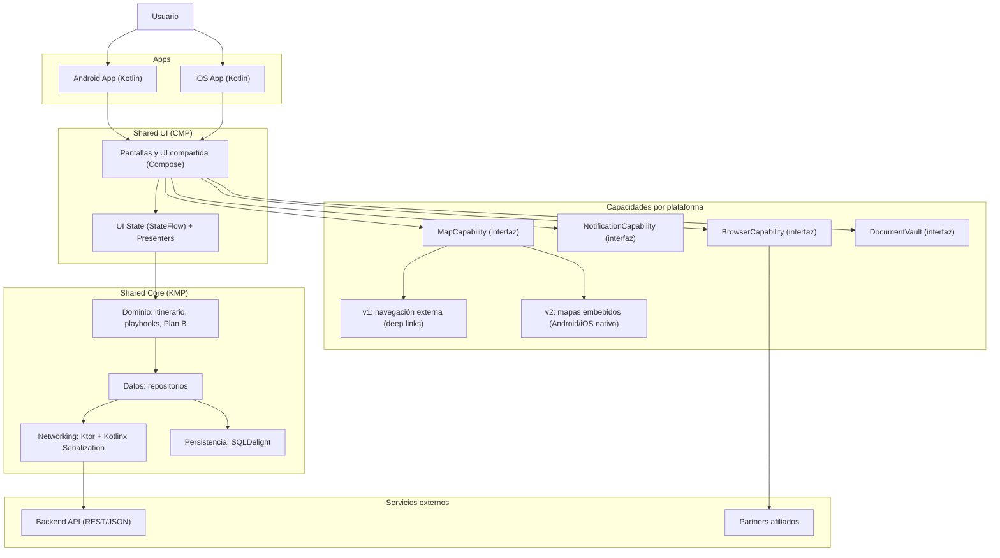
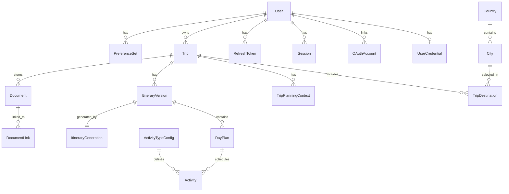

## Índice

0. [Ficha del proyecto](#0-ficha-del-proyecto)
1. [Descripción general del producto](#1-descripción-general-del-producto)
2. [Arquitectura del sistema](#2-arquitectura-del-sistema)
3. [Modelo de datos](#3-modelo-de-datos)
4. [Especificación de la API](#4-especificación-de-la-api)
5. [Historias de usuario](#5-historias-de-usuario)
6. [Tickets de trabajo](#6-tickets-de-trabajo)
7. [Pull requests](#7-pull-requests)

---

## 0. Ficha del proyecto

### **0.1. Tu nombre completo:**

Geovanni Duarte Guerrero    

### **0.2. Nombre del proyecto:**

Jaarvi

### **0.3. Descripción breve del proyecto:**

App movil asistente de viajes

### **0.4. URL del proyecto:**

> Puede ser pública o privada, en cuyo caso deberás compartir los accesos de manera segura. Puedes enviarlos a [alvaro@lidr.co](mailto:alvaro@lidr.co) usando algún servicio como [onetimesecret](https://onetimesecret.com/).

### 0.5. URL o archivo comprimido del repositorio

> Puedes tenerlo alojado en público o en privado, en cuyo caso deberás compartir los accesos de manera segura. Puedes enviarlos a [alvaro@lidr.co](mailto:alvaro@lidr.co) usando algún servicio como [onetimesecret](https://onetimesecret.com/). También puedes compartir por correo un archivo zip con el contenido


---

## 1. Descripción general del producto

Jaarvi es un asistente de viajes móvil que te ayuda a **planificar y ejecutar** un viaje como si viajaras con alguien muy experimentado en el destino. Te acompaña en dos momentos: **antes del viaje** (para armar un itinerario realista) y **durante el viaje** (para guiarte en la ejecución con pasos claros y decisiones prácticas), reduciendo errores, fricción y costos derivados del desconocimiento, y adaptándose a tus gustos y restricciones.


### **1.1. Objetivo:**

> Propósito del producto. Qué valor aporta, qué soluciona, y para quién.
Disminuir el desgaste de planear y llevar a cabo un viaje, para que el viajero aproveche mejor su tiempo y dinero. Jaarvi busca **reducir la incertidumbre**, **evitar errores costosos** y **mejorar la seguridad y eficiencia** con recomendaciones editables antes del viaje y asistencia práctica en el momento de ejecutar el itinerario, de forma que la experiencia sea más fluida, divertida y memorable.

### **1.2. Características y funcionalidades principales:**

* **Cobertura por fases (MVP)**: aunque la visión es “conocer todas las ciudades”, Jaarvi debe ser viable desde el inicio trabajando con una **cobertura inicial acotada** (por ejemplo: un set de ciudades/destinos) y ampliándola progresivamente a medida que se validan flujos y calidad de recomendaciones.

* **Planeación anticipada (pre-viaje)**: con base en las ciudades que el usuario quiere visitar, la cantidad de días y sus preferencias/restricciones (presupuesto, ritmo, intereses, límites de tiempo), Jaarvi debe proponer un plan inicial **fácil de editar** para viajes largos (por ejemplo Europa), que incluya:
  * agenda sugerida por día (pipeline de días) y actividades por día,
  * integraciones lógicas de traslados (vuelos, trenes, buses) y **hospedajes** en el timeline,
  * edición manual rápida (reordenar, reemplazar, eliminar, ajustar tiempos y costos) cuando el usuario no esté de acuerdo.

* **Planeación en destino (inicio del día)**: estando en el sitio y al iniciar el día, Jaarvi debe construir o ajustar un itinerario de actividades adaptado a la situación real (ubicación, tiempos, presupuesto, energía, horarios). Además de listar lugares, debe incorporar recomendaciones accionables sobre dinámicas culturales/económicas cuando aplique, por ejemplo: “En Turquía conviene negociar el vuelo en globo en el sitio; mejor en efectivo y, si es posible, en liras turcas”. En el MVP, esto debe apoyarse en un conjunto pequeño pero sólido de recomendaciones por destino, ampliable después.

* **Transparencia y control**: cuando Jaarvi recomiende una actividad o decisión, debe mostrar de forma simple el “por qué” (tiempo estimado, costo aproximado, distancia, conveniencia) y permitir cambiarlo en un par de acciones. Esto es clave para confianza y para que el usuario no se bloquee si una recomendación no encaja.

* **Asistencia en ejecución (en tiempo real)**: con base en itinerario, contexto, ubicación, tiempos, costos y preferencias, Jaarvi debe ayudar a ejecutar el plan con pasos claros para resolver situaciones comunes de forma eficiente y segura (por ejemplo: la mejor forma de ir del aeropuerto al hotel) y permitir al viajero armar o modificar una actividad en el momento.

* **Guía paso a paso por actividad (modo “Hoy”)**: cada día del viaje es un compendio de actividades. Jaarvi debe actuar como quien ya las hizo antes y conoce los problemas comunes, ofreciendo:

  * mapas con feedback en tiempo real de la ubicación en la ruta,
  * indicaciones explícitas con puntos de referencia (orientadas a caminar), por ejemplo: “Deberías estar viendo una panadería llamada HORNITOS; cruza por esa calle a la derecha”,
  * micro-instrucciones operativas por hitos (máquinas de tickets, trasbordos, accesos), por ejemplo: “Llegaste a la máquina de tickets; cambia idioma a español y compra el pase de 3 días…”.

  En el MVP, este valor debe concentrarse en un set de “playbooks” de alto impacto (aeropuerto→hotel, transporte público y pases, pagos/moneda, errores comunes), en vez de intentar cubrir todos los casos desde el día 1.

* **Notificaciones y gestión del tiempo**: Jaarvi debe poder recordarle al usuario cuándo salir, cuánto falta para el siguiente hito o cierre de un lugar y ayudarle a mantener el día dentro de tiempos realistas.

* **Plan B**: si el plan original no es viable (cierres, clima, cansancio, presupuesto), Jaarvi debe sugerir alternativas equivalentes y permitir cambiar el día sin rehacer todo.

* **Actividades obligatorias por día (configurables)**: el sistema debe soportar actividades “obligatorias” configuradas (seed) a nivel de datos. Un ejemplo típico es “Dormir / Dónde dormir”, pero podría ser otra según el producto. Jaarvi debe marcar si cada actividad obligatoria está **pendiente** o **resuelta** y permitir enlazar evidencia (por ejemplo, una reserva) o una nota (por ejemplo, “me quedo en casa de mi amigo Luis” o “noche en bus/vuelo”).

* La app almacena documentación relévante para los viajeros, como tickets, permisos, documentos asociados a cada actividad del itinerario de viaje.

MONETIZACION

* Jaarvi es también un afiliado a los distintos comercios que venden productos y servicios del ámbito turístico (vuelos, tours, entradas a museos, esenciales). En el MVP, estas recomendaciones deben ser **contextuales y no intrusivas**, priorizando la utilidad y la confianza del usuario.

### **1.3. Diseño y experiencia de usuario:**

> Proporciona imágenes y/o videotutorial mostrando la experiencia del usuario desde que aterriza en la aplicación, pasando por todas las funcionalidades principales.

### **1.4. Instrucciones de instalación:**
> Documenta de manera precisa las instrucciones para instalar y poner en marcha el proyecto en local (librerías, backend, frontend, servidor, base de datos, migraciones y semillas de datos, etc.)

---

## 2. Arquitectura del Sistema

Jaarvi se construye como una app móvil multiplataforma con **Kotlin Multiplatform (KMP)** para compartir el core (dominio y datos) 
y **Compose Multiplatform (CMP)** para compartir la UI (pantallas y componentes) entre Android e iOS. Las integraciones con 
el sistema operativo (mapas, notificaciones, almacenamiento seguro, navegador in-app) se aíslan mediante **interfaces de capacidades** 
con implementaciones por plataforma. En v1, la navegación se resuelve con **mapas externos** (deep links) y más adelante se habilitan
 **mapas embebidos** reutilizando la misma abstracción.


### **2.1. Diagrama de arquitectura:**
> Usa el formato que consideres más adecuado para representar los componentes principales de la aplicación y las tecnologías utilizadas. Explica si sigue algún patrón predefinido, justifica por qué se ha elegido esta arquitectura, y destaca los beneficios principales que aportan al proyecto y justifican su uso, así como sacrificios o déficits que implica.

Arquitectura propuesta: **Kotlin Multiplatform (KMP) + Compose Multiplatform (CMP)** con un **core compartido** (dominio/datos) y una **UI compartida** (pantallas y componentes), más implementaciones específicas por plataforma para capacidades del sistema operativo (mapas, notificaciones, almacenamiento seguro, navegador in-app).

Esto permite un **time-to-market** rápido para Android+iOS (una sola base de UI y lógica) y reduce duplicación, manteniendo flexibilidad para integrar capacidades nativas cuando sea necesario.



Beneficios principales:
- Menos duplicación: UI y lógica compartidas entre Android/iOS.
- Escalabilidad: se separa dominio/datos de la UI y de capacidades de plataforma.
- Evolución controlada: mapas embebidos se agregan luego sin reescribir el flujo (misma interfaz `MapCapability`).

Sacrificios/consideraciones:
- Algunas capacidades siguen siendo específicas por plataforma (notificaciones, almacenamiento, mapas embebidos).
- La disciplina de mantener el código compartido libre de dependencias Android-only es clave.

### **2.2. Descripción de componentes principales:**

> Describe los componentes más importantes, incluyendo la tecnología utilizada

- **Apps (Android/iOS)**: entrypoints por plataforma y wiring de dependencias.
- **UI compartida (CMP)**: pantallas principales (setup del viaje, planificador/edición, modo “Hoy”, documentos) y componentes reutilizables.
- **UI State (presenters)**: clases “tipo ViewModel” multiplataforma que exponen `StateFlow` y manejan eventos de UI (sin `androidx.lifecycle.ViewModel` en código compartido).
- **Core compartido (KMP)**:
  - **Dominio**: reglas de itinerario, playbooks, cálculo de tiempos, “Plan B”.
  - **Datos**: repositorios y cache.
  - **Networking**: Ktor + serialización.
  - **Persistencia**: SQLDelight.
- **Capacidades por plataforma (interfaces + impls)**: `MapCapability`, `NotificationCapability`, `BrowserCapability`, `DocumentVault`.

### **2.3. Descripción de alto nivel del proyecto y estructura de ficheros**

> Representa la estructura del proyecto y explica brevemente el propósito de las carpetas principales, así como si obedece a algún patrón o arquitectura específica.

Estructura objetivo (puede ajustarse al crear el proyecto):

```
.
├── shared/                 # KMP: dominio/datos + abstracciones multiplataforma
├── shared-ui/              # CMP: UI compartida (pantallas/componentes) + presenters
├── androidApp/             # Android: entrypoint + implementaciones de capacidades
└── iosApp/                 # iOS: entrypoint + implementaciones de capacidades
```

Patrón recomendado: **capas** (UI → presenters → dominio → repositorios → red/DB) y **capabilities** para aislar dependencias del sistema operativo.

### **2.4. Infraestructura y despliegue**

> Detalla la infraestructura del proyecto, incluyendo un diagrama en el formato que creas conveniente, y explica el proceso de despliegue que se sigue

Infraestructura (MVP):
- **Cliente móvil** (Android/iOS) consumiendo una **API** (si aplica) vía HTTPS.
- **Distribución**: Google Play Console y App Store Connect (TBD).
- **CI/CD**: pipeline de build/test por PR a `master` (TBD: herramienta específica).

Despliegue (flujo recomendado):
- Rama por ticket → Pull Request a `master` → build y tests automáticos → merge.
- Releases móviles: versionado + publicación a canales de prueba (internal/testflight) antes de producción (TBD).

### **2.5. Seguridad**

> Enumera y describe las prácticas de seguridad principales que se han implementado en el proyecto, añadiendo ejemplos si procede

Prácticas recomendadas (MVP):
- **HTTPS** para toda comunicación con backend/terceros.
- **Almacenamiento seguro** para datos sensibles (tokens/credenciales) usando mecanismos nativos por plataforma (detrás de `DocumentVault`/capability).
- **Mínimos permisos**: solicitar solo los permisos necesarios (por ejemplo, ubicación solo si aporta valor directo en ejecución).
- **Validación y manejo de errores**: no registrar PII en logs; mensajes de error claros para el usuario sin filtrar detalles sensibles.

### **2.6. Tests**

> Describe brevemente algunos de los tests realizados

Estrategia de testing (MVP):
- **Tests compartidos (KMP `commonTest`)**: reglas de dominio (itinerario, playbooks, tiempos, Plan B) y lógica de presenters (event → state).
- **Android UI tests**: Compose UI tests para flujos críticos (modo “Hoy”, edición de itinerario, apertura de navegación externa).
- **iOS UI tests**: XCUITest como smoke tests para flujos principales (arranque, navegación básica, flujos críticos).

---

## 3. Modelo de Datos

### **3.1. Diagrama del modelo de datos:**

Modelo propuesto (resumen): PostgreSQL + Prisma. Incluye usuarios y autenticación (email/contraseña + Google/Apple), viajes, itinerarios versionados, días por ciudad, actividades, documentos y auditoría de IA.




### **3.2. Descripción de entidades principales:**

- **User**: cuenta del viajero. Campos típicos: `id`, `email` (unique), `displayName`, `emailVerifiedAt`, `status`, `createdAt`, `updatedAt`.
- **UserCredential**: credenciales para login con email/contraseña. Guarda `passwordHash` (nunca plaintext) y metadatos del algoritmo.
- **OAuthAccount**: login social (Google/Apple). Unicidad por `(provider, providerAccountId)`; puede coexistir con `UserCredential`.
- **Session / RefreshToken**: sesiones por dispositivo y refresh tokens hasheados con expiración/rotación/revocación.
- **PreferenceSet**: preferencias y restricciones del usuario (JSONB) para planificación.
- **Trip**: viaje (draft/active/completed) con fechas y owner.
- **TripDestination**: ciudades incluidas en el viaje (por ciudad), con orden y cantidad de días.
- **Country / City**: catálogo de países y ciudades; `City` referencia `Country`.
- **ItineraryVersion**: versión del itinerario para un `Trip` (AI/manual/mixed) y estado (draft/ready/archived).
- **DayPlan**: día del itinerario ejecutado en una **ciudad** (`cityId`) para una fecha.
- **Activity**: actividades del día (transfer/visit/etc.). Soporta actividades “obligatorias” por configuración:
  - campos: `activityTypeKey`, `isMandatory`, `readinessStatus`, `readinessNote`, `preparedAt`
- **ActivityTypeConfig**: define tipos estables de actividad (seed en Prisma) y si un tipo es obligatorio por día (`isMandatoryDaily`). Ej.: `sleep` puede ser una fila seed, pero es configurable.
- **Document / DocumentLink**: documentos (metadata + referencia a storage) y sus links a trip/day/activity.
- **TripPlanningContext / ItineraryGeneration**: auditabilidad IA (snapshots de inputs/contexto, rationale, confidence, citations).

---

## 4. Especificación de la API

> Si tu backend se comunica a través de API, describe los endpoints principales (máximo 3) en formato OpenAPI. Opcionalmente puedes añadir un ejemplo de petición y de respuesta para mayor claridad

---

## 5. Historias de Usuario

> Documenta 3 de las historias de usuario principales utilizadas durante el desarrollo, teniendo en cuenta las buenas prácticas de producto al respecto.

**Historia de Usuario 1**

**Historia de Usuario 2**

**Historia de Usuario 3**

---

## 6. Tickets de Trabajo

> Documenta 3 de los tickets de trabajo principales del desarrollo, uno de backend, uno de frontend, y uno de bases de datos. Da todo el detalle requerido para desarrollar la tarea de inicio a fin teniendo en cuenta las buenas prácticas al respecto. 

**Ticket 1**

**Ticket 2**

**Ticket 3**

---

## 7. Pull Requests

> Documenta 3 de las Pull Requests realizadas durante la ejecución del proyecto

**Pull Request 1**

**Pull Request 2**

**Pull Request 3**

